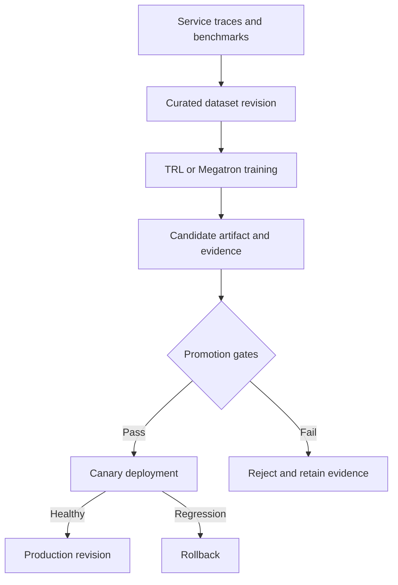

# System Integration

`system-integration`은 Post-Training Lab의 공통 lifecycle 설계 브랜치입니다.
이 브랜치는 학습 코드를 실행하는 lab이 아니라, 학습 전의 데이터 준비부터 학습 후 checkpoint의 production 반영까지를 연결하는 **system integration guide**입니다.
TRL과 Megatron-LM 중 어느 backend를 사용하더라도 유지해야 하는 공통 contract, 검증 단계와 운영 원칙을 설명합니다.

학습 framework 자체를 실습하려면 [`trl` branch](https://github.com/daegyu94/post-training-lab/tree/trl) 또는 [`megatron` branch](https://github.com/daegyu94/post-training-lab/tree/megatron)로 이동하세요.
이 브랜치에는 설치 script, 학습 command와 실행 가능한 reference implementation이 없습니다.

## Lifecycle at a Glance

핵심 원칙은 간단합니다.
운영 trace를 그대로 학습하지 않고, 학습이 끝난 checkpoint를 곧바로 배포하지 않으며, 배포 중 문제가 생기면 이전 revision으로 되돌아갈 수 있어야 합니다.

## Who Should Read This Branch

다음 질문에 답해야 하는 software engineer를 대상으로 합니다.

- service trace를 어떤 검증과 versioning을 거쳐 training dataset으로 만들 것인가?
- training framework에 관계없이 어떤 입력과 결과 정보를 보존할 것인가?
- checkpoint가 serving 가능한지 어떤 evidence로 판단할 것인가?
- canary, traffic promotion과 rollback을 어떤 상태 전이로 관리할 것인가?
- data, training, checkpoint와 serving metric을 어떻게 하나의 run으로 추적할 것인가?

SFT 또는 distributed training의 기본 개념을 먼저 익혀야 한다면 `trl` 또는 `megatron` branch를 먼저 실행하는 편이 이해하기 쉽습니다.

## Recommended Reading Order

| Order | Document | What you should understand |
| --- | --- | --- |
| 1 | [System Architecture](docs/architecture.md) | component 경계, data flow와 최소 구현 단위 |
| 2 | [Data Lifecycle](docs/data-lifecycle.md) | raw trace가 immutable dataset revision이 되는 과정 |
| 3 | [Checkpoint Lifecycle](docs/checkpoint-lifecycle.md) | training request, artifact manifest, promotion과 rollback |
| 4 | [Operations](docs/operations.md) | 공통 identifier, metric, 장애 대응과 운영 checklist |

처음 읽을 때는 위 순서대로 전체 흐름을 확인하고, 실제 system을 설계할 때 각 문서의 contract와 checklist를 구현 기준으로 사용하세요.

## Scope

이 브랜치가 다루는 범위는 다음과 같습니다.

- LLM service trace, feedback와 benchmark에서 training·evaluation candidate를 수집하는 과정
- 개인정보, secret, 잘못된 응답을 제거하는 data curation과 dataset versioning
- framework-independent canonical dataset과 training request contract
- TRL 또는 Megatron-LM backend 선택과 artifact handoff
- checkpoint 등록, offline evaluation, compatibility validation과 promotion gate
- canary deployment, serving traffic 전환, monitoring과 rollback
- multi-node GPU, network와 storage를 고려한 production architecture

다음 항목은 각 framework branch 또는 실제 사내 platform의 책임입니다.

- TRL `SFTTrainer`, QLoRA와 PEFT adapter의 상세 사용법
- Megatron Core의 TP, PP, DP, CP 설정과 distributed training command
- 특정 model과 GPU 환경에서 수행한 실행 기록
- trace ingestion, model registry, evaluation service와 deployment controller의 실제 구현

## Key Terms

| Term | Meaning in this branch |
| --- | --- |
| Canonical record | 특정 training framework 형식으로 변환하기 전의 검토 완료 sample |
| Dataset revision | 내용, split policy와 digest가 고정된 immutable dataset version |
| Training request | dataset, base model, recipe와 evaluation 기준을 연결하는 run 입력 |
| Checkpoint | training backend가 저장한 model state. 그 자체로 배포 가능하다는 뜻은 아님 |
| Artifact | checkpoint, adapter, tokenizer, configuration 등 등록·전달하는 파일 묶음 |
| Manifest | artifact의 lineage, 형식, 무결성과 compatibility를 설명하는 metadata |
| Candidate | registry에 등록됐지만 아직 production 승격 전인 artifact revision |
| Promotion gate | candidate를 다음 상태로 넘길지 판단하는 자동 또는 승인 기반 검사 |
| Serving revision | 특정 artifact와 serving configuration을 결합한 배포 단위 |

## One Example Through the System

아래 값은 contract 사이의 연결을 보여 주는 가상 예시입니다.

| Stage | Example identity | Produced evidence |
| --- | --- | --- |
| Dataset publish | `support-ko@2026-09-01` | content digest, split policy, record counts |
| Training | `run-20260901-001` | request, backend configuration, `summary.json` |
| Registry | `support-model:candidate-17` | artifact manifest, file digests, tokenizer revision |
| Evaluation | `eval-suite@42` | metric values, thresholds, pass/fail |
| Deployment | `support-model:serving-11` | canary result, serving configuration, rollout event |

`run-20260901-001`에서 시작해 사용한 dataset과 base model을 찾을 수 있어야 하고, 반대로 `serving-11`에서 어떤 training run과 evaluation이 이 revision을 승인했는지도 찾을 수 있어야 합니다.

## Branch Responsibilities

| Branch | Primary responsibility |
| --- | --- |
| `main` | 프로젝트 목적과 활성 branch 안내 |
| `trl` | TRL 기반 SFT/QLoRA 구현과 단일 노드 실험 |
| `megatron` | Megatron 기반 단일 GPU SFT workflow와 parallelism 개념 검증 |
| `system-integration` | framework-independent production lifecycle과 serving integration |
| `profiling` | 공통 resource metric 수집, schema와 dashboard 연동 |

Framework를 바꿔도 유효한 policy와 interface는 이 브랜치에 둡니다.
특정 Python API, CLI option, configuration 또는 checkpoint 형식에 의존하는 내용은 해당 framework branch에 둡니다.

## Current Status

현재 내용은 production system을 구현하기 위한 설계 기준이며 실행 가능한 platform은 아닙니다.
각 문서의 schema와 값은 contract를 설명하는 예시이므로, 실제 환경에서는 조직의 보안 정책, registry, serving engine과 승인 절차에 맞춰 구체화해야 합니다.
