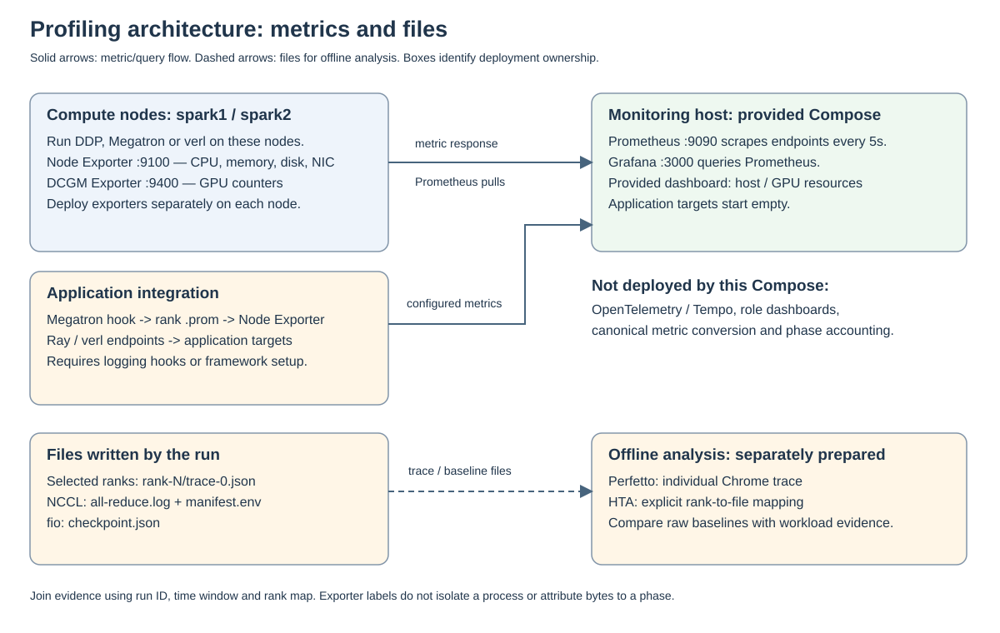

# Large-scale LLM Post-training Resource Profiling Lab

이 저장소는 Megatron 또는 verl 기반 post-training workload를 멀티노드에서 실행할 때 resource bottleneck을 찾는 오픈소스 profiling 실습입니다. 특정 command의 부모 PID를 sampling하는 wrapper 대신, 실제 cluster의 node, GPU, network, storage, distributed rank와 agentic rollout을 같은 run으로 연결합니다.

## What You Will Build



실습은 다음 흐름으로 진행합니다.

1. 각 training node에 Node Exporter와 DCGM Exporter를 배치합니다.
2. Prometheus와 Grafana를 띄워 CPU, memory, GPU, NIC와 disk를 한 화면에서 비교합니다.
3. 동일한 node allocation에서 NCCL Tests와 fio baseline을 측정합니다.
4. Megatron timer/straggler 또는 verl/Ray/rollout metric을 동일한 `run_id`로 연결합니다.
5. 상시 metric으로 병목 rank와 구간을 찾은 후 일부 rank와 step에만 PyTorch Profiler를 켭니다.
6. 오픈소스 trace로 원인이 구분되지 않을 때만 Nsight 같은 vendor tool을 짧은 diagnostic run에 사용합니다.

다이어그램의 도구별 관측 범위와 오픈소스만으로 확정할 수 없는 질문은 [tool 선택과 사각지대](docs/tooling.md)에 정리했습니다.

## Labs

| Lab | Outcome |
| --- | --- |
| [01. Cluster telemetry](docs/labs/01-cluster-telemetry.md) | 실제 멀티노드의 host/GPU metric을 Prometheus와 Grafana에서 조회 |
| [02. Hardware baselines](docs/labs/02-hardware-baselines.md) | NCCL과 storage 성능의 application-independent 기준 확보 |
| [03. Megatron profiling](docs/labs/03-megatron.md) | parallel rank imbalance, communication, pipeline bubble과 checkpoint 병목 분석 |
| [04. verl agentic RL profiling](docs/labs/04-verl.md) | rollout, training role, Ray scheduling과 tool/environment wait 분석 |
| [05. Selected trace](docs/labs/05-selected-trace.md) | 이상 rank와 짧은 step window만 trace하고 HTA/Perfetto로 분석 |
| [06. Distributed PyTorch profiling](docs/labs/06-distributed-pytorch.md) | 작은 DDP workload로 single-node에서 multi-node까지 profiler 흐름을 검증 |

처음에는 Lab 01, 02와 Lab 06을 순서대로 실행합니다. 이후 실제 Megatron 또는 verl run에 맞는 Lab 03, 04를 적용하고, 이상이 발견된 경우에만 Lab 05로 들어갑니다.

## Quick Start for the Monitoring Control Plane

`examples/observability/targets/*.json`의 예시 주소를 실제 compute node 주소로 바꾼 후 다음을 실행합니다.

```bash
./scripts/setup.sh
cd examples/observability
export GRAFANA_ADMIN_PASSWORD=<strong-password>
docker compose config
docker compose up -d
```

Prometheus는 `http://<monitoring-host>:9090`, Grafana는 `http://<monitoring-host>:3000`에서 확인합니다. 이 Compose 예제는 monitoring control plane만 실행합니다. exporter는 각 training node에서 별도로 실행해야 하며 production에서는 Kubernetes Operator, systemd 또는 조직의 서비스 관리 방식을 사용합니다.

## Repository Scope

- `examples/observability`: Prometheus file discovery, Grafana provisioning과 resource dashboard
- `examples/pytorch`: 선택 rank/step용 PyTorch Profiler helper와 DDP demo
- `scripts/check_tools.sh`: 오픈소스 도구와 vendor fallback의 설치 여부 확인
- `config/metrics.json`: framework에 관계없는 metric vocabulary와 collection policy
- `profiling_lab/schema.py`: metric schema validation

이 저장소는 Megatron, verl, Ray 또는 exporter 자체를 재구현하지 않습니다. workload별 adapter는 framework가 이미 제공하는 timer와 metric을 재사용하고, 없는 semantic signal만 얇게 추가하는 것을 원칙으로 합니다.

## Validate the Repository

GPU나 exporter 없이 Python helper, metric schema, shell script syntax를 확인할 수 있습니다.

```bash
.venv/bin/python -m pytest -q
bash -n scripts/*.sh
```
