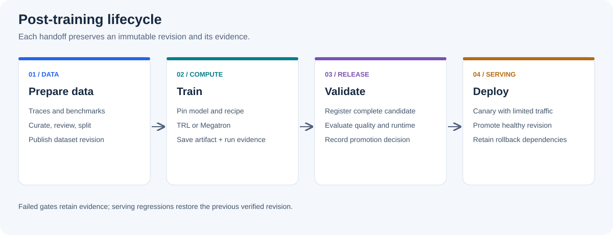

# System Integration

`system-integration`은 Post-Training Lab의 공통 lifecycle 설계 브랜치입니다.
이 브랜치는 학습 코드를 실행하는 lab이 아니라, 학습 전의 데이터 준비부터 학습 후 checkpoint의 production 반영까지를 연결하는 **system integration guide**입니다.
TRL과 Megatron-LM 중 어느 backend를 사용하더라도 유지해야 하는 공통 contract, 검증 단계와 운영 원칙을 설명합니다.

학습 framework 자체를 실습하려면 [`trl` branch](https://github.com/daegyu94/post-training-lab/tree/trl) 또는 [`megatron` branch](https://github.com/daegyu94/post-training-lab/tree/megatron)로 이동하세요.
이 브랜치에는 설치 script, 학습 command와 실행 가능한 reference implementation이 없습니다.
문서의 schema와 값은 설계 예시이며, 실제 platform의 저장소, serving engine과 승인 정책에 맞춰 구체화해야 합니다.

## Lifecycle at a Glance

## Recommended Reading Order

| Order | Document | What you should understand |
| --- | --- | --- |
| 1 | [System Architecture](docs/architecture.md) | component 경계, data flow와 최소 구현 단위 |
| 2 | [Data Lifecycle](docs/data-lifecycle.md) | raw trace가 immutable dataset revision이 되는 과정 |
| 3 | [Checkpoint Lifecycle](docs/checkpoint-lifecycle.md) | training request, artifact manifest, promotion과 rollback |
| 4 | [Operations](docs/operations.md) | 공통 identifier, metric, 장애 대응과 운영 checklist |

처음 읽을 때는 위 순서대로 전체 흐름을 확인하고, 실제 system을 설계할 때 각 문서의 contract와 [운영 검증 checklist](docs/operations.md#validation-checklist)를 구현 기준으로 사용하세요.

## Branch Responsibilities

| Branch | Primary responsibility |
| --- | --- |
| `main` | 프로젝트 목적과 활성 branch 안내 |
| `trl` | TRL 기반 SFT/QLoRA 구현과 단일 노드 실험 |
| `megatron` | Megatron 기반 단일 GPU SFT workflow와 parallelism 개념 검증 |
| `system-integration` | framework-independent production lifecycle과 serving integration |
| `profiling` | 공통 resource metric 수집, schema와 dashboard 연동 |

Framework를 바꿔도 유효한 policy와 interface는 이 브랜치에 둡니다.
특정 Python API, CLI option, configuration 또는 checkpoint 형식에 의존하는 내용은 해당 framework branch에 둡니다.
