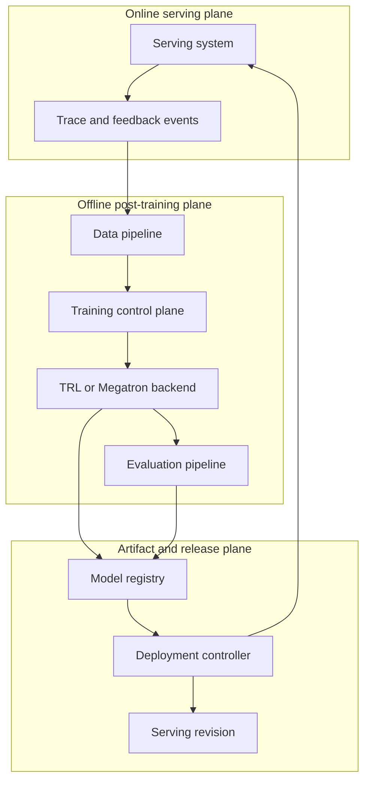
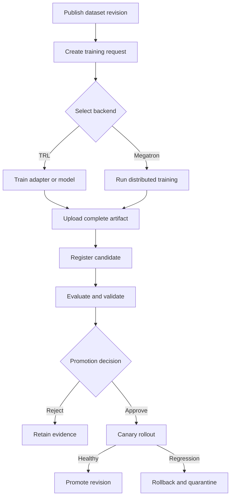

# System Architecture

## Purpose

post-training system은 사용자 요청을 처리하는 online serving path와, data preparation·training·evaluation을 수행하는 offline path를 분리합니다.
training job이나 shared storage의 장애가 현재 serving revision에 직접 영향을 주지 않게 하고, 검증을 통과한 immutable artifact만 명시적인 publish와 promotion을 거쳐 전달하는 것이 목적입니다.

## Design Invariants

구현 방식과 사용하는 제품이 달라도 다음 조건은 유지합니다.

1. raw trace를 training backend가 직접 읽지 않습니다.
2. dataset, base model, recipe와 artifact는 immutable revision으로 참조합니다.
3. training 중인 checkpoint directory를 registry 또는 serving node에 노출하지 않습니다.
4. evaluation evidence가 없는 candidate는 canary로 이동하지 않습니다.
5. production traffic 전환과 rollback은 기록 가능한 deployment event로 수행합니다.
6. 현재 production revision은 training, registry 또는 evaluation 장애가 발생해도 계속 serving할 수 있어야 합니다.

## Logical Topology

화살표는 logical control 또는 artifact flow를 나타냅니다.
실제 구현에서는 trace storage, dataset storage와 model registry가 서로 다른 storage system일 수 있습니다.

## Components

| Component | Input | Output | Responsibility |
| --- | --- | --- | --- |
| Serving system | serving revision, user request | response, trace, feedback | 요청 처리와 배포 revision 기록 |
| Data pipeline | allowed raw events, benchmark source | dataset revision, manifest | 복원, redaction, 품질 검사, deduplication과 split |
| Training control plane | dataset revision, base model, recipe | training request, run identity | 입력을 고정하고 backend job을 요청 |
| TRL backend | canonical dataset adapter, request | PEFT adapter 또는 full artifact, summary | 빠른 SFT/QLoRA training |
| Megatron backend | preprocessed dataset, request | checkpoint, summary | large-scale training backend. 현재 `megatron` branch 실습은 단일 GPU 기준 |
| Evaluation pipeline | candidate, held-out data, suite revision | evaluation evidence | quality, safety, regression과 compatibility 검사 |
| Model registry | complete artifact, manifest, evidence | immutable candidate revision | artifact와 lineage 보관, publish 상태 관리 |
| Deployment controller | approved candidate, rollout policy | serving revision, deployment event | preflight, canary, promotion과 rollback |
| Observability pipeline | stage metric, log, event | correlated dashboard and alert | 동일한 run과 revision 기준으로 상태 연결 |

TRL과 Megatron 내부의 tokenizer 적용, optimizer, parallelism과 checkpoint writer는 각 framework branch의 책임입니다.
registry 이후의 evaluation, promotion과 deployment contract는 backend 종류에 의존하지 않아야 합니다.

## End-to-End Control Flow

`upload complete`와 `register candidate`를 분리하는 이유는 incomplete checkpoint가 discovery API나 deployment controller에 보이지 않게 하기 위해서입니다.
일반적으로 임시 위치에 모든 파일을 쓴 뒤 digest를 검증하고, registry metadata를 원자적으로 visible 상태로 전환합니다.

## Boundary Contracts

| Boundary | Required input | Required output | Must not happen |
| --- | --- | --- | --- |
| Data → Training | dataset revision, digest, schema version | adapter가 읽을 수 있는 validated input | floating path 또는 raw trace 직접 사용 |
| Control plane → Backend | request ID, base model revision, recipe revision | run ID가 포함된 artifact와 summary | CLI command만 남기고 provenance 누락 |
| Backend → Registry | complete files, manifest, per-file digest | immutable candidate revision | 쓰는 중인 directory 공개 |
| Registry → Evaluation | candidate revision, tokenizer와 config | versioned evidence와 gate result | candidate 파일을 evaluation 중 수정 |
| Registry → Deployment | approved revision, compatibility result | serving revision과 rollout event | production alias를 파일 복사 중 변경 |

## Minimal Implementation Path

처음부터 모든 component를 별도 service로 만들 필요는 없습니다.
한 host에서 시작하더라도 경계와 artifact는 분리해 두면 이후 확장할 수 있습니다.

1. canonical JSONL과 dataset manifest를 immutable directory에 생성합니다.
2. training request를 YAML 또는 JSON으로 저장하고 framework script를 실행합니다.
3. training 결과의 `summary.json`, artifact와 digest 목록을 candidate directory에 모읍니다.
4. 별도 process에서 load test와 offline evaluation을 실행해 evidence를 저장합니다.
5. 사람이 승인한 candidate만 별도 serving directory에서 불러옵니다.
6. serving revision과 이전 revision을 기록해 수동 rollback부터 검증합니다.

PoC에서 directory와 script로 구현한 각 단계는 production에서 object storage, workflow orchestrator, model registry와 deployment controller로 바뀔 수 있습니다.
하지만 revision, digest, 상태 전이와 evidence contract는 그대로 유지합니다.

## Scaling Considerations

multi-node로 확장하면 model quality 외에 dataset read throughput, collective duration, GPU idle time, checkpoint save/load 시간, storage metadata 부하와 artifact transfer 시간이 critical path가 될 수 있습니다.
이 값은 [`profiling` branch](https://github.com/daegyu94/post-training-lab/tree/profiling)의 metric contract를 사용해 같은 `run_id`와 phase로 연결합니다.

training cluster와 serving cluster가 물리적으로 분리된 경우에는 artifact transfer 완료, digest validation과 registry publish를 하나의 release boundary로 취급합니다.
serving node는 training storage를 직접 mount해 미완성 checkpoint를 읽지 않습니다.

다음 단계: [Data Lifecycle](data-lifecycle.md)에서 첫 번째 contract인 dataset revision을 확인하세요.
