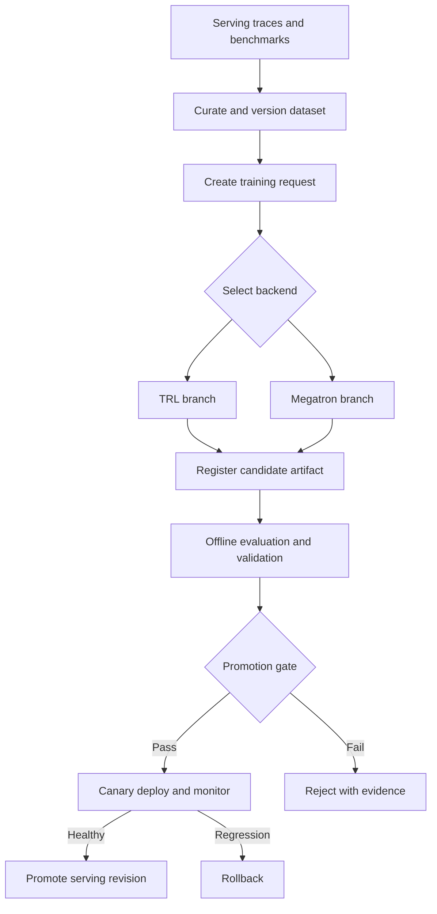

# System Architecture

## Purpose

post-training system은 live serving path와 training path를 분리해야 합니다. 사용자 요청을 처리하는 serving system이 training job의 장애나 자원 사용량에 직접 영향을 받지 않도록 구성하고, 검증을 통과한 immutable checkpoint만 명시적인 promotion 절차를 통해 serving system으로 전달합니다.

## Components

| Component | Responsibility |
| --- | --- |
| Serving system | 사용자 요청 처리, trace와 feedback event 생성, deployed model revision 기록 |
| Data pipeline | trace 정제, 보안 검사, 중복 제거, 품질 필터링과 dataset version 생성 |
| Evaluation pipeline | 고정 benchmark, held-out dataset, safety test와 regression test 실행 |
| Training control plane | dataset version과 backend를 선택하고 reproducible training request 생성 |
| TRL backend | 빠른 SFT/QLoRA 기준 실험과 adapter artifact 생성 |
| Megatron backend | multi-GPU·multi-node SFT와 distributed checkpoint 생성 |
| Model registry | checkpoint, tokenizer, configuration, provenance와 evaluation result 보관 |
| Deployment controller | compatibility validation, canary rollout, traffic promotion과 rollback |
| Observability pipeline | data, training, storage, network, deployment와 serving metric 연결 |

## End-to-End Flow

## System Boundaries

Training backend는 canonical dataset revision과 training request를 입력으로 받고 candidate artifact와 manifest를 출력합니다. backend 내부의 tokenization, parallelism, optimizer와 checkpoint writer는 framework branch의 책임입니다.

Model registry 이후 단계는 framework에 의존하지 않아야 합니다. deployment controller는 artifact manifest에 기록된 model architecture, tokenizer revision, tensor format, precision과 serving engine compatibility를 확인하고, 변환이 필요한 경우 원본과 변환본의 lineage를 모두 보존합니다.

Serving system은 checkpoint path를 임의로 덮어쓰지 않습니다. 새로운 model revision을 별도 위치에 준비하고 health check가 끝난 뒤 traffic을 점진적으로 이동합니다. rollback은 이전 revision을 다시 선택하는 방식으로 수행합니다.

## Scaling Considerations

PoC 환경에서는 하나의 host에서 data preparation, training과 evaluation을 순차 실행할 수 있습니다. 목표 환경에서는 training cluster, shared storage, model registry와 serving cluster를 분리하고 각 경계의 throughput과 failure domain을 측정해야 합니다.

1T급 model과 4노드 이상 GPU cluster로 확장할 때는 checkpoint 크기, distributed save/load 시간, optimizer state, network collective, dataset read throughput과 storage metadata 부하가 critical path에 포함됩니다. 따라서 model quality metric만이 아니라 training step time, checkpoint duration, effective storage throughput, network utilization과 recovery time을 같은 run identifier로 연결해야 합니다.
