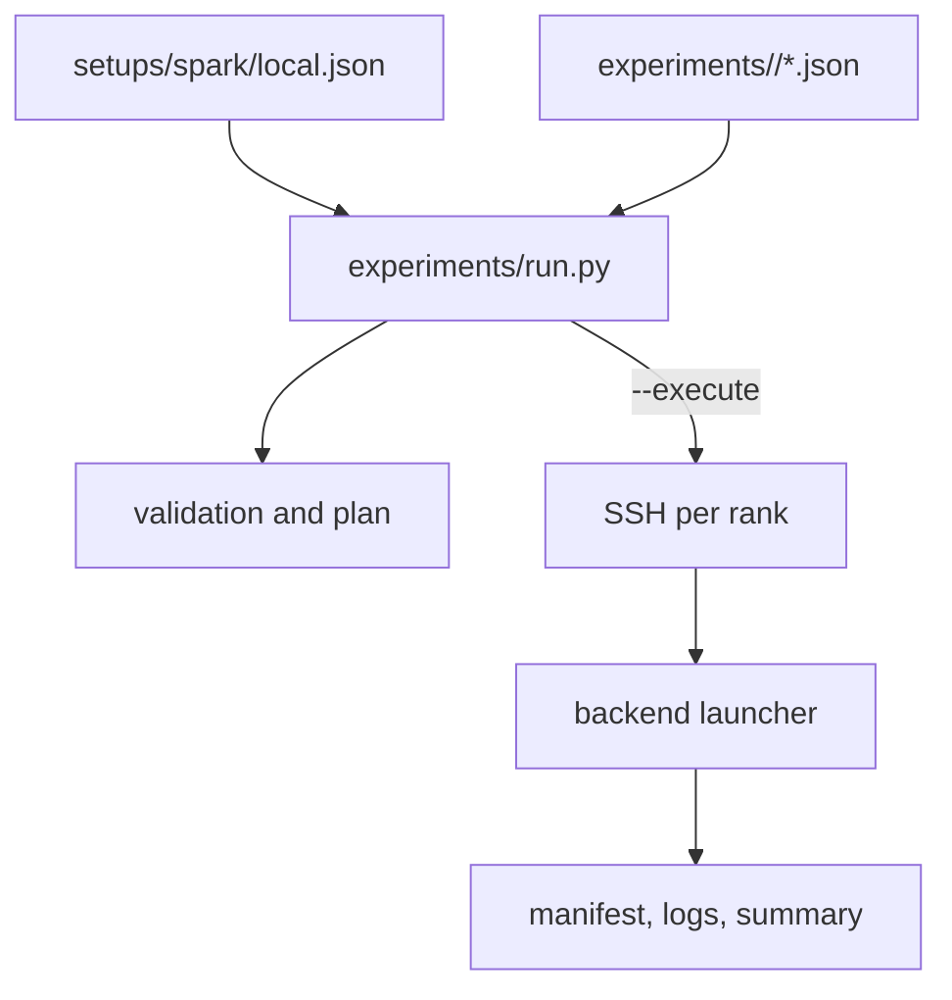

# Architecture

Post-Training Lab은 machine setup과 experiment configuration을 분리한 원격 실행 구조입니다.
Setup은 어디에서 실행할지를 정의하고 experiment는 무엇을 실행할지를 정의합니다.

## Configuration 책임

| 파일 | 관리하는 값 | 관리하지 않는 값 |
| --- | --- | --- |
| setups/spark/local.json | host, checkout, Python, model path, data path, output root, hardware env | learning rate, model revision, batch size |
| experiments/<backend>/*.json | backend, node 수, immutable revision, training env | host, SSH path, runner-owned variables |
| backend launcher | stage 순서와 backend CLI 매핑 | 다른 backend의 설정 |

Runner가 소유하는 environment는 NODE_RANK, PYTHON, OUTPUT_DIR, NNODES, NPROC_PER_NODE, MASTER_ADDR, MASTER_PORT, MODEL_DIR, DATA_DIR입니다.
Experiment에서 이 값을 override하면 validation error가 발생합니다.

## Runner의 검증 범위

Runner는 backend가 trl 또는 megatron인지 확인합니다.
Setup은 Spark이고 node 수는 1 또는 2여야 하며 nproc_per_node는 1이어야 합니다.
Model과 dataset revision은 40자리 hexadecimal SHA여야 합니다.
TRL은 distributed backend와 stage 조합을 검사합니다.
Megatron은 TP*PP, PP*EP, MICRO_BATCH_SIZE*DP에 대한 world size와 global batch divisibility를 검사합니다.

Dry-run은 remote file availability를 검사하지 않습니다.
실제 실행에서는 remote checkout의 commit과 dirty 상태를 확인하고 각 rank의 output을 독립적으로 claim합니다.
기존 output은 덮어쓰지 않으며, 한 rank가 실패하면 같은 run의 남은 process만 정리합니다.

## Output contract

experiments/run.py는 controller output에 manifest.json을 씁니다.
Manifest에는 setup과 experiment의 SHA-256, controller commit, rank별 host·command·log·exit status가 포함됩니다.
Backend summary는 backend가 생성하며 TRL과 Megatron의 형식이 완전히 같다고 가정하지 않습니다.
반복 측정 output은 [Experiments](experiments.md)의 별도 manifest와 records를 사용합니다.
