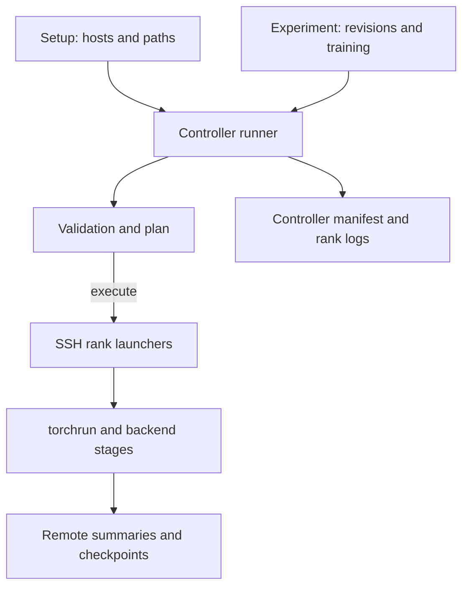

# Architecture

Setup은 실행 환경, experiment는 실험 조건, backend는 학습·저장을 담당합니다.
이 문서는 각 책임과 설정 계약을 정의하며, 실행 절차는 [Getting Started](getting-started.md)를 따릅니다.



## Responsibilities

| 경로 | 책임 | 포함하지 않는 책임 |
| --- | --- | --- |
| `setups/spark/` | host, Python, 입력·출력 경로, 환경별 변수 | 모델 revision·학습률 |
| `experiments/run.py` | 설정 검증, SSH 시작·제한·정리, controller 기록 | 백엔드 학습 loop |
| `experiments/<backend>/` | 고정 입력 revision과 학습 조건 | SSH 주소·mount 경로 |
| `datasets_lab/` | 공개·서비스 데이터의 canonical 변환 규칙과 고정 revision | 백엔드별 학습 설정 |
| `scripts/` | 데이터 준비 진입점 (`PYTHON`으로 backend venv 선택) | 학습 실행 |
| `backends/trl/` | TRL·Trainer·Accelerate의 SFT와 저장 | Megatron recipe, 데이터 변환 |
| `backends/megatron/` | Bridge 설정·Core 분산 모델과 checkpoint | Serving 배포, 데이터 변환 |
| `backends/verl/` | Agentic-RL 및 framework 비교 smoke의 data, reward와 launcher | 장기 수렴·품질 평가 |
| `backends/nemo_rl/` | 공식 NeMo RL container에서 framework 비교 smoke를 실행하는 launcher | NeMo RL source와 dependency vendoring |
| `third_party/post-training-telemetry/` | 계측·baseline·trace helper ([post-training-telemetry](https://github.com/daegyu94/post-training-telemetry) submodule) | 모든 학습 loop에 자동 hook 설치 |
| `tests/` | CPU 회귀와 mock 기반 실행 계약 검사 | 실제 GPU 실행 보장 |

TRL Spark는 telemetry의 `run_summary.py` 대신 자체 stage summary를 생성하므로 summary는 백엔드별 생성 코드를 기준으로 읽습니다.
Runner는 summary나 가중치를 controller로 자동 수집하지 않습니다.

## Configuration Contract

Runner가 소유해 experiment에서 덮어쓸 수 없는 변수는 다음과 같습니다.

```text
NODE_RANK  PYTHON  OUTPUT_DIR  CHECKPOINT_DIR  NNODES
NPROC_PER_NODE  MASTER_ADDR  MASTER_PORT  MODEL_DIR  DATA_DIR
```

노드별 hardware 환경변수는 setup의 공통 환경에 덧붙여지며 허용 prefix는 `NCCL`, `OMP`, `HF_`, `TOKENIZERS_`입니다.
`PYTHON_HEADERS`와 `CPATH`도 허용됩니다.
백엔드별 전체 allowlist는 [runner](../experiments/run.py)의 `TRL_ENV`·`MEGATRON_ENV`에서 확인합니다.

현재 setup은 `spark`, 노드 수는 1 또는 2, `nproc_per_node`는 정확히 1입니다.
모델·데이터 ID는 experiment에 명시해야 하며 revision은 40자리 SHA여야 합니다.
TRL은 stage와 분산 backend 조합을, Megatron은 topology와 batch의 나눗셈 조건을 추가 검사합니다.
Megatron의 `CHECKPOINT_PLACEMENT=local`은 각 노드의 `OUTPUT_DIR/checkpoints`를 사용하며, 완전한 shard 재로딩을 전제하지 않는 `STAGE=train` 측정에서만 허용합니다.

이 allowlist를 바꾸면 [Experiments](experiments.md)의 설정 설명도 함께 갱신합니다.
필드별 입력값은 [Getting Started](getting-started.md#4-configure-the-setup)를 따릅니다.

## Run Lifecycle

기본은 dry-run이며 `--execute`로 SSH 학습을 시작합니다.
Runner는 controller에서만 공유 checkout의 commit·dirty 상태를 확인합니다.
Commit이 `unknown`이면 기록이 생략되므로 실제 실행은 Git checkout에서 수행합니다.

각 rank는 새 run 출력을 claim하고 session 식별자를 확인한 뒤 launcher를 시작합니다.
공유 저장소 가시성 대기는 실행 timeout 이내 최대 70초입니다.
실패·timeout·중단 시 해당 run의 process를 정리하고 정리 실패도 manifest에 기록하며, checkpoint 복구나 자동 재시도는 하지 않습니다.

Controller manifest는 설정 SHA-256, controller commit, host, 명령, rank별 종료 상태를 기록합니다.
백엔드의 stage 순서와 원격 출력은 [TRL](backends/trl.md)·[Megatron](backends/megatron.md)을, 반복 측정은 [Experiments](experiments.md)를 따릅니다.
