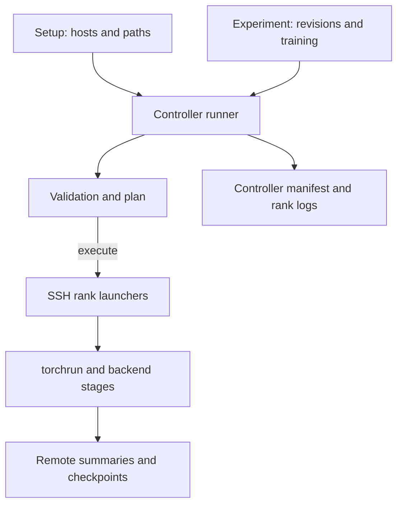

# Architecture

이 저장소는 실행 환경과 실험 조건을 분리합니다.
Setup은 어디서 실행할지, experiment는 무엇을 실행할지, backend는 어떻게 학습·저장할지를 담당합니다.

## Responsibilities

| 경로 | 책임 | 포함하지 않는 책임 |
| --- | --- | --- |
| `setups/spark/` | host, Python, 입력·출력 경로, 환경별 변수 | 모델 revision·학습률 |
| `experiments/run.py` | 설정 검증, SSH 시작·제한·정리, controller 기록 | 백엔드 학습 loop |
| `experiments/<backend>/` | 고정 입력 revision과 학습 조건 | SSH 주소·mount 경로 |
| `backends/trl/` | TRL·Trainer·Accelerate의 SFT와 저장 | Megatron recipe |
| `backends/megatron/` | Bridge 설정·Core 분산 모델과 checkpoint | Serving 배포 |
| `observability/` | 계측·baseline·trace helper | 모든 학습 loop에 자동 hook 설치 |
| `tests/` | CPU 회귀와 mock 기반 실행 계약 검사 | 실제 GPU 실행 보장 |

`run_summary.py` 계열은 공통 summary helper를 제공하지만 모든 진입점이 동일 schema를 사용하는 것은 아닙니다.
TRL 단일 GPU, TRL Spark와 Megatron summary는 각각 실제 생성 코드를 기준으로 읽습니다.
공통 runner는 backend summary나 가중치를 controller로 자동 수집하지 않습니다.

## Configuration Contract

Runner 소유 변수는 `NODE_RANK`, `PYTHON`, `OUTPUT_DIR`, `NNODES`, `NPROC_PER_NODE`, `MASTER_ADDR`, `MASTER_PORT`, `MODEL_DIR`, `DATA_DIR`입니다.
Experiment에서 덮어쓸 수 없습니다.
노드별 hardware 환경은 setup의 공통 환경에 덧붙여지며 허용 prefix는 `NCCL`, `OMP`, `HF_`, `TOKENIZERS_`입니다.
`PYTHON_HEADERS`와 `CPATH`도 허용됩니다.

현재 setup은 `spark`, 노드 수는 1 또는 2, `nproc_per_node`는 정확히 1입니다.
모델·데이터 revision은 40자리 SHA여야 합니다.
TRL은 stage와 분산 backend 조합을, Megatron은 topology와 batch의 나눗셈 조건을 추가 검사합니다.
자세한 필드 입력은 [Getting Started](getting-started.md#configure-the-setup)를 따릅니다.

## Run Lifecycle

Dry-run은 설정 파일을 읽고 계획만 출력하며 원격 파일 가용성이나 SSH를 검사하지 않습니다.
정상 Git checkout에서 실행하면 원격 checkout이 깨끗하고 controller와 같은 commit인지 확인합니다.
Controller commit이 `unknown`이면 현재 구현은 commit 일치 검사를 생략하므로 실제 실행은 반드시 Git checkout에서 수행합니다.
참여 rank는 run별 출력을 claim하며 기존 출력은 덮어쓰지 않습니다.

각 rank는 같은 run의 session 식별자를 확인하고 launcher를 시작합니다.
공유 저장소 가시성 대기는 실행 timeout 이내에서 최대 70초로 제한됩니다.
실패·timeout·중단 시 runner는 같은 run 소유 process를 정리하며 정리 실패도 manifest에 남깁니다.
이 동작은 checkpoint의 장애 복구나 무제한 자동 재시도 기능이 아닙니다.

Controller manifest는 설정 SHA-256, controller commit, host, 명령, rank별 종료 상태를 기록합니다.
백엔드의 stage 순서와 원격 출력은 [TRL](backends/trl.md)과 [Megatron](backends/megatron.md)을 따릅니다.
반복 측정은 [Experiments](experiments.md)의 별도 계획·records를 사용합니다.
Registry·serving lifecycle은 [Design](design.md)의 제안이며 현재 실행 경로와 구분합니다.
