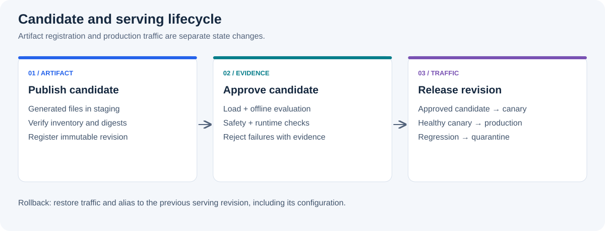

# Checkpoint Lifecycle

## Goal

training이 파일 저장에 성공한 시점과 model을 production에서 사용할 수 있는 시점은 다릅니다.
이 문서는 training request, checkpoint, registry candidate, evaluation evidence와 serving revision을 명시적인 상태로 분리해 accidental deployment를 막는 방법을 설명합니다.

## Artifact Vocabulary

| Term | Meaning |
| --- | --- |
| Checkpoint | optimizer state를 포함할 수 있는 training backend의 저장 결과 |
| Adapter | base model과 함께 load해야 하는 LoRA·PEFT parameter |
| Serving artifact | target serving engine이 직접 load할 수 있도록 준비한 파일 묶음 |
| Manifest | artifact의 lineage, 형식, 파일, digest와 compatibility metadata |
| Candidate | registry에 정상 등록됐지만 promotion 전인 immutable revision |
| Serving revision | candidate와 serving configuration을 결합한 배포 단위 |

checkpoint, adapter와 serving artifact를 모두 “model”이라고 부르면 load 조건과 rollback 대상을 혼동하기 쉽습니다.
manifest의 artifact type을 명시하고, format conversion을 수행했다면 원본과 변환본의 lineage를 모두 보존합니다.

## State Transitions



각 상태 전이는 event와 evidence를 남겨야 합니다.
파일 경로만 옮겨 상태를 표현하면 누가 어떤 기준으로 승인했는지와 어느 revision으로 rollback할지 알기 어렵습니다.

## Training Request

training request는 backend command를 대신하는 것이 아니라, 실행 전에 공통 provenance를 고정하는 상위 contract입니다.
아래 값은 설명을 위한 가상 예시입니다.

```yaml
request_id: run-20260901-001
dataset:
  id: support-ko
  revision: "2026-09-01"
  digest: sha256:<dataset-digest>
base_model:
  id: Qwen/Qwen2.5-7B-Instruct
  revision: <immutable-model-revision>
backend:
  name: trl
  recipe_revision: <git-commit>
evaluation:
  suite_revision: eval-suite-42
output:
  registry_path: support-model/candidates/run-20260901-001
```

TRL 또는 Megatron-LM의 상세 option은 backend-specific configuration artifact로 따로 저장합니다.
공통 request는 lineage와 결과 비교에 사용하고, 서로 의미가 다른 framework option을 억지로 하나의 schema로 합치지 않습니다.

## Relationship to `summary.json`

`trl`, `megatron`과 `profiling` branch의 실행 결과는 `schema_version: 1`과 공통 top-level section을 가진 `summary.json`을 생성합니다.
post-training system에서는 이를 training run의 evidence로 수집할 수 있습니다.

| `summary.json` section | Lifecycle use |
| --- | --- |
| `configuration` | request와 실제 backend 설정 비교 |
| `environment` | framework, hardware와 runtime 재현 정보 확인 |
| `quality` | held-out loss 등 training-level 결과 수집 |
| `performance` | throughput 또는 profiling 결과 연결 |
| `artifacts` | checkpoint, adapter와 log 위치 확인 |
| `validation` | checkpoint reload와 generation 검증 결과 확인 |

`summary.json`만으로 production promotion을 승인하지는 않습니다.
safety, task quality, serving compatibility와 canary 결과는 별도 evaluation·deployment evidence가 필요합니다.
결과의 run이 어떤 `request_id`에 속하는지 확인할 수 없거나 연결 정보가 request와 충돌하면 candidate 등록을 중단해야 합니다.
하나의 request를 재시도할 때는 attempt마다 별도의 `run_id`를 사용합니다.

현재 공통 `summary.json` schema에는 `request_id` 또는 `run_id` 전용 top-level field가 없습니다.
production integration은 registry metadata나 orchestration record에서 summary를 request와 명시적으로 묶어야 하며, output directory 이름만으로 관계를 추론해서는 안 됩니다.

## Artifact Manifest

candidate를 registry에 등록할 때 다음 항목을 함께 보관합니다.

| Field | Purpose |
| --- | --- |
| Run identity | training request, source commit과 recipe 연결 |
| Base model | 원본 model과 immutable revision |
| Dataset lineage | dataset revision, digest와 split policy |
| Artifact type and format | full checkpoint, distributed checkpoint, adapter 또는 serving format |
| Tokenizer | tokenizer와 chat template revision |
| Model configuration | architecture, context length와 required base model |
| Numeric format | BF16, FP16, FP8 또는 quantization 정보 |
| File inventory | relative path, size와 per-file digest |
| Evaluation policy | 실행할 suite revision과 gate policy 참조 |
| Runtime requirements | 대상 serving engine, version과 필요한 load configuration |

PEFT adapter를 등록할 때는 adapter만으로 완전한 serving artifact라고 표시하지 않습니다.
필요한 base model ID·revision, tokenizer와 merge 여부를 manifest에 기록해야 합니다.

## Atomic Publish

모든 파일을 임시 위치에 업로드한 뒤 manifest의 file inventory와 size·digest를 검증합니다.
검증이 끝나면 registry metadata를 원자적으로 visible 상태로 전환해 immutable candidate를 등록합니다.
training 중인 directory나 업로드 중인 파일은 discovery API에 노출하지 않습니다.

등록 후 생성되는 evaluation evidence는 candidate revision과 suite revision에 연결한 별도 record로 추가합니다.
artifact 파일과 최초 manifest는 덮어쓰지 않으며, serving format으로 변환하면 원본 candidate를 참조하는 새 artifact와 manifest를 생성합니다.

## Promotion Gates

threshold 값과 승인 주체는 service마다 다르지만, gate의 입력과 실패 시 행동은 명확해야 합니다.

| Gate | Required evidence | Failure action |
| --- | --- | --- |
| Integrity | manifest file 목록과 실제 size·digest 일치 | candidate publish 중단 |
| Load | clean process에서 artifact와 tokenizer load 성공 | incompatible 상태로 격리 |
| Determinism | 고정 validation sample과 seed의 expected check 통과 | implementation 조사 |
| Offline quality | held-out·task benchmark가 versioned threshold 통과 | promotion 거절 |
| Safety and regression | production revision 대비 허용 범위 이내 | promotion 거절과 delta 기록 |
| Serving compatibility | target engine startup, memory와 representative inference 통과 | serving conversion 또는 config 수정 |
| Canary | error, latency, quality proxy와 task success 기준 통과 | traffic rollback과 candidate 격리 |

짧은 subset에서 loss가 감소했다는 사실은 training path 검증에는 유용하지만 production 품질, safety와 task 성공률을 대신하지 않습니다.

## Deployment and Rollback

1. approved candidate를 현재 production과 다른 immutable location에 준비합니다.
2. artifact load, tokenizer, health endpoint와 representative inference를 preflight에서 검사합니다.
3. 제한된 replica 또는 traffic percentage로 canary를 시작합니다.
4. rollout window 동안 metric과 alert를 candidate revision 기준으로 비교합니다.
5. 기준을 만족하면 traffic을 단계적으로 확대하고 production alias를 원자적으로 갱신합니다.
6. canary 또는 production에서 regression이 발생하면 traffic routing과 alias를 이전 serving revision으로 되돌리고 candidate를 격리합니다.

rollback은 이전 파일을 다시 복사하는 작업이 아니라, 이미 검증되고 보존된 serving revision을 다시 선택하는 작업이어야 합니다.
따라서 이전 artifact, serving configuration, evaluation evidence와 dependency를 retention 기간 동안 함께 유지합니다.

다음 단계: [Operations](operations.md)에서 lifecycle 전체를 같은 identifier와 metric으로 운영하는 방법을 확인하세요.
