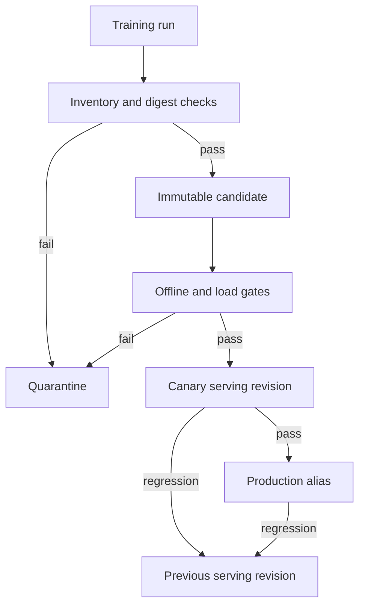

# Design: System Integration

이 문서는 기존 lifecycle 설계를 통합한 제안이며 실행 가능한 플랫폼 사용 설명서가 아닙니다.
현재 구현된 runner·변환기·학습 backend와 향후 registry·serving 기능을 구분합니다.
실행은 [Getting Started](getting-started.md), 현재 구조는 [Architecture](architecture.md)를 따릅니다.

## Problem and Boundaries

학습 파일이나 checkpoint 경로만으로는 어떤 입력과 승인 기준을 거쳐 배포됐는지 추적할 수 없습니다.
설계의 목표는 불변 데이터 revision, 실행 증거, 검증된 artifact와 배포 revision을 명시적으로 연결하는 것입니다.

| 영역 | 현재 구현 | 제안에 남아 있는 것 |
| --- | --- | --- |
| 데이터 | 공개·승인 기록 변환, JSONL·manifest | 수집 권한·검수 workflow, 불변 publish 서비스 |
| 학습 | 고정 revision, 설정 검증, SSH runner | request·retry를 관리하는 control plane |
| 저장 | adapter·분산 checkpoint, 일부 reload·resume | artifact registry와 atomic visibility |
| 평가 | held-out loss와 제한된 실행 검사 | versioned task·safety·serving gate |
| 배포 | 구현 없음 | canary, promotion, rollback |

## Data Publication

원본 event → trace 복원 → 민감정보 제거·검수 → 중복 제거·분할 → 불변 revision 발행을 제안합니다.
기존 모델 응답이 기록돼 있다는 사실만으로 올바른 SFT target이 되지는 않습니다.
Raw event와 reject evidence는 학습 데이터보다 더 강한 접근 제어와 별도 보존 정책이 필요할 수 있습니다.

분할은 세션·문서·task family 등 누출을 막을 단위로 수행합니다.
최종 test 정답과 grader는 학습 process가 읽지 못하도록 분리합니다.
발행 시 source revision, schema, filter·split policy, seed, 개수와 content digest를 함께 고정합니다.
하나라도 검증에 실패하면 revision을 공개하지 않고, 수정은 기존 버전 덮어쓰기 대신 새 revision으로 발행합니다.

백엔드 입력은 canonical 데이터의 파생물입니다.
Tokenizer·template·adapter revision과 변환 전후 개수를 보존하고 adapter 오류 수정은 새 파생물을 만듭니다.
이 제안의 운영 manifest와 [현재 변환기 manifest](datasets.md#output-formats)는 동일 schema가 아닙니다.

## Artifact States

Checkpoint는 학습 상태 저장물, adapter는 base model과 함께 읽는 추가 가중치, serving artifact는 대상 engine에 맞춘 배포 파일 묶음입니다.
Candidate는 등록된 불변 artifact이며 serving revision은 candidate와 배포 설정을 결합한 단위입니다.

파일을 임시 위치에 모두 올리고 size·digest를 검사한 뒤 registry metadata를 원자적으로 visible 상태로 전환하는 방식을 제안합니다.
학습 중이거나 업로드 중인 디렉터리를 discovery 대상으로 노출하지 않습니다.
Artifact와 최초 manifest는 덮어쓰지 않고 이후 평가 결과는 candidate·suite revision에 연결한 별도 record로 남깁니다.

Manifest에는 run, base model·dataset revision, tokenizer·template, artifact type·format, precision, 파일 목록·digest와 runtime 요구를 보존합니다.
Adapter에는 필요한 base revision을 기록하며 adapter만으로 완전한 배포 모델이라고 표시하지 않습니다.
현재 backend summary들은 완전히 동일한 schema가 아니므로 통합 시스템은 실제 형식을 확인해야 합니다.

## Gates and Rollback

| Gate | 필요한 증거 | 실패 시 제안 동작 |
| --- | --- | --- |
| Integrity | 전체 파일·size·digest | publish 중단 |
| Load | 깨끗한 process에서 모델·tokenizer 읽기 | incompatible candidate 격리 |
| Offline quality | 고정 suite·threshold·regression 결과 | promotion 거절 |
| Safety | versioned safety 검사 | promotion 거절 |
| Serving | 대상 engine의 시작·메모리·대표 추론 | 변환·설정 재검토 |
| Canary | 제한된 트래픽의 error·latency·task 결과 | 이전 revision으로 traffic 복구 |

짧은 subset의 loss 감소나 checkpoint 저장 성공은 production 승인의 대체물이 아닙니다.
Rollback은 파일 재복사가 아니라 보존된 이전 artifact와 serving 설정을 다시 선택하는 방식으로 설계합니다.
Registry·storage 장애 중에는 기존 production을 유지하고 promotion을 중단합니다.

## Correlation and Failure Handling

Dataset revision → request ID → run ID → candidate → evaluation result → serving revision의 연결을 metadata에 보존합니다.
같은 request를 재시도하더라도 attempt별 run ID와 새 출력을 사용합니다.
원본 prompt·응답·credential·사용자 식별자는 metric label에 넣지 않습니다.
지표의 단위와 수집 범위는 [관측 계약](observability-reference.md)을 사용합니다.

불완전한 checkpoint는 숨기고 실패한 rank·마지막 완료 step·writer 오류를 보존합니다.
자동 재시도는 멱등성이 확인된 단계에만 적용하며 alias·트래픽 전환은 예상 현재 버전을 검사하는 compare-and-swap 조건을 둡니다.
이 동작들은 현재 runner의 구현 보장이 아니라 후속 시스템 설계 조건입니다.
