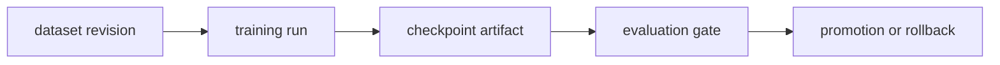

# Design: System Integration

이 문서는 dataset revision부터 training, checkpoint promotion과 serving까지의 통합 lifecycle을 구상하는 설계 문서입니다.
현재 repository의 실행 구현이나 serving system을 설명하는 문서가 아닙니다.

## Lifecycle 제안

설계의 핵심 invariant는 immutable input, run manifest, 분리된 평가 데이터와 명시적인 promotion gate입니다.
Checkpoint 저장 성공과 production promotion은 별도 상태로 기록해야 합니다.
장애 후 재개는 optimizer·scheduler·RNG state의 보존 여부를 별도로 확인해야 합니다.

## 현재 구현과의 경계

현재 구현된 경계는 backends/의 training, experiments/의 bounded runner, setups/의 Spark 환경과 observability/의 측정 도구입니다.
Dataset governance, checkpoint registry, serving deployment, promotion과 rollback API는 이 repository에 구현되어 있지 않습니다.
이 문서의 contract를 실제 platform 기능으로 오해하지 않습니다.

새 기능을 구현할 때는 먼저 artifact schema와 실패 상태를 정하고 최소한의 runnable reference와 검증 기록을 함께 추가해야 합니다.
