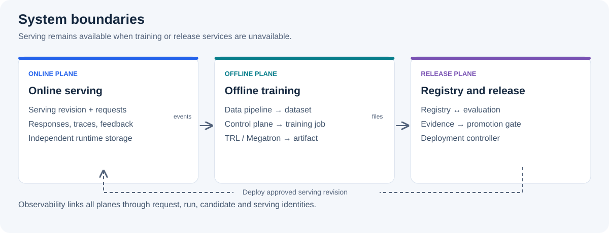

# System Architecture

## Purpose

학습 작업에 장애가 나더라도 현재 서비스는 계속 응답할 수 있어야 합니다.
이를 위해 사용자 요청을 처리하는 online serving 경로와 데이터 준비·학습·평가를 수행하는 offline 경로를 분리합니다.
검증을 통과한 고정 버전의 결과물만 등록(publish)하고, 별도 승인 절차를 거쳐 서비스에 반영(promotion)합니다.

## Design Invariants

구현 방식과 사용하는 제품이 달라도 다음 조건은 유지합니다.

1. raw trace를 training backend가 직접 읽지 않습니다.
2. dataset, base model, recipe와 artifact는 immutable revision으로 참조합니다.
3. training 중인 checkpoint directory를 registry 또는 serving node에 노출하지 않습니다.
4. evaluation evidence가 없는 candidate는 canary로 이동하지 않습니다.
5. production traffic 전환과 rollback은 기록 가능한 deployment event로 수행합니다.
6. 현재 production revision은 training, registry 또는 evaluation 장애가 발생해도 계속 serving할 수 있어야 합니다.

## Logical Topology

영역 사이의 실선은 artifact·event 전달, 점선은 deployment 제어를 나타냅니다.
실제 구현에서는 trace storage, dataset storage와 model registry가 서로 다른 storage system일 수 있습니다.

## Components

| Component | Input | Output | Responsibility |
| --- | --- | --- | --- |
| Serving system | serving revision, user request | response, trace, feedback | 요청 처리와 배포 revision 기록 |
| Data pipeline | allowed raw events, benchmark source | dataset revision, manifest | 복원, redaction, 품질 검사, deduplication과 split |
| Training control plane | dataset revision, base model, recipe | training request, run identity | 입력을 고정하고 backend job을 요청 |
| TRL backend | canonical dataset adapter, request | PEFT adapter 또는 full artifact, summary | 빠른 SFT/QLoRA training |
| Megatron backend | preprocessed dataset, request | checkpoint, summary | 분산 학습과 checkpoint 생성; 현재 구현은 Spark backend 가이드 참고 |
| Evaluation pipeline | candidate, held-out data, suite revision | evaluation evidence | quality, safety, regression과 compatibility 검사 |
| Model registry | complete artifact, manifest, evidence | immutable candidate revision | artifact와 lineage 보관, publish 상태 관리 |
| Deployment controller | approved candidate, rollout policy | serving revision, deployment event | preflight, canary, promotion과 rollback |
| Observability pipeline | stage metric, log, event | correlated dashboard and alert | 동일한 run과 revision 기준으로 상태 연결 |

TRL과 Megatron 내부의 tokenizer 적용, optimizer, parallelism과 checkpoint writer는 각 backend의 책임입니다.
registry 이후의 evaluation, promotion과 deployment contract는 backend 종류에 의존하지 않아야 합니다.

## Boundary Contracts

각 단계는 다음 단계가 입력을 검증할 수 있도록 버전과 출처를 함께 전달합니다.
예를 들어 학습 결과를 등록할 때는 파일 경로만 넘기지 않고 전체 파일 목록과 해시도 전달합니다.

| Boundary | Required input | Required output | Must not happen |
| --- | --- | --- | --- |
| Data → Training | dataset revision, digest, schema version | adapter가 읽을 수 있는 validated input | floating path 또는 raw trace 직접 사용 |
| Control plane → Backend | request ID, base model revision, recipe revision | run ID가 포함된 artifact와 summary | CLI command만 남기고 provenance 누락 |
| Backend → Registry | complete files, manifest, per-file digest | immutable candidate revision | 쓰는 중인 directory 공개 |
| Registry → Evaluation | candidate revision, tokenizer와 config | versioned evidence와 gate result | candidate 파일을 evaluation 중 수정 |
| Registry → Deployment | approved revision, compatibility result | serving revision과 rollout event | production alias를 파일 복사 중 변경 |

## Minimal Implementation Path

처음부터 모든 component를 별도 service로 만들 필요는 없습니다.
한 host에서 시작하더라도 경계와 artifact는 분리해 두면 이후 확장할 수 있습니다.

1. canonical JSONL과 dataset manifest를 immutable directory에 생성합니다.
2. training request를 YAML 또는 JSON으로 저장하고 framework script를 실행합니다.
3. training 결과의 `summary.json`, artifact와 digest 목록을 candidate directory에 모읍니다.
4. 별도 process에서 load test와 offline evaluation을 실행해 evidence를 저장합니다.
5. 사람이 승인한 candidate만 별도 serving directory에서 불러옵니다.
6. serving revision과 이전 revision을 기록해 수동 rollback부터 검증합니다.

PoC에서 directory와 script로 구현한 각 단계는 production에서 object storage, workflow orchestrator, model registry와 deployment controller로 바뀔 수 있습니다.
하지만 revision, digest, 상태 전이와 evidence contract는 그대로 유지합니다.

## Resource Boundaries

training과 serving의 compute·storage 경계를 분리하고, serving revision의 파일과 dependency는 training job의 수명과 무관하게 유지합니다.
multi-node의 I/O, collective communication과 artifact transfer 관측은 [Operations의 Storage and Network](operations.md#storage-and-network)를 따릅니다.
artifact를 공개하는 절차는 [Checkpoint Lifecycle의 Atomic Publish](checkpoint-lifecycle.md#atomic-publish)에서 정의합니다.

다음 단계: [Data Lifecycle](data-lifecycle.md)에서 첫 번째 contract인 dataset revision을 확인하세요.
