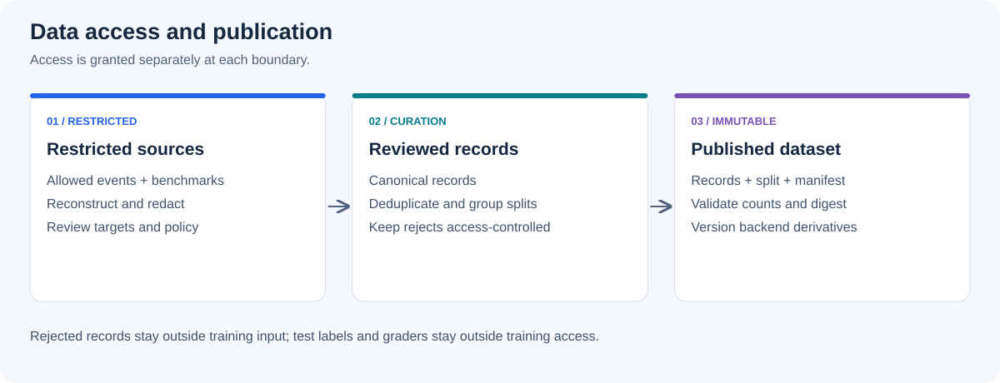

# Data Lifecycle

## Goal

데이터 준비의 목표는 출처와 검수 기준을 추적할 수 있는 고정 버전의 학습 데이터를 만드는 것입니다.
이 문서에서는 발행한 뒤 내용을 덮어쓰지 않는 버전을 **immutable dataset revision**이라고 부릅니다.
학습 backend에는 검토와 검증이 끝난 버전만 전달합니다.

이 문서는 운영 시스템의 설계 기준입니다.
현재 저장소에서 파일을 변환하는 방법은 [SFT 데이터 준비 가이드](../../datasets/README.md)를 따르세요.

## Data Objects

| Object | Description | Mutable? |
| --- | --- | --- |
| Raw event | request, response, tool event 또는 feedback의 원본 | 원본 보존 정책에 따름 |
| Reconstructed trace | 하나의 task 수행 과정을 순서대로 복원한 record | curation 중에는 수정 가능 |
| Canonical record | redaction과 품질 검토를 통과한 framework-independent sample | publish 전까지 수정 가능 |
| Dataset revision | canonical record, split과 manifest가 함께 고정된 version | 아니요 |
| Backend dataset | TRL 또는 Megatron 입력 형식으로 변환한 파생 artifact | 원본 revision에서 재생성 |

## Trust Boundaries



각 단계는 입력보다 넓은 접근 권한을 자동으로 상속하지 않습니다.
특히 raw event와 reject evidence는 canonical dataset보다 강한 접근 제어와 별도의 retention policy가 필요할 수 있습니다.

## Data Sources

학습 후보는 서비스 대화 기록, 사용자 피드백, 업무 benchmark, 사람이 작성한 예제와 전문가 검수 결과에서 수집합니다.
raw trace에 기존 model 응답이 있다는 사실만으로 그 응답이 정확하거나 SFT target으로 적합하다는 의미는 아닙니다.

source별로 collection policy, 사용 목적, retention class와 허용된 reviewer를 먼저 정합니다.
개인정보나 secret을 hash로 바꾸는 것만으로 익명화가 완료됐다고 간주하지 않습니다.
원문을 복원하거나 다른 dataset과 연결할 수 있는 값인지 별도로 검토해야 합니다.

## Curation Pipeline

| Stage | Main check | Output evidence |
| --- | --- | --- |
| Select | collection·consent policy상 사용 가능한 event인가? | source revision, selection policy |
| Reconstruct | request, response, tool call, result와 outcome이 한 trace로 복원되는가? | stable trace identity |
| Redact | 개인정보, credential, source secret, restricted content가 제거됐는가? | redaction status와 rule revision |
| Review | target이 정확하고 instruction, tool, safety와 format 기준을 만족하는가? | review status와 reject reason |
| Deduplicate | 동일하거나 매우 유사한 sample과 benchmark contamination이 없는가? | deduplication policy와 counts |
| Split | 같은 identity group이 여러 split에 걸치지 않는가? | split policy, seed와 group key |
| Publish | schema, count와 content digest가 검증됐는가? | immutable revision과 manifest |

reject sample을 조용히 삭제하면 data quality 문제를 추적하기 어렵습니다.
학습 input과 분리된 제한 영역에 reject reason과 policy revision을 남기되, 불필요한 민감 원문은 보존하지 않습니다.

## Preventing Data Leakage

같은 대화나 문서의 예제가 학습과 평가에 동시에 들어가지 않도록 먼저 묶은 뒤 분할합니다.
이런 중복 때문에 평가가 부풀려지는 현상을 데이터 누출(leakage)이라고 합니다.
묶음의 기준은 데이터 출처에 따라 선택합니다.

| Source pattern | Recommended grouping key | Leakage being prevented |
| --- | --- | --- |
| Multi-turn support chat | conversation 또는 session ID | 같은 대화 일부가 train과 test에 분산 |
| Repeated requests from one account | privacy-preserving user group ID | 사용자의 반복 표현을 model이 암기 |
| Document-grounded QA | source document ID | 같은 문서 내용이 train과 test에 중복 |
| Template-generated tasks | task family 또는 template ID | 문구만 다른 동일 task의 중복 |
| Time-sensitive service traces | collection time window | 미래 evaluation data가 과거 training에 포함 |

최종 test label과 grader는 training process가 읽을 수 없는 위치와 권한에 보관합니다.
split key를 선택할 때는 불필요한 사용자 식별자를 dataset에 노출하지 않고도 동일 group을 안정적으로 묶을 수 있어야 합니다.

## Canonical Record

공통 데이터 형식(canonical schema)은 특정 tokenizer나 학습 framework에 종속되지 않도록 설계합니다.
아래는 필드 관계를 보여 주는 예시이며 실제 운영 schema는 별도로 versioning해야 합니다.

```json
{
  "schema_version": "1",
  "sample_id": "sample-01HXYZ",
  "source": {
    "type": "service-trace",
    "revision": "trace-export-2026-09-01",
    "collected_at": "2026-09-01T03:14:00Z"
  },
  "task": {
    "category": "technical-support",
    "difficulty": "medium",
    "language": "ko"
  },
  "messages": [
    {"role": "system", "content": "<approved-system-instruction>"},
    {"role": "user", "content": "<redacted-request>"},
    {"role": "assistant", "content": "<reviewed-target>"}
  ],
  "tools": [],
  "quality": {
    "review_status": "approved",
    "reviewer_type": "human"
  },
  "split": "train"
}
```

`sample_id`는 revision 안에서 안정적으로 sample을 추적하기 위한 값이며 원본 사용자 ID를 그대로 사용하지 않습니다.
`messages`의 마지막 assistant content는 기존 model의 원본 응답이 아니라 승인된 training target이어야 합니다.
tool-using sample은 tool definition, call과 result가 consumer가 이해할 수 있는 contract로 함께 검증돼야 합니다.

## Dataset Manifest

dataset revision에는 최소한 다음 정보가 필요합니다.

| Field | Purpose |
| --- | --- |
| `dataset_id` | 논리 dataset 식별자 |
| `revision` | immutable content revision |
| `schema_version` | canonical record contract version |
| `source_revisions` | 입력 trace와 benchmark lineage |
| `split_policy` | grouping key, leakage 방지 기준과 seed |
| `filter_policy` | quality, safety, redaction과 deduplication rule revision |
| `record_counts` | split, source와 task category별 sample 수 |
| `content_digest` | record artifact의 무결성 확인 |
| `created_at` | 생성 시각 |

publish 전에 schema validation, split overlap 검사, sample ID uniqueness, record count와 digest를 자동 검사합니다.
하나라도 실패하면 revision을 visible 상태로 만들지 않습니다.
내용을 고칠 때는 기존 revision을 덮어쓰지 않고 새 revision을 생성합니다.

## Backend Adapters

TRL backend는 canonical record를 Hugging Face Dataset과 chat template 입력으로 변환하고, loss mask가 의도한 assistant token에만 적용되는지 검증합니다.
Megatron backend는 같은 record를 Megatron 전처리 형식으로 변환하고 tokenizer revision, sequence packing, data index와 distributed consumption 조건을 검증합니다.

adapter는 다음 값을 보존해야 합니다.

- source dataset ID, revision과 content digest
- 원본 `sample_id` 또는 역추적 가능한 안전한 mapping
- tokenizer와 chat template revision
- adapter code 또는 configuration revision
- 변환 전후 record count와 reject reason

backend dataset은 canonical dataset의 새로운 source가 아닙니다.
adapter bug를 수정하면 canonical revision을 바꾸지 않고 새 adapter revision으로 다시 생성합니다.

다음 단계: [Checkpoint Lifecycle](checkpoint-lifecycle.md)에서 이 dataset revision이 training request와 candidate artifact로 연결되는 방식을 확인하세요.
