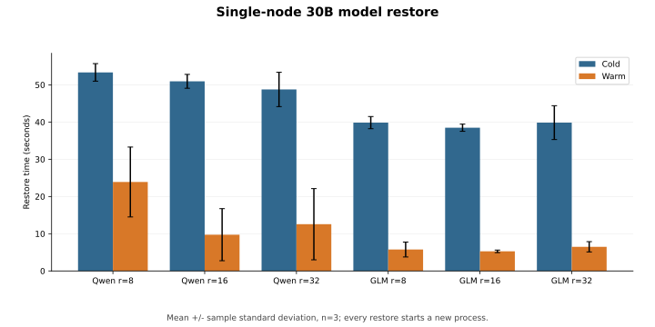
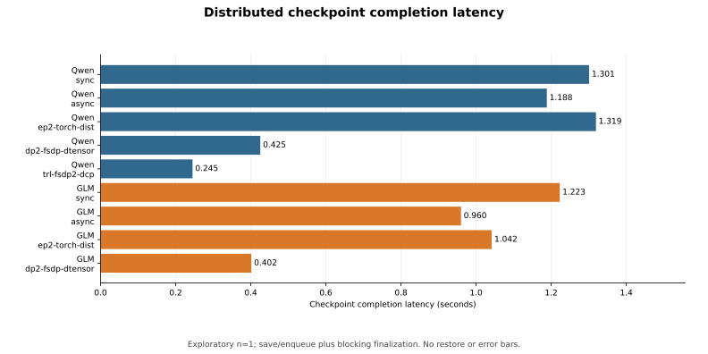
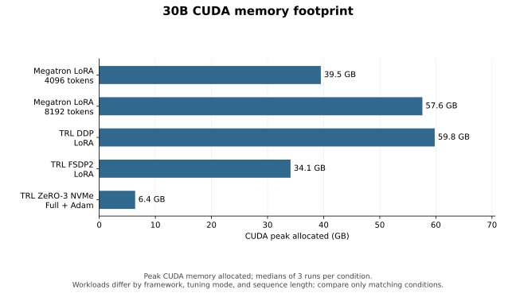
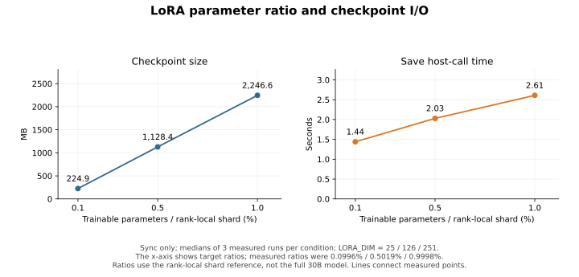

# Experiments

Experiment 파일은 모델·데이터 revision과 학습 조건을, setup은 실행할 노드와 경로를 선언합니다.
공통 runner가 둘을 결합하며 `--execute`가 있을 때만 SSH 학습을 시작합니다.
첫 실행은 [Getting Started](getting-started.md), 설정 책임은 [Architecture](architecture.md)를 따릅니다.

두 노드에서 `Qwen/Qwen3-30B-A3B`(TRL LoRA·Megatron MoE)와 `zai-org/GLM-4.7-Flash`(TRL DDP LoRA·Megatron MoE)의 SFT를 확인합니다.
30B는 메모리·통신·checkpoint·재로딩을, 0.5B smoke는 runner·전처리·저장 경로를 저비용으로 검사합니다.
정적 검사·CPU 테스트·dry-run·GPU 실행은 별도 증거로 구분합니다([AGENTS.md](../AGENTS.md), [판정 기준](getting-started.md#6-verify-the-result)).

## Read the Results First

이 문서는 **실행 가능성**, **반복 측정**, **규모 추정**을 다룹니다. 아래 표에서 질문을 고른 뒤 해당 결과의 조건과 지표를 함께 읽습니다.

| 알고 싶은 것 | 먼저 볼 결과 | 현재 확인된 범위 |
| --- | --- | --- |
| 30B SFT와 checkpoint 재로딩이 되는가? | [30B GPU Results](#30b-gpu-results) | 짧은 실행·재로딩 확인. 장기 수렴·모델 품질 검증은 아님 |
| 실제 checkpoint restore가 얼마나 걸리는가? | [Single-node TRL I/O Experiment](#single-node-trl-io-experiment) | 두 30B 모델의 LoRA r=8/16/32를 새 process에서 cold/warm 각 3회 측정 |
| Async가 학습을 덜 막는가? | [Revised Distributed Write Results](#revised-distributed-write-results-2026-09-14) | n=1에서 완료시간은 Qwen 1.301 → 1.188 s, GLM 1.223 → 0.960 s. 반복·장기 overlap 검증 전에는 speedup으로 단정하지 않음 |
| 분산 방식에 따라 CUDA 메모리가 얼마나 필요한가? | [Memory Footprint](#memory-footprint) | Qwen TRL LoRA에서 DDP 59.8 → FSDP2 34.1 GB. Full FT + NVMe 6.4 GB는 다른 workload |
| LoRA를 더 많이 학습하면 checkpoint도 커지는가? | [LoRA Ratio and Checkpoint I/O](#lora-ratio-and-checkpoint-io) | 고정된 Qwen target module에서 trainable 비율 약 10배 → 최신 checkpoint shard 크기 약 10배 |
| Qwen 결과를 GLM에도 적용할 수 있는가? | [Qwen and GLM Comparison](#qwen-and-glm-comparison) | Attention backend를 맞추면 관측 증가율이 유사함. GLM host memory가 더 크다는 기존 결론은 철회 |
| 100B~1T에 필요한 용량은? | [Scaling Estimates](#scaling-estimates-100b-to-1t) | 가정한 dtype·optimizer·sharding에 따른 계산. 해당 규모 GPU 실행 결과가 아님 |

### Metric Definitions

`rank`는 분산 학습 process 번호입니다. 이 실험은 노드당 1 rank이며, **rank별 합·최대값·반복 median은 서로 다른 집계**입니다.

| 지표 | 계산·범위 | 해석 |
| --- | --- | --- |
| Save 호출 누적 시간 | 한 run에서 rank별 성공한 `save()` 호출 시간을 합한 뒤 rank 최대값, 이후 run 간 median | 단일 checkpoint latency가 아님. Async에서는 background 완료를 기다리지 않은 반환 시간 포함 |
| Blocking finalization | rank별 blocking `finalize_async_saves` 호출 시간의 합과 rank 최대값 | 아직 끝나지 않은 async 작업을 기다리는 시간. Save 합에 단순히 더해도 첫 enqueue부터 완료까지의 wall time은 아님 |
| Checkpoint 크기 | probe 시점의 **최신 iteration**에 있는 `.distcp` shard bytes를 rank 간 합산 | 한 checkpoint의 논리 크기. 모든 저장 iteration의 합·device write traffic·metadata 전체 크기가 아님 |
| CUDA peak allocated | PyTorch allocator가 기록한 peak allocation | 전체 device 사용량이 아님. 측정 구간·rank 집계가 같은 값끼리 비교 |
| Host memory pressure | 노드의 첫 `MemAvailable` − 측정 중 최소 `MemAvailable` | process RSS가 아닌 노드 전체 변화량. 다른 process·page cache·초기 노드 상태의 영향 포함 |
| Buffered read 처리율 | rank별 logical read bytes 합 ÷ rank별 read 시간 최대값 | probe는 rank 순서로 실행되므로 동시 실행한 cluster throughput이 아닌 집계 지표. Cache 분류도 함께 확인 |
| TRL model restore 시간 | 별도 `tuned` process의 model load 시작부터 checkpoint 적용 완료까지 | LoRA는 base+adapter model 생성, ZeRO-3 full은 skeleton·engine 준비+native checkpoint load를 포함 |
| TRL restore 유효 처리율 | base snapshot과 checkpoint logical bytes ÷ model restore 시간 | 파일 순차 read가 아니라 실제 model reconstruction의 end-to-end 지표 |
| rMAD | `median(abs(x - median(x))) / median(x)` | 반복 간 산포. 10% 이하는 추가 반복 판단 규칙이며 통계적 유의성·정확성 보장은 아님 |

MB/GB는 10진 bytes, MiB/GiB/TiB는 2진 bytes입니다. 예를 들어 69.4 MiB는 약 72.8 MB입니다.
Spark는 unified memory를 사용하므로 CUDA peak와 host pressure를 더해서 총 메모리로 해석하지 않습니다.
원본 manifest는 커밋되지 않으므로 기존 표의 수치는 보고된 요약값이며, 새 집계·오차 검증에는 해당 run의 원본이 필요합니다.

## Presets

| 파일 | 노드·학습 | 단계 |
| --- | --- | --- |
| `experiments/trl/single-node-smoke.json` | 1노드 DDP LoRA, 1 step | base/train/tuned |
| `experiments/trl/smoke.json` | 2노드 DDP LoRA, 1 step | base/train/tuned |
| `experiments/megatron/smoke.json` | 2노드 full SFT, 2 step | base/train/tuned |
| `experiments/megatron/resume-smoke.json` | 2노드 full SFT, 2→3 step | base/train/resume/tuned |
| `experiments/trl/nvme-offload-30b.json` | 2노드 Qwen3 30B full SFT, ZeRO-3 NVMe offload | base/train/tuned |
| `experiments/trl/nvme-offload-ultrachat-30b.json` | 2노드 Qwen3 30B full SFT, UltraChat·ZeRO-3 NVMe offload | base/train/tuned |
| `experiments/trl/nvme-offload-ultrachat-glm-30b.json` | 2노드 GLM 30B full SFT, UltraChat·ZeRO-3 NVMe offload | base/train/tuned |
| `experiments/megatron/qwen3-30b-lora.json` | 2노드 Qwen3 30B MoE LoRA, 평가와 node-local async checkpoint | train |
| `experiments/megatron/glm-4.7-flash-30b-lora.json` | 2노드 GLM-4.7-Flash 30B MoE LoRA, 평가와 node-local async checkpoint | train |
| `experiments/trl/glm-4.7-flash-30b-lora.json` | 2노드 GLM-4.7-Flash 30B DDP LoRA, no_robots | all |
| `experiments/megatron/qwen3-30b-full.json` | 2노드 Qwen3 30B MoE full-parameter — 아래 참고, 메모리 적합성 미검증 | all |

앞의 smoke 네 개는 Qwen2.5-0.5B와 고정 No Robots 입력을 쓰며 모델 품질·장기 수렴·성능 비교용이 아닙니다.
Megatron의 두 30B preset은 검증 당시와 같은 TP=1·PP=1·EP=2로 1 step, 평가 1회와 async checkpoint를 실행합니다.
TRL NVMe preset은 `train` 후 별도 `tuned` process에서 native ZeRO checkpoint를 복원해 평가합니다([30B NVMe 실습](../labs/nvme-30b/README.md)).

`qwen3-30b-full.json`은 **실측 미검증**입니다.
로컬 `no_robots` 5000행 중 길이 초과 행에서 중단됐으며, 메모리 비교 기준인 `MAX_LENGTH=2048`은 유지했습니다.
[메모리 추정기](#estimate-memory-before-running)의 per-rank 예측은 Adam 149.7 GiB(파라미터 29.9 + gradient 29.9 + Adam 89.6), `--optimizer sgd` 90.0 GiB입니다.
119 GiB 예산 대비 Adam은 약 31 GiB 초과, SGD는 이내지만 둘 다 추정값입니다.

`experiments/run.py`는 `--backend`, `--setup`, `--experiment`, `--output`을 요구합니다.
기본은 dry-run이고 `--timeout`은 기본 900초의 양의 정수이며 기존 출력 디렉터리는 재사용할 수 없습니다.
모든 preset은 `MODEL_ID`, `MODEL_REVISION`, `DATASET_ID`, `DATASET_REVISION`을 명시해야 하고, 백엔드가 지원하는 모든 CLI 옵션이 runner에 노출된 것은 아닙니다.
Runner는 output 디렉터리 이름을 `OBSERVATORY_RUN_ID`로 예약해 framework metric과 host telemetry를 같은 실행에 연결합니다.

## Estimate Memory Before Running

실행 전 snapshot의 `*.safetensors` 헤더에서 텐서 바이트를 읽어 메모리를 추정합니다.
아키텍처별 수식 대신 실제 크기를 쓰며, expert 가중치는 이름으로 식별해 EP sharding을 적용합니다.

```bash
python experiments/estimate_memory.py \
  --model-dir '<snapshot-dir>' \
  --backend megatron --finetuning-mode full --ep 2 --world-size 2 \
  --budget-gib 119
```

`--budget-gib`는 per-rank 예산과 비교해 `FITS`/`DOES NOT FIT`을 판정하고, `--offload cpu|nvme`는 optimizer·gradient를 on-device에서 빼되 해당 계층이 감당할 용량을 따로 알려줍니다.

| 검증 대상 | 실측 ([30B GPU Results](#30b-gpu-results)) | 예측 |
| --- | --- | --- |
| TRL DDP LoRA | 58.825 GiB | 59.2 GiB |
| TRL FSDP2 LoRA | 32.147 GiB | 29.3 GiB |
| Megatron LoRA EP=2 | 34.759 GiB | 30.8 GiB |

CUDA context·allocator 단편화·workspace를 제외한 **추정값**이므로 실측보다 낮을 수 있습니다(표에서 최대 -11%).
예산에 근접한 `FITS`는 실제 적합성을 보장하지 않습니다.

## Build an Experiment from Knobs

`experiments/build.py`는 backend·dataset·model·offload·epoch 옵션을 `experiments/generated/<output 이름>.json`으로 저장하고 `run.py`에 넘깁니다.

```bash
python experiments/build.py \
  --backend trl --dataset ultrachat \
  --model-id Qwen/Qwen2.5-0.5B-Instruct --model-revision <40-hex> \
  --setup setups/spark/local.json --output results/ultrachat-epoch1 \
  --epochs 1 --train-samples 256 --eval-samples 32
```

- 기본값은 실제 2노드 클러스터에 맞춰져 있습니다(`--nnodes 2`).
- `--dataset` 선택지는 고정 목록이 아니라 `datasets_lab.public_data.PRESETS`에서 읽습니다(`reference_only` 제외).
- `--epochs`와 `--max-steps`는 배타적입니다. TRL은 `SFTConfig`로 처리합니다. Megatron은 controller에서 `manifest.json`을 읽어 `steps = ceil(epochs * train_count / global_batch_size)`로 변환하므로, **현재 node-local 데이터 구성에서는 `--max-steps`를 씁니다.**
- `--offload {none,cpu,nvme}`는 TRL 전용입니다. `cpu`/`nvme`는 `--distributed-backend deepspeed`를 강제하고 해당 DeepSpeed 설정을 선택하며, NVMe profile은 `--finetuning-mode full`이 필요합니다. `--backend megatron`과 함께 쓰면 즉시 오류입니다.
- Megatron 전용 `--tp`/`--pp`/`--ep`/batch 옵션은 검증된 30B preset 기본값(TP=1, PP=1, EP=2)을 그대로 씁니다. 각 옵션의 뜻은 `--help`에서 확인합니다.
- Dataset은 [Datasets](datasets.md)에 따라 미리 준비합니다.

<a id="실제로-확인한-조합"></a>

### Verified Runs

`build.py --execute`로 확인한 조합입니다.

| Case | Backend | Model | Dataset | knob | 결과 |
| --- | --- | --- | --- | --- | --- |
| 1 | TRL DDP | Qwen2.5-0.5B-Instruct | ultrachat (256/32) | `--epochs 1` | base/train/tuned 통과 |
| 2 | TRL DeepSpeed | Qwen3-30B-A3B | no_robots | `--offload nvme --max-steps 1` | train 통과, 별도 `tuned` 평가 통과 |
| 3 | Megatron | Qwen3-30B-A3B | self_oss (40,000/8,000) | `--max-steps 1 --stage all` | base `1.402232` → tuned `1.342737` |
| 4 | Megatron | GLM-4.7-Flash | ultrachat (160,000/30,000) | `--max-steps 1 --max-length 4096 --stage all` | base `2.269922` → tuned `2.012836` |

**Case 1**은 256샘플·16 step에서 `base` 1.4340 → `train` 1.4308 → `tuned` 1.4308을 확인했습니다.
저장 전후 eval loss 일치는 이 실행의 adapter 재로딩 증거이며 모델 품질 지표는 아닙니다.

**Case 3·4**는 node-local에 흩어진 `torch_dist` metadata·shard를 NFS checkpoint 경로로 모은 뒤 base→train→tuned와 iteration 1 재로딩을 통과했습니다.
NaN·skipped iteration은 0, `checkpoint_reload_verified`는 `true`였습니다.
Case 4는 UltraChat 길이 초과로 `--max-length 2048`에서 실패한 뒤 4096으로 통과했습니다.

<a id="30b-gpu-results"></a>

## 30B GPU Results

2026-09-09에 commit `54a5fe0b69d168a86746d7de576d5dcae61c36b9`의 깨끗한 checkout으로 `spark1`·`spark2`에서 GPU당 process 하나를 실행했습니다.
**이 표는 1-step 실행 가능성만 보여주며 장기 안정성이나 학습 품질을 뜻하지 않습니다.**

Megatron은 TP=1·PP=1·EP=2·DP=2, BF16, sequence length 2048, global batch 2, attention LoRA를 사용했고 두 모델 모두 1 optimizer step, 평가, async `torch_dist` checkpoint와 양 rank exit 0을 확인했습니다.

| Model | Train result | Peak allocated |
| --- | --- | --- |
| Qwen3-30B-A3B | loss `4.110986`, grad norm `15.480`, step `7.28 s` | `34.759 GiB` |
| GLM-4.7-Flash | loss `2.497179`, grad norm `7.883`, step `6.37 s` | `34.671 GiB` |

TRL은 Qwen3-30B-A3B, 같은 precision·길이·batch와 attention LoRA를 사용했습니다.

| Backend | Train / eval loss | Peak allocated / reserved | Update evidence |
| --- | --- | --- | --- |
| DDP | `3.156563` / `2.587339` | `58.825 / 58.971 GiB` | sampled parameter delta가 0이 아님 |
| FSDP2 | `3.156250` / `2.566406` | `32.147 / 34.188 GiB` | optimizer step과 sharded checkpoint |

같은 조건은 `experiments/megatron/{qwen3-30b-lora,glm-4.7-flash-30b-lora}.json`으로 재실행할 수 있습니다.
[Checkpoint and Memory Experiment](#checkpoint-and-memory-experiment)는 같은 모델을 반복 측정한 별도 실험이므로, 이 표와 그쪽의 median은 서로 다른 run의 값입니다.

### NVMe and Full SFT

두 노드의 `/mnt/post-training`은 로컬 NVMe root filesystem에 있고 backend별 디렉터리에 `spark` 쓰기 권한이 있습니다.
Megatron Qwen3-30B-A3B와 GLM-4.7-Flash LoRA는 로컬 NVMe에 데이터 cache와 로그를 쓰고, NFS의 공통 `torch_dist` checkpoint에서 iteration 1을 새 process로 재로딩해 `STAGE=all`을 완료했습니다 — 정확한 수치는 위 [Verified Runs](#verified-runs)의 Case 3·4와 같습니다.
Megatron은 NVMe를 native training state offload 대상으로 지원하지 않으므로 이 결과는 dataset cache와 checkpoint I/O 검증입니다.

30B full SFT의 DDP·FSDP2 실패는 dataset 전체 적재가 원인이 아닙니다.
DDP는 parameter와 gradient가 unified memory 한도에 근접하고, 설치된 Accelerate의 FSDP2 준비 과정은 sharding 전에 trainable BF16 parameter를 FP32로 올립니다.
남은 후보였던 TRL DeepSpeed ZeRO-3 NVMe offload는 2노드에서 Qwen과 GLM 모두 1 optimizer step, 별도 `tuned` process 평가와 복구 가능한 native ZeRO checkpoint까지 확인했습니다.
기존 Qwen 검증 실행에서 두 노드 모두 `/mnt/post-training/trl/zero_stage_3` swap footprint가 약 256GiB로 각 노드 물리 RAM 119GiB보다 컸습니다 — NVMe offload 없이는 이 구성이 노드 RAM만으로 성립하지 않는다는 근거이며, 자세한 수치와 한계는 [30B NVMe 실습](../labs/nvme-30b/README.md#why-nvme-offload-is-necessary)을 따릅니다.

#### UltraChat Full-SFT Topology Comparison (2026-09-14)

두 모델 모두 UltraChat revision `8049631c405ae6576f93f445c6b8166f76f5505a`, length 512, train/eval 4/1, BF16, AdamW, ZeRO-3 NVMe와 1 optimizer step을 사용했습니다.
2-node의 restore는 학습 process가 종료된 뒤 새 `tuned` process가 model skeleton과 DeepSpeed engine을 준비하고 native checkpoint를 적용할 때까지의 end-to-end elapsed time입니다.

| Model | 1-node | 2-node | Checkpoint / save | New-process restore | 2-node min `MemAvailable` / peak swap |
| --- | --- | --- | ---: | ---: | ---: |
| Qwen3-30B-A3B | OOM before checkpoint | Passed | 451.7 GiB / 720.2 s | 994.1 s | 24.6 GiB / 3.15 GiB |
| GLM-4.7-Flash | OOM before checkpoint | Passed | 167.3 GiB / 300.6 s | 420.3 s | 25.5 GiB / 0.57 GiB |


Qwen 2-node는 restore 중 peak swap이 시작값 0.56 GiB보다 높아졌지만 최소 `MemAvailable`이 24.6 GiB였고 restore와 finite eval을 완료했으므로 유효 결과로 유지합니다.
GLM 2-node의 peak swap은 시작값과 같아 측정 중 swap 증가가 없었습니다.
반면 1-node는 Qwen이 `MemAvailable` 0과 swap 16.0 GiB, GLM이 각각 0.13 GiB와 16.0 GiB에 도달한 뒤 kernel OOM으로 종료되어 checkpoint와 restore 값이 없습니다.

Qwen 2-node raw 결과는 `results/trl-ultrachat-fullsft-2node-20260914`, GLM 2-node 실패·성공 raw 결과는 각각 `results/trl-ultrachat-glm-fullsft-2node-20260914`와 `results/trl-ultrachat-glm-fullsft-2node-retry1-20260914`에 있습니다.
1-node 실패 근거는 `results/single-node-io-{qwen,glm}-zero3-full-*-20260914`에 있으며 GLM은 첫 2-node 시도의 stale `zero_stage_3` 파일 누락 실패 후 해당 임시 경로를 비우고 재실행한 결과입니다.
고정 NVMe root를 쓰는 `deepspeed-zero3-nvme.json`은 이전 process의 `zero_stage_3`가 남아 있으면 다음 실행과 충돌할 수 있으므로 동시 실행하지 않고, 비활성 상태를 확인한 뒤 임시 offload 경로를 정리해야 합니다.

<a id="checkpoint-and-memory-experiment"></a>

## Checkpoint and Memory Experiment

`spark1`·`spark2`의 local NVMe만 사용해 30B 모델의 checkpoint I/O와 memory footprint를 반복 측정한 전용 실험입니다.
NFS는 조건에 포함하지 않고 Megatron checkpoint는 rank별 local shard 저장 성능만 평가합니다.

실행·집계는 `experiments/checkpoint_memory_30b.py`, read/cache 분류는 `experiments/checkpoint_io_probe.py`, cohort 생성은 `experiments/prepare_checkpoint_cohort.py`를 기준으로 합니다.
아래는 측정 이유와 결과입니다.

### Research Questions

1. Megatron distributed checkpoint의 논리 크기와 실제 local NVMe write traffic은 얼마인가?
2. Sync와 async checkpoint가 save latency, finalization과 학습 step time에 어떤 차이를 만드는가?
3. Megatron의 buffered read에서 page cache가 cold·warm 성능에 미치는 영향은 얼마인가?
4. DeepSpeed NVMe offload의 Direct I/O와 framework checkpoint의 buffered I/O는 어떻게 다른가?
5. 같은 30B 모델에서 framework와 분산 전략에 따라 CUDA·unified host memory·NVMe footprint가 어떻게 달라지는가?
6. Sequence length 2048/4096/8192에서 Megatron LoRA의 memory footprint가 어떻게 달라지는가?
7. LoRA trainable parameter 비율이 커지면 checkpoint 크기와 I/O가 어떻게 달라지는가?
8. 실제 Megatron restore의 cold/warm latency와 유효 처리율은 얼마인가?

이 결과는 local checkpoint의 장애 복구, topology 변경 restore, power-loss durability 또는 framework 간 절대적 우열을 증명하지 않습니다.

### Revised I/O Conditions (2026-09-14)

| 항목 | 값 |
| --- | --- |
| Model | `Qwen/Qwen3-30B-A3B` revision `ad44e777bcd18fa416d9da3bd8f70d33ebb85d39`, `zai-org/GLM-4.7-Flash` revision `7dd20894a642a0aa287e9827cb1a1f7f91386b67` |
| Dataset | `HuggingFaceH4/ultrachat_200k` revision `8049631c405ae6576f93f445c6b8166f76f5505a` |
| Topology | 분산: `spark1`·`spark2`, 노드당 process 하나, world size 2, Megatron EP=2 또는 FSDP DP=2; single-node: `spark1`, world size 1 |
| Precision | BF16 (그래프 축이 아니라 통제 변수) |
| Sequence / batch | length 512, micro 1, global 2, seed 42, 1 optimizer step |
| Storage | 각 노드 `/mnt/post-training/<backend>` local NVMe |

`spark1`과 `spark2`에서 같은 경로 문자열은 서로 다른 물리 disk를 가리킵니다.
Metadata와 shard가 독립 filesystem에 나뉘면 새 process가 완전한 checkpoint를 찾을 수 없으므로 이 실험에서는 `tuned`·`resume`을 실행하지 않고 save 경로만 측정합니다(`CHECKPOINT_PLACEMENT=local`, `STAGE=train`).

### I/O Paths

설치된 구현의 I/O 동작이 서로 다르므로 하나의 `NVMe I/O` 항목으로 묶지 않습니다.

| 경로 | File I/O | Page cache | 완료 기준 |
| --- | --- | --- | --- |
| Megatron sync checkpoint write | buffered | 사용 | data-file `fsync()` 포함 |
| Megatron async checkpoint write | buffered worker thread | 사용 | enqueue와 blocking finalization 분리, data-file `fsync()` 포함 |
| Megatron checkpoint read | buffered | 사용 | 일반 file read |
| TRL FSDP2 PyTorch DCP | buffered | 사용 | collective `save()` 반환, `FileSystemWriter(sync_files=True)` |
| DeepSpeed parameter/optimizer offload | Linux AIO with `O_DIRECT` | 우회 | AIO 완료, 별도 `fsync()`는 관찰되지 않음 |
| DeepSpeed ZeRO checkpoint artifact | `torch.save()` / `torch.load()` | 사용 | offload AIO 경로와 별개 |

Megatron은 data file과 metadata에 `fsync()`를 호출하지만 metadata rename 이후 부모 directory의 `fsync()`는 관찰되지 않았습니다.
따라서 측정에는 data flush 비용이 포함되지만 power loss durability를 입증하지는 않습니다.

TRL DeepSpeed ZeRO-3는 finetuning mode·optimizer·checkpoint format·runtime offload가 모두 다르므로 Megatron의 순수 baseline이 아니라 framework-native system 비교입니다.

### Measurement Design

- **Async 완료 시간**: 첫 enqueue 반환 시간과 마지막 blocking finalization을 분리하고, 둘의 합을 checkpoint 완료 시간으로 사용합니다.
- **Cache 분류**: 공유 cluster의 전역 `drop_caches` 대신 파일별 `POSIX_FADV_DONTNEED`를 요청하고 device-read delta를 관찰합니다. Eviction은 advisory이고 read-ahead도 있으므로 임계값은 정확한 cache-hit ratio가 아닙니다.
- **Direct I/O baseline**: storage microbenchmark이며 Megatron throughput이 아닙니다.
- **Cohort**: 모델별 tokenizer로 고른 512-token 이하 UltraChat을 사용합니다. 분산은 32 train/8 eval에서 실제 4/1행만 읽고 single-node는 4/1행을 사용하며, 수렴·데이터 품질의 근거가 아닙니다.
- **Sequence length**: Megatron LoRA fixed-padding sweep으로 분리합니다. 긴 step은 async I/O를 숨길 시간도 늘리므로 sync/async 우열로 해석하지 않습니다.
- **누락값**: `null`로 기록하고 invalid로 분류합니다.
- **용량 관리**: probe·metric 수집 직후 `cleanup_checkpoints()`로 checkpoint를 삭제하고 manifest·measurement record는 보존합니다.

<a id="single-node-trl-io-experiment"></a>

### Single-node TRL I/O Experiment

기존 `checkpoint_io_probe.py`의 순차 shard read는 저장장치와 page cache 상태를 설명하는 보조 microbenchmark로 유지하되, model loading 성능의 대표값으로 사용하지 않습니다.
실제 restore는 `experiments/model_restore_30b.py`가 `spark1`에서 별도 TRL `tuned` process를 실행하고 model과 checkpoint가 적용된 시점까지 직접 측정합니다.

| 구분 | LoRA r=8/16/32 | DeepSpeed ZeRO-3 full SFT |
| --- | --- | --- |
| 학습 목적 | Adapter 크기 변화 생성 | 실제 full-state checkpoint 생성 |
| 학습량 | 1 optimizer step | 1 optimizer step |
| 저장물 | TRL/PEFT adapter | Native ZeRO-3 model checkpoint |
| restore | Base snapshot+adapter | Model skeleton+ZeRO checkpoint load |
| cache 조건 | Base와 adapter를 함께 cold/warm 처리 | Base와 ZeRO checkpoint를 함께 cold/warm 처리 |

실험은 다음 순서로 진행합니다.

1. 두 30B 모델에 모델별 tokenizer로 앞에서부터 선택한 동일 UltraChat revision의 512-token 이하 4 train/1 eval cohort를 사용합니다. 필요한 행을 찾으면 scan을 끝내므로 전체 데이터 길이 분포를 다시 계산하지 않습니다.
2. LoRA r=8/16/32 또는 ZeRO-3 full SFT를 1 optimizer step 실행하고 실제 checkpoint save 완료 시간과 크기를 기록합니다.
3. Base snapshot과 생성 checkpoint에 `POSIX_FADV_DONTNEED`를 요청하고 새 process에서 cold restore를 실행합니다.
4. Eviction 없이 새 process를 다시 실행해 warm restore를 측정합니다.
5. 위 lifecycle을 독립적으로 3회 반복하고 arithmetic mean과 표준편차를 기록합니다.

다음 명령은 먼저 dry-run plan만 만들며, 확인한 뒤 `--execute`를 추가해 실제 GPU restore를 수행합니다.

```bash
python experiments/model_restore_30b.py \
  --setup setups/spark/local.json \
  --dataset-source '<spark1-ultrachat-dir>' \
  --model qwen --variant lora-r8 --repeats 3 \
  --output results/single-node-io-qwen-lora-r8
```

`--model`은 `qwen|glm`, `--variant`는 `lora-r8|lora-r16|lora-r32|zero3-full`입니다.
Fine-tuning 품질은 목적이 아니므로 장기 학습과 restore 후 evaluation은 실행하지 않습니다.
`POSIX_FADV_DONTNEED`는 advisory이므로 cold라는 이름만으로 cache miss를 단정하지 않으며 `/proc/self/io`의 storage read bytes를 함께 기록합니다.
TRL launcher의 기존 resource sampler가 실행 중 `MemAvailable`과 swap 사용량을 0.2초 간격 raw JSONL로 기록합니다.
Memory pressure는 중심 결과가 아니라 모델별 최대 rank인 r=32의 validity guard로만 확인하며, 가용 메모리가 총 RAM의 10% 아래로 내려가면서 swap 사용량도 의미 있게 증가할 때 해당 모델의 rank sweep을 재검토합니다.

#### Single-node Results (2026-09-14)

LoRA 여섯 조건은 각 3회 모두 학습, checkpoint 생성, 별도 cold restore process와 별도 warm restore process를 완료했습니다.
표의 `±`는 sample standard deviation이며, checkpoint 시간과 크기는 3회 arithmetic mean입니다.

| Model / LoRA | Trainable 비율 | Checkpoint | Save | Cold restore | Warm restore |
| --- | ---: | ---: | ---: | ---: | ---: |
| Qwen r=8 | 0.0219% | 38.2 MB | 0.936 s | 53.34 ± 2.36 s | 23.89 ± 9.39 s |
| Qwen r=16 | 0.0438% | 65.0 MB | 0.853 s | 50.94 ± 1.86 s | 9.74 ± 6.99 s |
| Qwen r=32 | 0.0875% | 118.4 MB | 2.488 s | 48.76 ± 4.61 s | 12.56 ± 9.57 s |
| GLM r=8 | 0.0351% | 62.4 MB | 0.551 s | 39.84 ± 1.64 s | 5.76 ± 2.00 s |
| GLM r=16 | 0.0702% | 104.4 MB | 1.727 s | 38.47 ± 0.97 s | 5.27 ± 0.34 s |
| GLM r=32 | 0.1403% | 188.6 MB | 2.622 s | 39.84 ± 4.55 s | 6.48 ± 1.38 s |



Cold restore는 base snapshot 약 58–63 GB를 다시 읽으므로 adapter rank보다 base model I/O가 지배적입니다.
Warm 결과는 모든 경우 cold보다 짧지만 Qwen의 분산이 커서 rank별 작은 차이를 성능 추세로 해석하지 않습니다.
Raw manifest는 `results/single-node-io-{qwen|glm}-lora-r{8|16|32}*-20260914/manifest.json`이며 GLM r=32는 중단 없이 수집한 part 1·2의 세 record를 합쳤습니다.

DeepSpeed ZeRO-3 full SFT는 Qwen과 GLM을 각각 1회 실행했으나 optimizer 초기화 중 host memory와 swap을 소진한 뒤 kernel OOM으로 종료됐습니다.
따라서 두 모델 모두 checkpoint와 cold/warm restore가 생성되지 않았으며, 현재 single-node memory capacity에서는 해당 full-SFT 조건이 성립하지 않습니다.
Qwen raw 결과는 `results/single-node-io-qwen-zero3-full-pilot3-20260914`, GLM raw 결과는 `results/single-node-io-glm-zero3-full-pilot-20260914`에 있습니다.

### Run the Measurements

기본값은 실제 GPU 작업을 시작하지 않는 dry-run입니다.

```bash
python experiments/checkpoint_memory_30b.py \
  --setup setups/spark/local.json \
  --phase checkpoint \
  --output results/checkpoint-30b

python experiments/checkpoint_memory_30b.py \
  --setup setups/spark/local.json \
  --phase memory \
  --output results/memory-30b
```

계획을 확인한 뒤 같은 명령에 `--execute`를 붙입니다. Setup은 [Getting Started](getting-started.md)에 따라 실제 경로로 준비하고, 각 노드에 선택 모델의 고정 snapshot과 원본 UltraChat을 준비합니다.

GLM checkpoint는 다음처럼 선택합니다. `--model glm`이 GLM cohort와 checkpoint plan을 함께 선택합니다.

```bash
python experiments/checkpoint_memory_30b.py \
  --setup setups/spark/local.json --model glm --phase checkpoint \
  --output results/checkpoint-30b-glm
```

2026-09-14의 local-NVMe write-only matrix는 모델에 맞는 `experiments/megatron/distributed-write-30b{,-glm}.json`을 `--plan`으로 주고 `--repeats 1 --steps 1 --within-run-warmup 0 --checkpoint-interval 1 --write-only --execute`로 실행했습니다.
TRL 비교 셀은 같은 driver에 `--phase memory --condition trl-fsdp2-dcp --repeats 1 --execute`를 사용합니다.

`--plan`을 직접 지정하면 모든 variant의 model·dataset ID/revision이 선택한 cohort와 맞아야 합니다. 예를 들어 Qwen plan에 `--model glm`을 함께 주면 SSH 전에 실패합니다.
Memory phase에서도 `--model glm`을 사용합니다. `--condition trl-ddp`처럼 조건을 선택할 수 있고, 전체 matrix의 GLM FSDP2는 현재 실패가 기록된 조건입니다.
`--resume`은 memory phase의 기존 run 수집·실행 재개 옵션이며 모델 checkpoint에서 학습을 이어가는 `STAGE=resume`과 다릅니다. 다른 모델의 출력 경로는 재사용할 수 없습니다.

Checkpoint phase는 sync/async warmup과 측정, rank별 resource sampling, warm-after-write/cold/warm buffered read와 Direct I/O baseline을 한 번에 수행합니다.
Buffered/Direct read 값은 storage 진단용이며 model restore 성능은 위의 별도 restore 실험으로 다시 측정합니다.
Memory phase는 4096/8192 Megatron pilot과 반복, TRL DDP/FSDP2 LoRA, TRL ZeRO-3 NVMe full fine-tuning을 실행합니다.
`LEN-2048` Megatron memory 값은 checkpoint phase 결과를 재사용합니다.

<a id="실측-결과"></a>

### Measured Results

Raw manifest·measurement record는 커밋하지 않으므로(`results/`는 gitignore 대상) 아래는 요약값입니다.

#### Revised Distributed Write Results (2026-09-14)

분산 결과는 실행 시간이 길어 조건당 1회만 수행한 exploratory 측정입니다.
모든 checkpoint는 각 노드의 local NVMe에 기록하고 inventory 수집 뒤 삭제했으며, 공유 remote filesystem을 사용하지 않으므로 restore는 실행하지 않았습니다.

| Model / backend | Format / layout | Size | Enqueue 또는 save | Finalize | 완료 latency |
| --- | --- | ---: | ---: | ---: | ---: |
| Qwen Megatron sync | EP=2 `torch_dist` | 10.6 MB | 1.301 s | 0.000 s | 1.301 s |
| Qwen Megatron async | EP=2 `torch_dist` | 10.6 MB | 0.429 s | 0.760 s | 1.188 s |
| Qwen Megatron Phase 2 | EP=2 `torch_dist` | 10.6 MB | 1.319 s | 0.000 s | 1.319 s |
| Qwen Megatron Phase 2 | DP=2 `fsdp_dtensor` | 20.9 MB | 0.425 s | 0.000 s | 0.425 s |
| Qwen TRL FSDP2 DCP | trainable model state | 28.2 MB | 0.245 s | 포함 | 0.245 s ⚠ |
| GLM Megatron sync | EP=2 `torch_dist` | 22.0 MB | 1.222 s | 0.001 s | 1.223 s |
| GLM Megatron async | EP=2 `torch_dist` | 22.0 MB | 0.170 s | 0.790 s | 0.960 s |
| GLM Megatron Phase 2 | EP=2 `torch_dist` | 22.0 MB | 1.041 s | 0.000 s | 1.042 s |
| GLM Megatron Phase 2 | DP=2 `fsdp_dtensor` | 43.1 MB | 0.401 s | 0.000 s | 0.402 s |



처리 크기가 10–43 MB로 작아 고정 latency가 지배할 수 있으므로 completion latency를 주 지표로 사용합니다.
Throughput은 rank별 logical bytes 합을 이 시간으로 나눠 raw manifest에서 계산할 수 있지만 storage device의 절대 bandwidth나 framework 우열을 나타내지 않습니다.
특히 async는 enqueue만 보면 빠르지만 finalization을 포함한 Qwen 완료 시간은 1.188 s로 sync 1.301 s와 가깝습니다.

Qwen TRL DCP는 성공했지만 `MemAvailable`이 최소 18.0%까지 내려가고 swap 사용량이 최대 10.2 GB 증가했습니다.
10% validity guard에는 걸리지 않았으나 다른 성공 셀보다 memory pressure가 크므로 표와 그림에 주의가 필요한 탐색값으로 남깁니다.
GLM TRL FSDP2는 Accelerate 1.14의 CPU-efficient load가 plain `Tensor`에서 `.device_mesh`를 요구해 학습 전에 실패했습니다.
해당 최적화를 끄면 타입 오류는 사라졌지만 full replica를 FSDP sharding 전에 GPU로 올리면서 CUDA OOM이 발생해, 현재 환경에서는 유효한 GLM TRL DCP 값이 없습니다.
`zarr`는 object-store 지향 경로이고 이번 실험은 node-local filesystem write 완료가 질문이므로 Phase 2 비교에서 제외했습니다.

Raw manifest는 Qwen Phase 1 `results/distributed-io-qwen-n1-v4-20260914`, Qwen Phase 2 `results/distributed-io-qwen-phase2-n1-v5-20260914`, Qwen TRL `results/distributed-io-trl-dcp-qwen-n1-v3-20260914`, GLM Megatron `results/distributed-io-glm-n1-v2-20260914`에 있습니다.
GLM TRL 실패 증거는 `results/distributed-io-trl-dcp-glm-n1-v3-20260914`과 호환성 우회 run인 `results/distributed-io-trl-dcp-glm-n1-v4-20260914`에 있습니다.
그림은 `scripts/plot_io_experiment_results.py`가 이 raw record를 직접 읽어 생성하며, 실패한 GLM TRL 값은 그리지 않습니다.

기존 실험과 이번 개정의 차이는 다음과 같습니다.

| 기존 측정 | 이번 개정 | 다시 측정할 필요 |
| --- | --- | --- |
| 순차 shard read probe | 실제 새 process TRL model restore를 cold/warm로 측정 | probe는 cache 진단용으로만 유지 |
| Qwen 중심 checkpoint 결과 | Qwen·GLM 모두 같은 512-token, 1-step 조건 | n=1이므로 결론이 필요하면 성공 셀만 3회 반복 |
| sync/async `save()` 반환시간 | async blocking finalization까지 포함한 완료시간 | 장기 학습 overlap은 별도 실험 필요 |
| 한 가지 Megatron layout | EP=2 `torch_dist`와 DP=2 `fsdp_dtensor` | payload 범위 통제 후에만 형식 우열 비교 |
| 분산 restore에 NFS 사용 | local NVMe write-only | 실제 shared storage를 도입할 때 restore 추가 |

<a id="megatron-local-checkpoint-sync-vs-async"></a>

#### Local Checkpoint Results

5회 반복 모두 종료 기준(rMAD ≤ 10%)을 만족해 8회로 확장하지 않았습니다.
이후 반복 수는 memory phase와 같은 **3회로 통일**했습니다(`--repeats` 기본값).
아래 표의 5회 결과를 앞 3회만으로 다시 median을 내면 sync `2.3697s`(+0.57%), async `1.2824s`(-1.41%)로 rMAD는 1.06%·2.49%에 머물러, 나머지 2회가 결론을 바꾸지 않았기 때문입니다.

| Variant | Run 수 | Checkpoint 크기(median) | Run당 save 호출 누적 시간(median) | Cold-buffered read(median) | rMAD |
| --- | ---: | ---: | ---: | ---: | ---: |
| sync | 5 | 69.4 MiB | 2.356s | 3.12 GB/s | 0.57% |
| async | 5 | 69.4 MiB | 1.301s | 3.58 GB/s | 1.62% |

LoRA rank 8에서 최신 checkpoint 크기는 같고 async의 run당 save 호출 누적 시간은 약 1초 짧습니다.
이는 rank별 save 호출 시간을 run 안에서 합산한 값의 차이이며, 단일 save latency나 전체 저장 완료 시간의 비교는 아닙니다. Async의 background I/O와 finalization, 학습 step time을 함께 봐야 학습 중단 비용을 평가할 수 있습니다.

#### Memory Footprint

| 조건 | Run 수 | CUDA peak allocated(median) | Host memory pressure(median) |
| --- | ---: | ---: | ---: |
| `LEN-4096` (Megatron LoRA) | 3 | 39.5 GB | 53.7 GB |
| `LEN-8192` (Megatron LoRA) | 3 | 57.6 GB | 72.6 GB |
| `MEM-TRL-DDP` | 3 | 59.8 GB | 69.7 GB |
| `MEM-TRL-FSDP2` | 3 | 34.1 GB | 104.0 GB |
| `MEM-TRL-Z3-NVME` | 3 | 6.4 GB | 91.8 GB |



Megatron LoRA에서 sequence length를 4096에서 8192로 늘리면 CUDA peak allocated가 39.5 GB에서 57.6 GB로 약 46% 증가했습니다.
같은 TRL LoRA 조건에서 FSDP2는 DDP보다 CUDA peak가 59.8 GB에서 34.1 GB로 약 43% 낮았습니다.
ZeRO-3 NVMe의 6.4 GB는 full fine-tuning에 runtime offload를 건 결과이므로 LoRA 조건과 직접적인 backend 우열로 비교하지 않습니다.

Unified-memory hardware이므로 CUDA와 host 측정값을 더하지 않고 별도 panel로 봅니다.
`EST-MEG-ADAM`(Megatron full + Adam) 추정값은 rank당 160.8 GiB로 119 GiB 예산을 초과해 실행하지 않았습니다.
`EST-MEG-SGD`(full + SGD)는 96.6 GiB로 예산 안에 들어오지만 pilot 실행은 별도로 결정하지 않았습니다(추정만 수행).

> **`MEM-TRL-Z3-NVME`의 optimizer 표기 정정(2026-09-12).**
> 이 조건은 `OPTIMIZER=sgd`로 실행됐지만, DeepSpeed는 optimizer state를 offload하면 client optimizer를 `DeepSpeedCPUAdam`으로 교체합니다(`deepspeed/runtime/engine.py`는 다른 client optimizer를 `zero_force_ds_cpu_optimizer` 기본값에서 거부).
> 실제 저장된 optimizer state를 열어 확인한 결과 `exp_avg`·`exp_avg_sq`(Adam 모멘트)와 `betas`·`eps`가 들어 있었습니다 — SGD(momentum=0)라면 state가 없어야 합니다.
> 따라서 위 6.4 GB / 91.8 GB는 **SGD가 아니라 Adam 상태를 NVMe로 offload한 실행의 값**이며, 설정 파일은 실제 동작에 맞춰 `adamw`로 고쳤고 이 조합은 이제 [검증 단계에서 거부](backends/trl.md#configure-training)됩니다.

`LEN-1024`는 2048-cohort의 길이 초과 행에서 실패해 sweep을 2048~8192로 변경했습니다.

DeepSpeed의 Direct offload traffic과 buffered ZeRO-checkpoint traffic을 분리해 보고하는 항목은 아직 측정하지 않았습니다.

<a id="lora-trainable-ratio가-checkpoint-io에-미치는-영향"></a>

### LoRA Ratio and Checkpoint I/O

위 LoRA rank 8(약 0.03%) 측정에 이어, sync 파이프라인에서 `LORA_DIM`만 바꿔 비율의 영향을 확인했습니다.

Megatron은 학습 시작 시 rank-local model-parallel shard 기준 trainable parameter 수와 비율을 로그로 남깁니다.
`lora_dim=8`에서 trainable 5,111,808 / shard 16,041,719,808 = 0.0319%이고, LoRA는 `target_modules`에 rank당 `r × (in_dim + out_dim)`을 더하므로 trainable 수는 `lora_dim`에 정확히 비례합니다.
따라서 rank 1당 638,976이고 목표 비율 `R`은 `lora_dim = round(R × 16,041,719,808 / 638,976)`으로 역산합니다.
비율은 global 30.52B가 아니라 Megatron이 실제로 로그에 남기는 rank-local shard 기준입니다.

| Variant | `LORA_DIM` | 역산 비율 | Checkpoint 크기(median) | Run당 save 호출 누적 시간(median) | rMAD |
| --- | ---: | ---: | ---: | ---: | ---: |
| `ratio-0.1pct` | 25 | 0.0996% | 224.9 MB | 1.44s | 2.10% |
| `ratio-0.5pct` | 126 | 0.5019% | 1,128.4 MB | 2.03s | 0.13% |
| `ratio-1pct` | 251 | 0.9998% | 2,246.6 MB | 2.61s | 0.60% |



목표 비율 0.1%에서 1.0%로 약 10배 늘리면 checkpoint 크기도 224.9 MB에서 2,246.6 MB로 9.99배 증가했습니다.
반면 같은 구간에서 save 시간은 1.44초에서 2.61초로 1.81배만 늘었습니다 — 동일한 저장 횟수에서 크기에 비례하지 않는 비용이 있음을 시사합니다. 메타데이터·동기화·직렬화 중 어떤 비용이 지배적인지는 별도 계측이 필요합니다.
이 시간은 `CHECKPOINT_MODE=sync`에서 데이터 파일 `fsync()`까지 포함한 blocking `save()` 호출들을 rank별로 합한 뒤 최대값을 취한 것입니다. 크기는 최신 iteration 하나의 shard 합이므로 이 두 값으로 단일 checkpoint의 write bandwidth를 계산하지 않습니다(async의 enqueue 반환 시간과 달리 실제 쓰기를 포함하지만, 부모 디렉터리 `fsync()`는 빠져 있어 장애 durability를 뜻하지는 않습니다).

12/12 run 통과(pilot 3 + 측정 9), 세 조건 모두 rMAD가 10% 기준을 크게 밑돌아 8회로 확장하지 않았습니다.

Checkpoint 크기 비는 5.02배·9.99배로 `LORA_DIM` 비 5.04배·10.04배에 근접했습니다.
`ratio-0.1pct` pilot 로그도 역산과 일치했습니다: `Trainable parameters: 15,974,400`, `Trainable percentage: 0.10%`.

이 조건들은 plan만 바꿔 실행합니다.

```bash
python experiments/checkpoint_memory_30b.py \
  --setup setups/spark/local.json \
  --phase checkpoint \
  --plan experiments/megatron/lora-ratio-checkpoint-io.json \
  --output results/lora-ratio-checkpoint-io \
  --repeats 3 --execute
```

<a id="qwen-vs-glm-방법론이-일반화되는가"></a>

## Qwen and GLM Comparison

여기까지의 모든 반복 측정(checkpoint I/O, memory footprint, LoRA ratio)은 Qwen3-30B-A3B 하나에서만 실행됐습니다.
GLM-4.7-Flash는 [30B GPU Results](#30b-gpu-results)에서 Megatron 1-step 실행 가능성만 확인됐고, TRL은 `spark_config.py`·`spark_train.py`에 `glm4_moe_lite` family와 전용 LoRA target module이 이미 있었지만 **한 번도 실행된 적이 없었습니다.**
2026-09-12에 GLM의 TRL adapter 재로딩, memory matrix와 checkpoint I/O를 확인했습니다. Memory·checkpoint 반복 측정은 조건당 3회이며, 아래 1-step adapter 재로딩 표는 별도 실행입니다. LoRA 비율 sweep은 Qwen 결과이며 GLM에서 반복한 것으로 해석하지 않습니다.

### Adapter Reload

`experiments/trl/glm-4.7-flash-30b-lora.json`(no_robots, MAX_STEPS=1)으로 처음 실행했습니다.

| Stage | eval_loss | Peak allocated |
| --- | --- | --- |
| base | 1.926144 | 57.699 GiB |
| train | 1.928212 | 57.843 GiB |
| tuned | 1.928212 | 57.699 GiB |

`train`과 `tuned`의 eval_loss가 소수점까지 일치 — Qwen Case 1과 같은 adapter 재로딩 신뢰성 증거입니다.
Qwen의 별도 1-step 실행 수치와는 run·입력 조건이 다르므로 이 표로 모델별 메모리 우열을 판단하지 않습니다.

### Memory Comparison

| 조건 | Qwen CUDA / host | GLM CUDA / host | CUDA 차이 |
| --- | ---: | ---: | ---: |
| `LEN-4096`(Megatron LoRA) | 39.5 / 53.7 GB | 34.54 / 48.65 GB | −12.6% ⚠ |
| `LEN-8192`(Megatron LoRA) | 57.6 / 72.6 GB | 38.94 / 57.30 GB | −32.4% ⚠ |
| `MEM-TRL-DDP` | 59.8 / 69.7 GB | 58.24 / 109.50 GB | −2.6% (host 값은 아래 참고, 모델 신호 아님) |
| `MEM-TRL-Z3-NVME` | 6.4 / 91.8 GB | 7.27 / 85.88 GB | +13.6% |
| `MEM-TRL-FSDP2` | 34.1 / 104.0 GB(통과) | **3/3 실패**(아래) | — |

⚠ 두 `LEN-*` 행은 attention backend가 서로 다릅니다(Qwen `local`, GLM `transformer_engine`). 모델 차이로 읽으면 안 되며, 통제된 비교는 [아래 대조 실험](#sequence-length-기울기)을 따릅니다.

<a id="sequence-length-기울기"></a>

**Sequence length 기울기 차이는 모델이 아니라 attention 구현 때문입니다.**
표면적으로 Qwen은 4096→8192에서 CUDA peak가 +45.8%(39.5→57.6 GB), GLM은 +12.7%(34.54→38.94 GB)만 증가해 아키텍처 차이처럼 보입니다.
하지만 두 측정은 **애초에 같은 attention 경로가 아니었습니다** — `megatron_lab/config.py`의 `select_transformer_impl()`은 `TRANSFORMER_IMPL=auto`를 family별로 다르게 해석합니다.

```python
selected = ("transformer_engine" if requested == "auto" and family == "glm4_moe_lite"
            else "local" if requested == "auto" else requested)
```

즉 Qwen은 `local`, GLM은 `transformer_engine`으로 측정됐습니다(GLM은 MLA provider 제약으로 `local`을 아예 거부합니다).
Qwen만 backend를 바꿔 같은 조건으로 다시 측정한 결과입니다.

| 조건 | 4096 | 8192 | 기울기 |
| --- | ---: | ---: | ---: |
| Qwen + `local`(기존 측정) | 39.5 GB | 57.6 GB | **+45.8%** |
| Qwen + `transformer_engine`(대조 실험) | 36.85 GB | 41.51 GB | **+12.6%** |
| GLM + `transformer_engine` | 34.54 GB | 38.94 GB | **+12.7%** |

**이 두 길이에서 같은 backend를 사용한 관측 증가율은 +12.6%와 +12.7%로 유사합니다.** 다른 길이·batch·recompute 정책에서도 같은 증가율을 보장하지는 않습니다.
따라서 원래 세웠던 "GLM의 MLA가 KV를 압축해 완만하다"는 가설은 **기각됩니다** — 차이를 만든 것은 Megatron `local` 경로가 attention 행렬을 materialize해 sequence length에 제곱으로 증가하는 항을 남기는 반면, Transformer Engine의 fused attention은 그렇지 않다는 점입니다.

이 비교에서 배운 운영상의 교훈은 모델 비교 자체보다 큽니다: `auto`처럼 **입력에 따라 조용히 다른 구현을 고르는 설정은 A/B 비교의 통제 변수를 깨뜨립니다.**
위 memory comparison 표의 `LEN-*` 행도 Qwen은 `local`, GLM은 `transformer_engine` 측정이므로 두 값을 모델 차이로 읽으면 안 됩니다.

**TRL DDP의 host memory pressure 차이는 모델 차이가 아니라 측정 방법의 문제였습니다.**
처음에는 CUDA peak가 거의 같은데(59.8 vs 58.24 GB) host pressure만 GLM이 57% 높다고(109.50 vs 69.7 GB) 기록했습니다.
통제된 재측정에서 이 결론은 **철회됩니다.**

먼저 로딩 자체를 격리해 CPU로만 모델을 올리며 RSS를 0.2초 간격으로 샘플링했습니다(`AutoModelForCausalLM.from_pretrained`, GPU 미사용).

| | 로드된 parameter | peak RSS | parameter 대비 |
| --- | ---: | ---: | ---: |
| Qwen | 56.87 GiB | 111.02 GiB | **×1.95** |
| GLM | 55.77 GiB | 105.47 GiB | **×1.89** |

**이 격리 실험에서 두 모델의 peak RSS는 각각 로드된 parameter bytes의 약 1.9배였습니다.** 따라서 "GLM만 두 벌을 쓴다"는 해석은 성립하지 않습니다.

그다음 Qwen DDP를 오늘 같은 조건으로 다시 돌려 host pressure의 rank별 분포를 봤습니다.

| 조건 | rank별 host pressure | 편차 |
| --- | --- | ---: |
| GLM(3 run × 2 rank) | 99.3 / 103.0 / 104.0 / 117.0 / 117.6 / 118.4 GB | 19.1 GB |
| Qwen(오늘 재측정, 2 rank) | 69.1 / **122.3** GB | **53.2 GB** |

같은 모델·같은 run 안에서도 두 rank가 69 GB와 122 GB로 갈렸고, Qwen의 최대값이 오히려 GLM보다 높습니다.
즉 이 지표는 노드 상태에 크게 흔들려 **모델을 구분하는 근거로 쓸 수 없습니다.**
원래의 57% 격차는 GLM은 rank 최대값, Qwen은 다른 세션에서 측정된 값을 비교한 데서 생긴 것이었습니다.

조사 과정에서 배제한 후보도 함께 남깁니다.

- **모델 크기 아님.** safetensors 헤더 실측으로 GLM 58.2 GiB(~31.2B), Qwen 56.9 GiB(~30.5B)로 오히려 GLM이 2.3% 큽니다. GLM의 `model.safetensors.index.json`은 `total_size`를 실제의 정확히 절반인 29.1 GiB로 기록하므로 **이 필드를 메모리 추정에 쓰면 2배 틀립니다.**
- **CUDA allocator 단편화 아님.** reserved−allocated 격차가 두 모델 모두 정확히 0.54 GiB입니다.
- **shard 분할 아님.** GLM은 레이어별 expert 텐서가 정확히 1개 shard에 모여 있고(median 1, max 1) Qwen은 최대 2개로 오히려 더 흩어져 있습니다.
- **dtype 변환 아님.** 두 모델 모두 파일과 목표 dtype이 BF16으로 같습니다.
- **expert fusion 자체도 아님.** 두 모델 모두 디스크에는 per-expert 텐서로 저장되고 메모리에서는 fused 3D 파라미터(`experts.gate_up_proj`)를 쓰므로, 조립 비용은 양쪽 다 발생합니다.

기존의 “shard 분할 때문에 GLM host memory가 더 크다”는 가설도 유지하지 않습니다. 비교의 전제인 모델별 pressure 격차가 통제된 재측정에서 성립하지 않았기 때문입니다.

### FSDP2 Compatibility

**FSDP2는 정도가 아니라 종류가 다른 실패입니다.** Qwen은 34.1 GB로 통과하지만 GLM은 3회 모두 같은 지점에서 실패했습니다:

```
accelerate/utils/fsdp_utils.py:543, fsdp2_load_full_state_dict()
AttributeError: 'Tensor' object has no attribute 'device_mesh'
```

**원인은 persistent buffer입니다.** 두 모델을 meta device에 올려 accelerate와 같은 순서로 `fully_shard`를 적용한 뒤 `state_dict()`에서 `DTensor`가 아닌 항목을 센 결과입니다.

| 모델 | 감싼 decoder layer | non-DTensor 항목 |
| --- | ---: | --- |
| Qwen3-30B-A3B | 48 | **0개** |
| GLM-4.7-Flash | 47 | **46개** — 전부 `model.layers.N.mlp.gate.e_score_correction_bias` (shape 64) |

`modeling_glm4_moe_lite.py:376`이 MoE 라우터의 expert-score correction bias를 `register_buffer(...)`로 등록하는데 `persistent=False`가 없어 `state_dict()`에 포함됩니다.
FSDP2의 `fully_shard`는 `nn.Parameter`만 샤딩하고 buffer는 평범한 텐서로 남기는데, accelerate(`fsdp_utils.py:543`)는 `state_dict()`의 모든 항목이 `DTensor`라고 가정하고 `.device_mesh`를 읽습니다.
Qwen3 MoE가 통과하는 이유도 같은 지점에서 설명됩니다 — 이 모델이 등록하는 buffer는 `inv_freq` 계열뿐이고 전부 `persistent=False`라 `state_dict()`에 아예 들어가지 않습니다.

즉 이것은 GLM의 결함이 아니라 **persistent buffer를 가진 모델 전반에 적용되는 accelerate FSDP2 경로의 가정 오류**이며, MoE·MLA 여부와는 무관합니다.
`first_k_dense_replace: 1`이라 MoE 레이어가 47개 중 46개인 것과 실패 항목 46개가 정확히 일치합니다.
**우회를 실제로 시도했고, 두 번째 장벽이 나왔습니다.**
문제의 `fsdp2_load_full_state_dict()`는 accelerate에서 `cpu_ram_efficient_loading`이 켜져 있을 때만 호출되므로, 이 플래그를 꺼서 해당 경로를 건너뛰어 봤습니다.
첫 장벽은 실제로 사라져 처음으로 `accelerator.prepare`를 통과하고 가중치 로딩까지 끝냈지만, 곧바로 다음에서 실패했습니다.

```
fsdp2_prepare_model → fully_shard → _move_states_to_device → tensor.to(device)
torch.OutOfMemoryError: 119.69 GiB 중 659 MiB만 남은 상태에서 768 MiB 할당 실패
(해당 process가 73.56 GiB 사용 중)
```

이 플래그를 끄면 **샤딩하기 전에** 각 모듈의 전체 가중치를 device로 올리는데, 이는 `cpu_ram_efficient_loading`이 애초에 막으려던 동작입니다.
즉 버그 하나를 메모리 폭발과 맞바꾸는 셈이라 119 GiB unified memory에서는 쓸 수 없습니다.

정리하면 이 조합에는 **관찰된 실패 경로가 두 개**입니다. 현재 설치 버전과 시도한 설정에서 성공하지 못했으며, 하드웨어 자체의 영구적인 불가능성을 입증한 것은 아닙니다.

| 경로 | 결과 |
| --- | --- |
| 기본값(`cpu_ram_efficient_loading` on) | accelerate의 DTensor 가정이 persistent buffer에서 깨짐 — 3/3 실패 |
| 우회(`cpu_ram_efficient_loading` off) | 샤딩 전 전체 가중치를 device로 이동하다 CUDA OOM |

호환성을 개선하려면 persistent buffer의 값을 rank 간 올바르게 전달하는 로딩 경로가 필요합니다. 단순히 buffer를 `persistent=False`로 바꾸는 우회는 `cpu_ram_efficient_loading` 경로에서 rank 0만 실제 가중치를 읽으므로 다른 rank가 이 라우터 bias를 못 받아 **조용히 다른 routing 결과를 낼 위험**이 있어 채택하지 않았습니다.
이 저장소에서 GLM을 쓸 때는 DDP 또는 DeepSpeed를 사용합니다.

### Checkpoint Comparison

| Variant | Qwen(3회 재계산) | GLM(3회) | 비율 |
| --- | ---: | ---: | ---: |
| Sync run당 save 호출 합 | 2.3697s | 3.1121s | ×1.31 |
| Async run당 save 호출 합 | 1.2824s | 1.5805s | ×1.23 |
| Checkpoint 크기 | 72.8 MB | 150.2 MB | ×2.06 |

두 모델 모두 **async의 run당 save 호출 누적 시간이 더 짧습니다**(sync/async 비율: Qwen 1.85배, GLM 1.97배). Background 저장 완료나 학습 throughput이 같은 배수로 개선됐다는 뜻은 아닙니다.
rMAD는 GLM sync 0.31%, async 0.90%로 10% 기준을 크게 밑돌아 사전에 정한 규칙상 추가 반복을 요구하지 않았습니다.

**Checkpoint 크기 2.06배는 우연이 아니라 LoRA target module 구성 차이입니다.**
`backends/megatron/megatron_lab/config.py`는 family별로 다른 target module을 씁니다.

```python
target_modules = (
    ["linear_q_down_proj", "linear_q_up_proj", "linear_kv_down_proj", "linear_kv_up_proj", "linear_proj"]
    if spec.family == "glm4_moe_lite"
    else ["linear_qkv", "linear_proj"]
)
```

Qwen은 fused QKV 1개 + proj 1개(2종류), GLM은 MLA의 Q/KV down·up projection 4개 + proj 1개(5종류)입니다.
같은 `lora_dim=8`에서 실제 로그도 이를 뒷받침합니다: Qwen `Trainable parameters: 5,111,808`(0.0319%), GLM `Trainable parameters: 10,515,968`(0.07%) — 비율 **2.057배**로 checkpoint 크기 비율(2.063배)과 거의 일치합니다.
[LoRA trainable-ratio 실험](#lora-ratio-and-checkpoint-io)에서 확인한 "checkpoint 크기는 trainable parameter 수에 거의 비례한다"는 관계와 두 모델의 관측값이 부합합니다. 다만 GLM의 여러 LoRA dimension을 sweep한 결과는 아니므로, 새 target module·저장 형식에서의 선형성은 별도 확인이 필요합니다.

### Supported Conclusions

| 관측 | 현재 해석 | 추가로 확인할 것 |
| --- | --- | --- |
| 두 모델의 async save 호출 합이 sync보다 작음 | Host가 save API 안에 머무는 시간 감소 | Finalization 포함 완료 시간, step time, 장기 throughput |
| Qwen LoRA 비율 약 10배 → checkpoint 크기 약 10배 | 고정 target module에서 trainable 수와 저장 크기가 거의 비례 | 다른 target module·checkpoint 형식 |
| GLM은 같은 LoRA dimension에서 checkpoint 약 2.06배 | Target module 구성과 trainable parameter 수가 다름 | 같은 `LORA_DIM`을 동일 학습 비율로 취급하지 않기 |
| TE에서 Qwen·GLM의 길이 증가율이 유사 | 기존 +45.8% 대 +12.7% 차이는 backend가 혼재한 비교 | 더 긴 sequence·batch·recompute별 실측 |
| GLM host pressure가 더 크다는 결론 철회 | 노드 전체 pressure를 모델 고유 사용량으로 해석할 수 없음 | 동일 초기 상태와 process RSS·loading 구간별 계측 |
| GLM FSDP2 실패 | 설치된 로딩 경로의 buffer 호환성과 우회 시 OOM | 수정된 로딩 경로에서 정확성·메모리 재검증 |
| Train/tuned eval loss 일치 | 해당 입력에서 adapter 재로딩을 뒷받침 | 학습 품질·장기 안정성은 별도 평가 |

비교 전에 모델·데이터 revision, tokenizer cohort, 실제 attention backend, optimizer, padding, 저장 주기와 집계 범위를 맞춥니다. `auto`라는 같은 문자열만으로 같은 구현 경로라고 판단하지 않습니다.

## Scaling Estimates: 100B to 1T

아래는 **용량 계산**입니다. 실제 GPU 검증은 30B급까지이며, 100B~1T 실행 결과나 GPU 구매·배치 수량을 뜻하지 않습니다.

### Assumptions

`P`는 full FT의 전체 parameter 수, LoRA에서는 frozen base parameter 수입니다. `f=0.001`은 base 대비 추가 adapter parameter 비율(0.1%)입니다. 앞선 LoRA sweep의 **rank-local shard 기준 비율과 분모가 다릅니다.**

| 저장 항목 | 가정한 bytes/parameter |
| --- | ---: |
| BF16 weight | 2 |
| BF16 gradient | 2 (학습 대상만) |
| FP32 master weight + Adam 1차·2차 moment | 12 (학습 대상만) |

Full FT 학습 state는 `16P`, weights-only checkpoint는 `2P`, optimizer를 포함한 checkpoint는 `14P` bytes로 계산합니다. Checkpoint에는 gradient를 포함하지 않는 가정입니다.
LoRA 학습 state는 `2P + 16fP`, 배포용 adapter weight만 저장하면 `2fP`, **adapter와 Adam state를 함께 저장하면 `14fP`**입니다. LoRA checkpoint는 frozen base를 포함하지 않으므로 base model의 revision과 가중치를 별도로 보존해야 합니다.

12 bytes는 Adam moment만의 크기가 아니라 **master weight를 포함한 이 저장 방식의 가정**입니다. Framework의 gradient dtype·master copy·optimizer state 저장 정책에 따라 달라집니다.
Qwen 약 30.5B를 2 rank로 균등 분할한 optimizer 저장량은 `30.5e9 / 2 × 12` = 약 170.4 GiB/rank이고, 보고된 `offloaded_tensors` 171 GiB/rank와 가깝습니다. 이 일치가 다른 모델·framework의 모든 상태 배치를 검증하지는 않습니다.

### State and Checkpoint Capacity

전체 모델에 대한 합계이며 rank당 크기가 아닙니다. Metadata·padding·중복 저장은 제외합니다.

| 모델 규모 | Full FT 학습 state | LoRA 학습 state | Base weights만 | Full-state checkpoint | LoRA weights만 | LoRA + Adam checkpoint |
| --- | ---: | ---: | ---: | ---: | ---: | ---: |
| 30.5B (anchor) | 0.44 TiB | 57.3 GiB | 56.8 GiB | 0.39 TiB | 0.06 GiB | 0.40 GiB |
| 100B | 1.46 TiB | 187.8 GiB | 186.3 GiB | 1.27 TiB | 0.19 GiB | 1.30 GiB |
| 500B | 7.28 TiB | 938.8 GiB | 931.3 GiB | 6.37 TiB | 0.93 GiB | 6.52 GiB |
| 1T | 14.55 TiB | 1877.5 GiB | 1862.6 GiB | 12.73 TiB | 1.86 GiB | 13.04 GiB |

1T의 배포용 LoRA weight는 약 **1.86 GiB**, optimizer를 포함한 LoRA checkpoint는 **13.04 GiB**입니다. 이전 표의 13.04 GiB는 adapter weight만의 크기가 아니었습니다. Full-state 12.73 TiB와 비교할 때도 같은 저장 범위를 사용합니다.

### Ideal Sharding Lower Bound

Full FT의 `16P` bytes를 모든 GPU에 균등하게 나누고, offload 없이 전체 예산을 학습 state에 사용할 수 있다고 가정합니다. 표는 `ceil(16P / device budget)`인 **정수 용량 하한**입니다. DDP는 상태를 복제하므로 이 나눗셈을 적용할 수 없고, 실제 sharding에도 비분할·중복 항목과 topology 제약이 있습니다.

| 모델 규모 | 119 GiB/device 예산 | 80 GB/device 예산 | 141 GB/device 예산 |
| --- | ---: | ---: | ---: |
| 30.5B | 4 | 7 | 4 |
| 100B | 13 | 20 | 12 |
| 500B | 63 | 100 | 57 |
| 1T | 126 | 200 | 114 |

### Limits of the Estimate

Activation, MoE routing·communication buffer, workspace, CUDA context와 allocator 여유분은 제외했습니다. BF16 gradient 대신 FP32 gradient를 유지하면 full FT에서 parameter당 2 bytes가 추가됩니다. Spark의 119 GiB도 CPU와 공유하는 예산이므로 실제 GPU 전용 여유 공간과 같지 않습니다.

Sequence length 효과는 별도입니다. Qwen의 4096→8192 CUDA peak는 `local`에서 +45.8%, `transformer_engine`에서 +12.6%였습니다. 이 관측값을 모든 규모에 일정 배수로 적용하지 않습니다. 새 모델에서는 실제 target module·optimizer·attention 구현과 loading peak를 확인한 뒤 [메모리 추정기](#estimate-memory-before-running)와 pilot으로 실행 가능성을 판단합니다.

## Repeated Megatron Measurements

`experiments/benchmarks.py`는 [benchmark plan](../experiments/megatron/benchmark-plan.json)의 cell·variant를 읽어 Qwen2.5-0.5B와 No Robots를 고정한 A/B 비교를 수행합니다.
여기서 얻은 시간·메모리 차이를 30B 성능으로 일반화하지 않습니다.

기본 계획은 8개 cell, variant별 4회 측정과 별도 warmup입니다.
길이 비교는 `MAX_LENGTH` 상한만 바꾸지 않고 고정 길이 padding을 씁니다.
Selective recompute는 현재 설정 오류로 warmup에서 실패하므로 full/selective 비교가 완결된다고 기대하지 않습니다.

```bash
python experiments/benchmarks.py \
  --setup setups/spark/local.json \
  --output results/benchmarks-16x2 \
  --steps 16 --repeats 2 --within-run-warmup 4 \
  --checkpoint-intervals 4 8 \
  --execute
```

이 축소 계획은 warmup 포함 48개 run을 선택하고 첫 4개 within-run step을 측정에서 제외합니다.
Cell 이름의 checkpoint interval 16/32는 유지되지만 실제 interval은 인자의 4/8이므로 run config를 기준으로 해석합니다.
`--plan`으로 계획을, `--timeout`으로 개별 실행 제한을 바꿀 수 있고 실패한 variant의 후속 반복은 생략될 수 있습니다.
`--execute` 없이 같은 인자로 먼저 계획을 확인합니다.

## Read the Outputs

| 확인할 질문 | 기록 위치 | 읽는 방법 |
| --- | --- | --- |
| 개별 실행이 성공했는가? | `runs/<run>/manifest.json`의 `status`, `ranks` | 각 rank 종료 상태부터 확인. 실패·pilot·warmup을 측정 median에 섞지 않음 |
| Checkpoint 반복 결과는? | 최상위 `manifest.json`의 `checkpoint_summary.<variant>` | `run_count`, `save_call_seconds_median`, `logical_checkpoint_bytes_median`, rMAD 확인 |
| Save와 finalization을 따로 보려면? | 각 record의 `metrics`, `measurements/rank-<rank>-train.jsonl` | Save는 rank별 호출 합, finalization은 별도 blocking 호출 합. 누락된 값은 0으로 대체하지 않음 |
| Read가 정말 cold였는가? | record의 `post_run.ranks`, `post_run.aggregate.reads` | `rank_classifications`와 physical/logical bytes를 함께 확인. cold 요청 성공만으로 실제 eviction을 단정하지 않음 |
| Memory condition의 값은? | Memory manifest의 `records[].resources`, `metrics_by_rank` 또는 `trl_summary` | `condition`, `pilot`, `status`로 실행을 고른 뒤 동일 rank 집계 방식으로 비교 |

`run_count`는 post-run probe가 있는 성공한 measured run 수입니다. 개별 metric 누락 여부는 원본 record에서 추가로 확인합니다. `extend_to_eight_runs=true`는 추가 반복 권고이며 자동 실행 기능은 아닙니다.

출력에는 계획·실행 설정, manifest, rank 로그, measurement JSONL과 `records.jsonl`이 남습니다.
기록은 성공·실패·생략을 포함하며 정상 종료·예상 step 수·finite 값 검사를 통과한 measured run만 비교합니다.
Warmup 성공은 측정 반복 수에 포함하지 않습니다.

해석할 때 구분할 것:

- Whole-run 시간은 원격 시작·초기화·평가·정리를 포함합니다.
- CUDA allocator peak는 전체 장치 사용량이 아닙니다.
- Checkpoint save와 blocking finalization은 host 호출 시간이며 native step timer와 별도입니다.
- Async background I/O의 자원 경쟁이 학습 시간에 영향을 줄 수 있습니다.

반복 결과는 각 실행의 manifest와 `records.jsonl`에서 판정하며 과거 run log를 저장소에 복제해 보관하지 않습니다.
