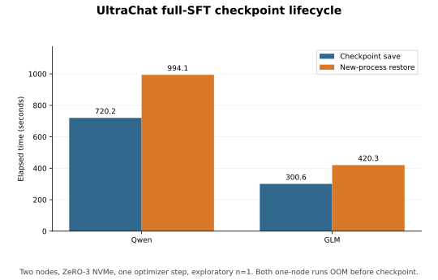

# 30B Results

30B Qwen과 GLM의 GPU 실행 결과, memory·checkpoint 측정과 framework 호환성 기록입니다.

이 문서는 두 층으로 나뉩니다.

| 층 | 범위 | 용도 |
| --- | --- | --- |
| [Controlled Results (2026-09-15)](#controlled-results-2026-09-15) | 하나의 commit, 같은 cohort·topology, cell마다 반복 측정 | **현재 판단 근거** |
| [Historical Results (through 2026-09-14)](#historical-results-through-2026-09-14) | 조건이 섞인 탐색 실행 | 배경과 실패 기록. 최신 표와 합쳐 비교하지 않음 |

## Controlled Results (2026-09-15)

Checkpoint·memory·recompute matrix는 commit `bee4520e05a04aaf48f8fe971a6b2a1726f6250b`의 깨끗한 worktree에서 실행했습니다.

**통제 변수** — 두 모델이 공유합니다.

| 항목 | 값 |
| --- | --- |
| Dataset | 같은 UltraChat revision |
| Topology | TP=1, PP=1, EP=2 |
| Precision | BF16 |
| Batch | micro 1 / global 2 |
| Seed | 42 |
| Attention | `transformer_engine` |
| Fine-tuning | attention-projection LoRA (`LORA_DIM=8`) |
| Checkpoint 위치 | node-local NVMe (NFS는 repository checkout에만 사용) |

**반복 규칙** — 비교 cell은 별도 warmup 또는 pilot 뒤 3회 측정했습니다.
Save-call rMAD가 10%를 넘으면 8회로 늘리기로 했지만 모든 checkpoint cell이 기준 이하여서 연장하지 않았습니다.

**측정하지 않은 것** — checkpoint가 node-local이므로 distributed restore는 이 matrix에 없습니다.

### Distributed checkpoint write

> **핵심**: async는 save API가 blocking하는 시간을 1/5\~1/6로 줄이지만, finalization까지 더한 **완료 시간** 이득은 Qwen 7.0%, GLM 19.0%에 그칩니다.

두 rank는 각자 node-local NVMe에 checkpoint shard를 씁니다.
sync는 `save()` 호출이 write를 기다리는 반면 async는 save를 queue에 넣고 반환한 뒤, 종료 전 blocking finalization이 남은 write를 기다립니다.
따라서 이 표는 restore나 storage throughput이 아니라 checkpoint API가 host를 막는 시간을 측정합니다.
세부 I/O 경로는 [Checkpoint and Memory I/O](checkpoint-io.md#io-paths)를 따릅니다.

Qwen과 GLM 각각 12/12 run을 통과했습니다.

| 열 | 의미 |
| --- | --- |
| 논리 크기 median | 두 rank의 checkpoint file logical byte 합을 run별로 구한 median |
| Save/enqueue median | 두 rank 중 긴 `save()` host 시간을 run별로 구한 median. sync에서는 write 대기 시간, async에서는 queue 반환 시간 |
| Finalize median | 두 rank 중 긴 blocking finalization 시간을 run별로 구한 median. sync에는 background write가 없어 `0.000 s` |
| 완료 median | 같은 run의 save/enqueue와 blocking finalization 합의 median |
| rMAD | Save/enqueue 시간의 상대 median absolute deviation: `median(|x - median(x)|) / median(x)`. 값이 작을수록 run 간 흔들림이 작음 |

sync/async `torch_dist`는 EP=2에서 save mode만 바꾼 비교입니다.
`fsdp_dtensor`는 Megatron FSDP의 DP=2 layout에서 DTensor checkpoint write가 되는지 확인하려고 실행했습니다.
이 행은 EP=2 `torch_dist`와 format뿐 아니라 EP=2 → EP=1, FSDP off → on이 함께 달라져 write 성능 비교 대상이 아닙니다.

#### Qwen

| Variant | 논리 크기 median | Save/enqueue median | Finalize median | 완료 median | rMAD |
| --- | ---: | ---: | ---: | ---: | ---: |
| sync `torch_dist`, EP2 | 10.64 MB | 1.045 s | 0.000 s | 1.046 s | 0.30% |
| async `torch_dist`, EP2 | 10.64 MB | 0.204 s | 0.769 s | 0.972 s | 2.15% |
| layout check: `torch_dist`, EP2 | 10.64 MB | 1.065 s | 0.000 s | 1.066 s | 1.38% |
| layout check: `fsdp_dtensor`, DP2 | 20.92 MB | 0.441 s | 0.000 s | 0.441 s | 2.21% |

#### GLM

| Variant | 논리 크기 median | Save/enqueue median | Finalize median | 완료 median | rMAD |
| --- | ---: | ---: | ---: | ---: | ---: |
| sync `torch_dist`, EP2 | 22.04 MB | 1.064 s | 0.000 s | 1.064 s | 0.92% |
| async `torch_dist`, EP2 | 22.04 MB | 0.173 s | 0.689 s | 0.862 s | 0.83% |
| layout check: `torch_dist`, EP2 | 22.04 MB | 1.063 s | 0.000 s | 1.064 s | 1.27% |
| layout check: `fsdp_dtensor`, DP2 | 43.14 MB | 0.410 s | 0.000 s | 0.410 s | 1.14% |

값 차이가 어디서 오는지:

- **Async 이득이 작은 이유**: async가 줄인 것은 enqueue 반환까지의 시간(Qwen 1.045 → 0.204 s)이고, 나머지는 `finalize`로 옮겨갔습니다(0.769 s). 합인 완료 시간은 1.046 → 0.972 s, 즉 7.0%입니다(GLM은 1.064 → 0.862 s로 19.0%).
- **`fsdp_dtensor` 행을 format 우열로 읽지 않는 이유**: 논리 크기가 `torch_dist`의 약 2배(Qwen 10.64 → 20.92 MB)이고 parallel layout도 달라 payload와 memory placement 자체가 다릅니다.
- **크기가 10\~43 MB인 이유와 한계**: 이 matrix는 optimizer를 제외한 LoRA checkpoint입니다. 이 정도 크기에서는 host scheduling·metadata·고정 I/O latency가 시간을 지배할 수 있으므로, async의 비율을 full-SFT나 더 큰 adapter checkpoint에 일반화할 수 없습니다.

Raw manifests: `results/refresh-distributed-{qwen|glm}-bee4520/manifest.json`

### Multi-step checkpoint impact

> **핵심**: checkpoint를 네 번 저장할 때 async는 학습 process가 checkpoint API 안에서 직접 기다린 시간을 Qwen 23.0%·GLM 15.3% 줄였습니다.
> 다만 이 결과만으로 전체 학습이 그만큼 빨라진다고 판단할 수는 없습니다.

앞 절의 1-step 실험은 한 번의 save가 host를 얼마나 오래 막는지 보여줍니다.
이 실험은 save를 반복하면 async write가 후속 학습 step과 겹치면서 대기 시간과 step 시간에 어떤 변화가 생기는지 확인합니다.

각 run은 optimizer step 8회를 수행하고 2 step마다 LoRA와 optimizer state를 저장해 checkpoint 4개를 만들었습니다.
sync는 각 save가 끝날 때까지 학습을 멈추고, async는 save를 queue에 넣은 뒤 학습을 계속하다가 blocking finalization에서 남은 write를 기다립니다.
앞의 2 step은 warmup으로 보고 steady-step 집계에서 제외했습니다.
각 모델은 별도 warmup run 2회와 측정 run 6회, 합계 8/8 run을 통과했습니다.

| Model | Variant | Checkpoint 4개 논리 크기 합 median | Save/enqueue 합 median | Finalize 대기 median | 직접 대기 합 median | Steady step median |
| --- | --- | ---: | ---: | ---: | ---: | ---: |
| Qwen | sync | 291.86 MB | 2.441 s | 0.000 s | 2.441 s | 3239.25 ms |
| Qwen | async | 291.86 MB | 1.119 s | 0.774 s | 1.881 s | 3304.50 ms |
| GLM | sync | 602.56 MB | 2.822 s | 0.000 s | 2.822 s | 3410.05 ms |
| GLM | async | 602.56 MB | 1.573 s | 0.818 s | 2.391 s | 3442.35 ms |

`직접 대기 합`은 네 번의 save/enqueue와 blocking finalization에서 학습 process가 기다린 시간의 합이며 run 전체 시간은 아닙니다.
같은 모델의 sync와 async가 저장한 논리 크기는 같으므로 동일한 payload를 비교했습니다.
async에서 steady-step median은 Qwen 2.0%·GLM 0.9% 길어졌지만, 이 작은 차이만으로 background I/O가 학습을 느리게 했다고 단정하지 않습니다.

이 실험으로는 **반복 저장 시 checkpoint 직접 대기가 줄었다**고 말할 수 있습니다.
8-step run은 이 대기 시간이 save와 후속 step 사이에서 어떻게 이동하는지 보는 짧은 실험이며, 장시간 학습의 end-to-end throughput은 보여주지 않습니다.
이를 판단하려면 같은 workload를 100 step 이상 실행해 전체 경과 시간과 step-time 분포를 sync/async로 비교해야 합니다.

Raw manifests: `results/refresh-checkpoint-impact-{qwen|glm}-bee4520/manifest.json`

### Transformer Engine memory

> **핵심**: 같은 attention backend에서 4096 → 8192 allocated 증가율은 Qwen 12.65%, GLM 12.75%로 사실상 같습니다. 길이 기울기는 모델 차이가 아닙니다.

두 모델 모두 length별 pilot 1회 + 측정 3회, 합계 8/8 run을 통과했습니다.
표는 측정 run마다 두 rank 중 큰 값을 취한 뒤의 median입니다.

| Model | Length | Peak allocated median | Peak reserved median |
| --- | ---: | ---: | ---: |
| Qwen | 4096 | 34.320 GiB | 40.738 GiB |
| Qwen | 8192 | 38.662 GiB | 48.500 GiB |
| GLM | 4096 | 34.537 GiB | 41.311 GiB |
| GLM | 8192 | 38.942 GiB | 49.859 GiB |

Raw manifests: `results/refresh-memory-te-{qwen|glm}-bee4520/manifest.json`

### Qwen recompute

> **핵심**: Megatron Qwen LoRA에서 selective recompute는 full recompute보다 step time을 26.8\~27.9% 줄이는 대신 peak allocated를 35.0\~62.9% 늘렸습니다.

Activation recomputation은 forward activation을 모두 저장하는 대신 backward에서 다시 계산해 CUDA memory를 아끼는 방법입니다.
Megatron Core의 full mode는 더 넓은 범위를 재계산해 느리지만 memory 사용량이 작고, selective mode는 재계산 범위를 줄여 빠르지만 더 많은 activation을 보관합니다.
이 실험은 sequence length가 늘어날 때 두 mode의 속도와 memory 차이가 어떻게 변하는지 비교합니다.

각 cell은 warmup 1회 + 측정 3회, 총 16/16 run을 통과했습니다.
표는 4-step run에서 첫 step을 제외한 median과 측정 run의 최대 CUDA peak입니다.

| Length | Recompute | Steady step median | Peak allocated max | Peak reserved max |
| ---: | --- | ---: | ---: | ---: |
| 2048 | full | 3148.1 ms | 32.150 GiB | 36.564 GiB |
| 2048 | selective | 2304.3 ms | 43.413 GiB | 46.270 GiB |
| 4096 | full | 6343.5 ms | 34.321 GiB | 39.990 GiB |
| 4096 | selective | 4572.3 ms | 55.905 GiB | 59.492 GiB |

trade-off가 길이에 따라 나빠집니다: 2048에서 selective의 메모리 비용은 +35.0%지만, 4096에서는 +62.9%(34.321 → 55.905 GiB)입니다.
시간 이득은 두 길이에서 비슷하지만(26.8%·27.9%) memory 비용은 길이에 따라 커지므로, selective mode는 충분한 memory 여유가 있을 때만 선택할 수 있습니다.

`full`·`selective`의 동작과 위 수치는 Megatron Bridge/Core, Transformer Engine, Qwen LoRA 조건에 한정됩니다.
Activation recomputation 자체는 다른 framework에도 있지만 mode의 범위와 비용은 구현마다 다르므로, 이 결과를 GLM·TRL·FSDP2·DeepSpeed에 그대로 적용할 수 없습니다.

Raw manifest: `results/refresh-recompute-qwen-bee4520/manifest.json`

### Full-SFT capacity

> **핵심**: 이 결과는 single-node 모델 비교가 아니라 **2노드 Qwen Megatron 파일럿**입니다.
> 사전 추정은 90.0 GiB/rank로 119 GiB 예산 안이었지만, 첫 optimizer step 전에 kernel OOM이 발생했습니다.

| 항목 | 조건과 결과 |
| --- | --- |
| 모델·backend | Qwen3-30B-A3B, Megatron |
| topology | 2노드, 노드당 1 rank, EP=2, DP=2 |
| 학습 조건 | full SFT, BF16, Transformer Engine, full recompute, sequence length 2048 |
| optimizer | distributed SGD, 1 step 예정 |
| 실제 결과 | FP32 main gradient 구성 중 OOM, optimizer step과 checkpoint 모두 0회 |

실행 계획, launcher 환경 변수, 런타임 설정 로그에서 모두 `sgd`를 확인했습니다.
하지만 parameter update 전에 실패했으므로 이 결과가 입증하는 것은 **SGD 설정이 Megatron에 전달됐다**는 것뿐이며, SGD 학습이 실제로 수행됐다는 뜻은 아닙니다.
TRL ZeRO-3 NVMe 실행에서 요청한 SGD가 `DeepSpeedCPUAdam`으로 대체된 문제와는 별개입니다.

추정기는 parameter·gradient·optimizer state와 activation을 계산하지만 CUDA context, allocator 단편화, framework workspace와 임시 buffer는 포함하지 않습니다.
실행은 FP32 main gradient buffer를 만들던 중 멈췄으므로, 90.0 GiB라는 `FITS` 판정만으로는 실행 가능성을 보장할 수 없습니다.
같은 설정을 반복하기 전에 FP32 main gradient를 포함해 setup peak를 줄이는 sharding topology를 확인해야 합니다.

별도의 TRL ZeRO-3 NVMe single-node 실험에서는 Qwen과 GLM 모두 checkpoint 전에 OOM이 발생했습니다.
조건과 2노드 결과는 [UltraChat Full-SFT Topology Comparison](#ultrachat-full-sft-topology-comparison-2026-09-14)에서 비교합니다.

Controller 로그: `results/refresh-full-sft-sgd-qwen-ed40ca7-cohort1/rank-0.log`

### Remaining experiments

| 순서 | 실험 | 실행 조건 |
| ---: | --- | --- |
| 1 | Full-SFT 재시도 | FP32 main gradient까지 shard하는 topology를 확인하고 다시 추정한 뒤 1-step pilot부터 |
| 2 | GLM recompute matrix | recompute를 모델 간 결론으로 써야 할 때만, 같은 4-cell을 3회 반복 |
| 3 | Async 장기 throughput | 운영 결정에 필요할 때만 100 step 이상 고정 workload 추가 |
| 4 | Distributed restore | shared checkpoint store가 생긴 뒤에만 계획 |

0.5B smoke, NFS checkpoint와 backend-mixed exploratory 결과는 이 통제 비교에 포함하지 않습니다.

## Historical Results (through 2026-09-14)

아래는 이전 조건에서 `build.py --execute`로 확인한 기록입니다.
Dataset·attention backend·반복 수가 위 통제 실험과 다르므로 최신 표와 합쳐 비교하지 않습니다.

### Verified Runs

TRL DDP(Qwen2.5-0.5B), TRL DeepSpeed ZeRO-3 NVMe offload(Qwen3-30B-A3B), Megatron(Qwen3-30B-A3B·GLM-4.7-Flash 각 1-step)에서 base/train/tuned 또는 train/tuned 평가가 모두 통과했습니다.
Megatron 두 모델은 node-local에 흩어진 `torch_dist` shard를 NFS 경로로 모아 iteration 1을 새 process로 재로딩하는 것까지 확인했습니다(NaN·skipped iteration 없음).
GLM은 UltraChat 일부 대화가 길어 `--max-length 2048`에서 실패한 뒤 4096으로 통과했습니다 — 길이 상한을 cohort 실제 분포보다 낮게 잡으면 이 실패가 재현됩니다.
개별 run의 loss 값 자체는 재사용 근거가 아니므로 보존하지 않습니다.

<a id="30b-gpu-results"></a>

### 30B GPU Results

2026-09-09에 commit `54a5fe0b69d168a86746d7de576d5dcae61c36b9`을 checkout하고 미커밋 변경이 없는 worktree에서 `spark1`·`spark2` GPU마다 process 하나를 실행했습니다.
**이 표는 1-step 실행 가능성만 보여주며 장기 안정성이나 학습 품질을 뜻하지 않습니다.**

Megatron 공통 조건:

| 항목 | 값 |
| --- | --- |
| Parallelism | TP=1, PP=1, EP=2, DP=2 |
| Precision | BF16 |
| Sequence length / global batch | 2048 / 2 |
| Fine-tuning | attention LoRA |

두 모델 모두 1 optimizer step과 평가, async `torch_dist` checkpoint를 완료했고 두 rank의 exit code가 모두 0임을 확인했습니다.

| Model | Train result | Peak allocated |
| --- | --- | --- |
| Qwen3-30B-A3B | loss `4.110986`, grad norm `15.480`, step `7.28 s` | `34.759 GiB` |
| GLM-4.7-Flash | loss `2.497179`, grad norm `7.883`, step `6.37 s` | `34.671 GiB` |

TRL: Qwen3-30B-A3B, 같은 precision·길이·batch와 attention LoRA.

| Backend | Train / eval loss | Peak allocated / reserved | Update evidence |
| --- | --- | --- | --- |
| DDP | `3.156563` / `2.587339` | `58.825 / 58.971 GiB` | sampled parameter delta가 0이 아님 |
| FSDP2 | `3.156250` / `2.566406` | `32.147 / 34.188 GiB` | optimizer step과 sharded checkpoint |

DDP와 FSDP2의 loss는 소수점 네 자리까지 사실상 같지만 peak allocated는 58.825 → 32.147 GiB로 45% 낮습니다.
DDP는 각 rank에 model·gradient·optimizer state replica를 유지하는 반면 FSDP2는 이를 두 rank에 shard하므로, 계속 점유하는 CUDA memory가 줄어듭니다.
감소율이 정확히 50%가 아닌 것은 activation과 일시적 all-gather buffer는 shard되지 않거나 순간적으로 추가되기 때문입니다.

같은 조건은 `experiments/megatron/{qwen3-30b-lora,glm-4.7-flash-30b-lora}.json`으로 재실행할 수 있습니다.
[Checkpoint and Memory Experiment](checkpoint-io.md#checkpoint-and-memory-experiment)는 같은 모델을 반복 측정한 별도 실험이므로, 이 표와 그쪽의 median은 서로 다른 run의 값입니다.

### NVMe and Full SFT

두 노드의 `/mnt/post-training`은 로컬 NVMe root filesystem에 있고 backend별 디렉터리에 `spark` 쓰기 권한이 있습니다.

- Megatron Qwen3-30B-A3B와 GLM-4.7-Flash LoRA는 로컬 NVMe에 데이터 cache와 로그를 쓰고, NFS의 공통 `torch_dist` checkpoint에서 iteration 1을 새 process로 재로딩해 `STAGE=all`을 완료했습니다(위 [Verified Runs](#verified-runs)와 동일 실행).
- Megatron은 NVMe를 native training state offload 대상으로 지원하지 않습니다. 따라서 이 결과는 **dataset cache와 checkpoint I/O 검증**입니다.

30B full SFT에서 각 경로가 막힌 이유:

| 경로 | 막힌 지점 |
| --- | --- |
| TRL DDP | parameter와 gradient가 unified memory 한도에 근접 |
| TRL FSDP2 | 설치된 Accelerate의 준비 과정이 sharding **전에** trainable BF16 parameter를 FP32로 승격 |
| TRL DeepSpeed ZeRO-3 + NVMe | **통과** — 2노드에서 Qwen과 GLM 모두 1 optimizer step, 별도 `tuned` 평가, 복구 가능한 native ZeRO checkpoint 확인 |

실패 원인은 dataset 전체 적재가 아닙니다.
기존 Qwen 검증 실행에서 두 노드 모두 `/mnt/post-training/trl/zero_stage_3` swap footprint가 약 256 GiB로 각 노드 물리 RAM 119 GiB보다 컸습니다 — NVMe offload 없이는 이 구성이 노드 RAM만으로 성립하지 않는다는 근거이며, 자세한 수치와 한계는 [30B NVMe 실습](../../labs/nvme-30b/README.md#why-nvme-offload-is-necessary)을 따릅니다.

#### UltraChat Full-SFT Topology Comparison (2026-09-14)

> **핵심**: 같은 full-SFT 조건에서 1-node는 두 모델 모두 checkpoint 전에 kernel OOM, 2-node는 두 모델 모두 통과했습니다. 노드 수가 성패를 가릅니다.

공통 조건: UltraChat revision `8049631c405ae6576f93f445c6b8166f76f5505a`, length 512, train/eval 4/1, BF16, AdamW, ZeRO-3 NVMe, 1 optimizer step.
2-node restore는 학습 process 종료 후 새 `tuned` process가 model skeleton과 DeepSpeed engine을 준비하고 native checkpoint를 적용할 때까지의 end-to-end elapsed time입니다.

| Model | 1-node | 2-node | Checkpoint / save | New-process restore | 2-node min `MemAvailable` / peak swap |
| --- | --- | --- | ---: | ---: | ---: |
| Qwen3-30B-A3B | OOM before checkpoint | Passed | 451.7 GiB / 720.2 s | 994.1 s | 24.6 GiB / 3.15 GiB |
| GLM-4.7-Flash | OOM before checkpoint | Passed | 167.3 GiB / 300.6 s | 420.3 s | 25.5 GiB / 0.57 GiB |



- **1-node가 실패한 이유**: Qwen은 `MemAvailable` 0과 swap 16.0 GiB, GLM은 0.13 GiB와 swap 16.0 GiB에 도달한 뒤 kernel OOM으로 종료됐습니다. checkpoint와 restore 값이 없는 것은 그 때문입니다.
- **2-node를 유효로 본 근거**: Qwen은 restore 중 peak swap이 시작값 0.56 GiB보다 높아졌지만 최소 `MemAvailable`이 24.6 GiB였고 restore와 finite eval을 완료했습니다. GLM의 peak swap은 시작값과 같아 측정 중 swap 증가가 없었습니다.
- **Qwen과 GLM의 시간 차(720.2 s 대 300.6 s)는 checkpoint 크기 차(451.7 GiB 대 167.3 GiB)와 같은 방향**이며, 이 표만으로 모델별 I/O 효율을 판정하지 않습니다.

Raw 결과:

| 대상 | 경로 |
| --- | --- |
| Qwen 2-node | `results/trl-ultrachat-fullsft-2node-20260914` |
| GLM 2-node (실패·성공) | `results/trl-ultrachat-glm-fullsft-2node-20260914`, `results/trl-ultrachat-glm-fullsft-2node-retry1-20260914` |
| 1-node 실패 | `results/single-node-io-{qwen,glm}-zero3-full-*-20260914` |

GLM은 첫 2-node 시도가 stale `zero_stage_3` 파일 누락으로 실패해, 해당 임시 경로를 비우고 재실행한 결과입니다.
고정 NVMe root를 쓰는 `deepspeed-zero3-nvme.json`은 이전 process의 `zero_stage_3`가 남아 있으면 다음 실행과 충돌하므로, 동시 실행하지 않고 비활성 상태를 확인한 뒤 임시 offload 경로를 정리합니다.

## Qwen and GLM Comparison

이 절은 위 [통제 matrix](#controlled-results-2026-09-15)에서 두 모델에 같은 topology와 Transformer Engine을 적용한 결과만 비교합니다.

<a id="sequence-length-기울기"></a>

### Sequence Length with the Same Attention Backend

> **핵심**: sequence length를 4096에서 8192로 늘렸을 때 peak allocated 증가율은 Qwen 12.65%, GLM 12.75%로 거의 같습니다.

| Model | Length 4096 | Length 8192 | 증가율 |
| --- | ---: | ---: | ---: |
| Qwen | 34.320 GiB | 38.662 GiB | 12.65% |
| GLM | 34.537 GiB | 38.942 GiB | 12.75% |

두 행은 모두 `TRANSFORMER_IMPL=transformer_engine`, BF16, TP=1·PP=1·EP=2와 같은 batch 조건을 사용합니다.
따라서 이 범위에서는 모델보다 effective attention backend를 먼저 맞추는 것이 중요합니다.
이 결과는 4096→8192 구간의 기울기가 유사하다는 뜻이며, 다른 backend·길이·batch·recompute에서도 같다는 보장은 아닙니다.

### Checkpoint Comparison

> **핵심**: 같은 `LORA_DIM=8`이어도 GLM은 Qwen보다 trainable parameter가 2.057배 많고 checkpoint도 2.07배 큽니다.

| Model | Attention LoRA target | Trainable parameter | Checkpoint 크기 |
| --- | --- | ---: | ---: |
| Qwen | Fused QKV + output projection | 5,111,808 (0.0319%) | 10.64 MB |
| GLM | Q/KV down·up + output projection | 10,515,968 (0.0700%) | 22.04 MB |

`LORA_DIM`은 각 LoRA 행렬의 rank만 정합니다.
실제 trainable parameter 수는 target module의 개수와 shape에도 좌우되며, `backends/megatron/megatron_lab/config.py`는 모델 family에 맞는 target을 선택합니다.

여기서는 target 차이로 trainable parameter가 2.057배 늘고 checkpoint도 거의 같은 비율로 커졌습니다.
이는 [Qwen LoRA ratio 실험](checkpoint-io.md#lora-ratio-and-checkpoint-io)의 "고정 target에서 trainable parameter 수와 checkpoint 크기가 거의 비례한다"는 결과와도 맞습니다.
GLM은 여러 LoRA rank를 sweep하지 않았으므로, 다른 rank·target·저장 형식까지 같은 비율이라고 일반화하지 않습니다.

**실무에서는 두 모델에 같은 `LORA_DIM`을 주기보다 실제 trainable 비율을 맞춰야 합니다.**

### What the Comparison Shows

| 비교 항목 | 확인한 것 | 이 결과만으로 말할 수 없는 것 |
| --- | --- | --- |
| Sequence length memory | 같은 Transformer Engine에서 두 모델의 4096→8192 증가율이 약 12.7%로 유사 | 다른 attention backend·길이·batch에서의 증가율 |
| LoRA checkpoint | GLM의 target 구성은 같은 rank에서도 더 많은 trainable parameter와 더 큰 checkpoint를 만듦 | 모델별 checkpoint writer나 storage 효율의 우열 |
| Async save | 두 모델 모두 save API의 host blocking 시간이 감소 | 장기 학습의 end-to-end throughput 향상 |

모델을 비교할 때는 설정 이름뿐 아니라 effective attention backend, LoRA target과 trainable 비율, optimizer, checkpoint format과 집계 범위를 함께 맞춥니다.

## Repeated Megatron Measurements

`experiments/benchmarks.py`는 [benchmark plan](../../experiments/megatron/benchmark-plan.json)의 cell·variant를 읽어 Qwen2.5-0.5B와 No Robots를 고정한 A/B 비교를 수행합니다.
여기서 얻은 시간·메모리 차이를 30B 성능으로 일반화하지 않습니다.
이 절은 **smoke 도구 설명**이며 현재 30B 결과에는 사용하지 않습니다(30B recompute는 위 [전용 matrix](#qwen-recompute)에서 완결).

기본 계획은 8개 cell, variant별 4회 측정과 별도 warmup입니다.
길이 비교는 `MAX_LENGTH` 상한만 바꾸지 않고 고정 길이 padding을 씁니다.

```bash
python experiments/benchmarks.py \
  --setup setups/spark/local.json \
  --output results/benchmarks-16x2 \
  --steps 16 --repeats 2 --within-run-warmup 4 \
  --checkpoint-intervals 4 8 \
  --execute
```

이 축소 계획은 warmup 포함 48개 run을 선택하고 첫 4개 within-run step을 측정에서 제외합니다.

- Cell 이름의 checkpoint interval 16/32는 유지되지만 **실제 interval은 인자의 4/8**이므로 run config를 기준으로 해석합니다.
- `--plan`으로 계획을, `--timeout`으로 개별 실행 제한을 바꿉니다. 실패한 variant의 후속 반복은 생략될 수 있습니다.
- `--execute` 없이 같은 인자로 먼저 계획을 확인합니다.
