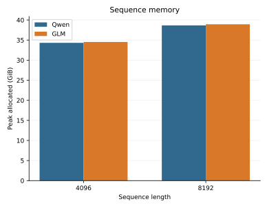
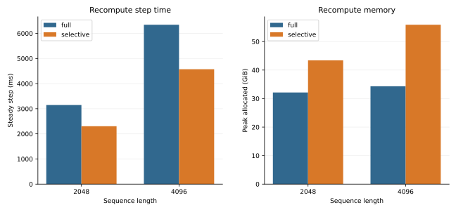
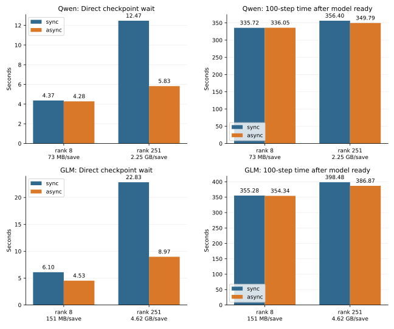
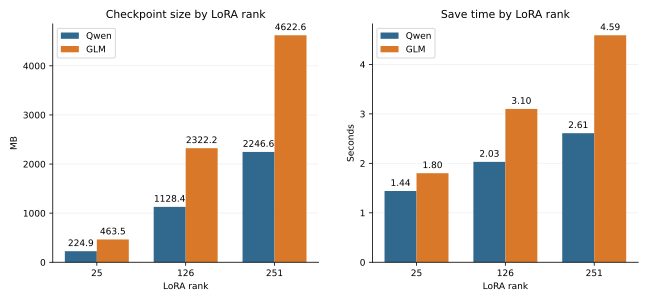

# 30B 실측 결과

이 문서는 현재 유지하는 30B 실험의 실측값을 기록하는 단일 기준입니다.
지원 여부와 실행법은 [Experiments](../experiments.md)를 따르며, 여기서는 비교 조건과 결과만 보존합니다.

## TRL full SFT checkpoint

Qwen과 GLM을 각각 2노드에서 BF16, AdamW, DeepSpeed ZeRO-3 parameter·optimizer NVMe offload로 1 optimizer step 학습한 성공 run입니다.
두 run은 UltraChat revision `8049631c405ae6576f93f445c6b8166f76f5505a`, max length 512, train/eval sample 4/1을 사용했으며 각각 1회 측정값입니다.

| Model | Rank 0 node-local logical size | Save elapsed |
| --- | ---: | ---: |
| Qwen3-30B-A3B | 451.7 GiB (484,990,956,789 bytes) | 720.2 s |
| GLM-4.7-Flash | 167.3 GiB (179,681,022,652 bytes) | 300.6 s |

Logical size는 rank 0의 node-local `<OUTPUT_DIR>/model`에서 파일 크기를 합산한 값이며, 두 노드의 shard를 합친 cluster-wide 크기가 아닙니다.
Save elapsed는 rank 0에서 `trainer.save_model()` 전체를 감싼 wall-clock 시간이므로 serialization·DeepSpeed 협조·local NVMe write를 포함하며, SSD 순수 write latency나 throughput으로 해석하지 않습니다.

## Megatron LoRA 공통 조건

| 항목 | 값 |
| --- | --- |
| 모델 | Qwen3-30B-A3B, GLM-4.7-Flash |
| 데이터 | 같은 UltraChat revision과 고정 cohort |
| 토폴로지 | 2노드, 노드당 1 process, TP=1, PP=1, EP=2 |
| 정밀도·batch | BF16, micro batch 1, global batch 2 |
| 학습 | attention-projection LoRA, 기본 `LORA_DIM=8`(ratio sweep만 변경), seed 42 |
| attention | `transformer_engine` |
| checkpoint | rank별 node-local NVMe |
| 반복 | 비교 variant별 warmup 또는 pilot 1회 뒤 측정 3회 |

표의 memory는 run마다 두 rank 중 큰 값을 취해 집계했습니다.
Checkpoint 크기는 두 rank의 최신 shard logical byte 합이며, 시간은 두 rank 중 긴 host 시간을 사용합니다.

## Sequence memory

같은 attention backend에서 sequence length를 4096에서 8192로 늘리면 peak allocated는 Qwen 12.65%, GLM 12.75% 증가했습니다.

| Model | Length | Peak allocated median (GiB) | Peak reserved median (GiB) |
| --- | ---: | ---: | ---: |
| Qwen | 4096 | 34.320 | 40.738 |
| Qwen | 8192 | 38.662 | 48.500 |
| GLM | 4096 | 34.537 | 41.311 |
| GLM | 8192 | 38.942 | 49.859 |



## Recompute

Selective recompute는 full보다 steady step이 Qwen에서 26.8\~27.9%, GLM에서 11.7\~13.5% 짧았습니다.
반면 peak allocated는 Qwen에서 35.0\~62.9%, GLM에서 39.9\~72.7% 컸습니다.
Steady step은 4-step run의 첫 step을 제외한 median이고, memory는 측정 run 전체의 최댓값입니다.

| Model | Length | Mode | Steady step median (ms) | Peak allocated max (GiB) | Peak reserved max (GiB) |
| --- | ---: | --- | ---: | ---: | ---: |
| Qwen | 2048 | full | 3148.1 | 32.150 | 36.564 |
| Qwen | 2048 | selective | 2304.3 | 43.413 | 46.270 |
| Qwen | 4096 | full | 6343.5 | 34.321 | 39.990 |
| Qwen | 4096 | selective | 4572.3 | 55.905 | 59.492 |
| GLM | 2048 | full | 3369.4 | 32.337 | 36.902 |
| GLM | 2048 | selective | 2974.4 | 45.249 | 46.959 |
| GLM | 4096 | full | 8280.5 | 34.538 | 41.309 |
| GLM | 4096 | selective | 7163.5 | 59.635 | 62.613 |



## Async checkpoint scaling

Qwen·GLM 100-step run에서 10 step마다 checkpoint를 저장하고, LoRA rank 8과 251의 sync·async를 각각 3회 측정했습니다.
`Post-ready`는 rank별 stage 시간에서 model-ready 시간을 뺀 뒤 큰 값을 run 대표값으로 삼은 median입니다.
`Direct wait`는 각 run의 save/enqueue와 종료 전 blocking finalization을 더한 값의 median입니다.
각 시간 열은 run별로 따로 median을 구하므로 열끼리 정확히 더해지지 않을 수 있습니다.

| Model | LoRA rank | Trainable (%) | Mode | Checkpoint 10개 합 (GB) | Save/enqueue 합 (s) | Finalize (s) | Direct wait (s) | Post-ready (s) | Steady step (ms) | Save rMAD (%) |
| --- | ---: | ---: | --- | ---: | ---: | ---: | ---: | ---: | ---: | ---: |
| Qwen | 8 | 0.0319 | sync | 0.730 | 4.365 | 0.000 | 4.365 | 335.723 | 3219.85 | 0.12 |
| Qwen | 8 | 0.0319 | async | 0.730 | 3.515 | 0.765 | 4.280 | 336.050 | 3226.20 | 0.23 |
| Qwen | 251 | 0.9998 | sync | 22.468 | 12.474 | 0.000 | 12.474 | 356.404 | 3339.25 | 0.88 |
| Qwen | 251 | 0.9998 | async | 22.468 | 4.296 | 1.566 | 5.830 | 349.785 | 3335.35 | 1.13 |
| GLM | 8 | 0.0655 | sync | 1.506 | 6.097 | 0.000 | 6.098 | 355.279 | 3402.90 | 0.80 |
| GLM | 8 | 0.0655 | async | 1.506 | 3.805 | 0.740 | 4.526 | 354.341 | 3402.90 | 1.13 |
| GLM | 251 | 2.0141 | sync | 46.226 | 22.834 | 0.000 | 22.834 | 398.483 | 3664.80 | 1.35 |
| GLM | 251 | 2.0141 | async | 46.226 | 6.305 | 2.666 | 8.972 | 386.873 | 3672.55 | 0.98 |



Qwen rank 8에서 async는 direct wait를 1.9% 줄였지만 post-ready는 0.10%, steady step은 0.20% 길어 실질적인 이득이 없었습니다.
Qwen rank 251에서는 direct wait가 53.3%, post-ready가 1.86% 줄었습니다.
GLM rank 8에서는 direct wait가 25.8%, post-ready가 0.26% 줄었고 steady step은 같았습니다.
GLM rank 251에서는 direct wait가 60.7%, post-ready가 2.91% 줄었으며 steady step은 0.21% 길었습니다.
Async 효과는 checkpoint가 커지면 나타났지만 compute가 전체 시간을 지배하므로 direct wait 감소가 그대로 end-to-end 개선율이 되지는 않았습니다.

같은 matrix를 다시 실행할 때는 preset의 100-step·3회 반복·interval 10 기본값을 사용합니다.

```bash
python experiments/checkpoint_memory_30b.py \
  --setup setups/spark/local.json \
  --model qwen \
  --plan experiments/megatron/async-checkpoint-scale-30b.json \
  --output results/async-checkpoint-scale-30b \
  --execute
```

## LoRA ratio

같은 LoRA rank 25·126·251을 적용했을 때 rank 25에서 251로 늘리면 checkpoint 크기는 Qwen 9.99배, GLM 9.97배가 됐습니다.
Save 시간은 Qwen 1.81배, GLM 2.55배가 됐습니다.
Trainable 비율의 분모는 전체 모델이 아니라 Megatron 로그의 rank-local shard입니다.
Ratio label은 Qwen의 목표 비율이며 GLM은 같은 rank에서 실제 trainable 비율이 더 큽니다.

| Model | Ratio label | LoRA rank | Measured trainable (%) | Checkpoint median (MB) | Save median (s) | Save rMAD (%) |
| --- | --- | ---: | ---: | ---: | ---: | ---: |
| Qwen | 0.1% | 25 | 0.0996 | 224.9 | 1.44 | 2.10 |
| Qwen | 0.5% | 126 | 0.5019 | 1128.4 | 2.03 | 0.13 |
| Qwen | 1.0% | 251 | 0.9998 | 2246.6 | 2.61 | 0.60 |
| GLM | 0.1% | 25 | 0.2043 | 463.5 | 1.80 | 0.13 |
| GLM | 0.5% | 126 | 1.0213 | 2322.2 | 3.10 | 0.53 |
| GLM | 1.0% | 251 | 2.0141 | 4622.6 | 4.59 | 1.39 |



그래프는 위 표를 직접 읽어 그립니다.
다시 만들려면 `python experiments/plot_measured_results.py`를 실행합니다.

## 해석 범위

- Full SFT는 1-step 실행 가능성과 checkpoint save를 확인한 것으로 장기 수렴이나 품질을 뜻하지 않습니다.
- LoRA 결과는 짧은 run의 기술적 비교이며 장기 수렴, 품질 또는 full SFT 성능을 뜻하지 않습니다.
- 서로 다른 절의 값은 표에 명시한 조건이 같을 때만 비교합니다.
- Checkpoint는 node-local save만 측정했습니다. Shared storage가 없으므로 distributed restore·resume은 측정하지 않았습니다.
- 로컬 원본은 full SFT의 `results/trl-ultrachat-fullsft-2node-20260914/summary-train.json`, `results/trl-ultrachat-glm-fullsft-2node-retry1-20260914/summary-train.json`과 LoRA의 `results/refresh-memory-te-{qwen,glm}-bee4520/manifest.json`, `results/refresh-recompute-qwen-bee4520/manifest.json`, `results/lora-ratio-checkpoint-io/manifest.json`, `results/qwen-async-sync-100step-3x-2b2002c/manifest.json`, `results/qwen-async-sync-rank251-100step-3x-2b2002c/manifest.json`, `results/glm-recompute-54be3ee/manifest.json`, `results/glm-lora-ratio-54be3ee/manifest.json`, `results/glm-async-sync-100step-3x-68091dd/manifest.json`입니다. `results/`는 Git에 포함하지 않으며 추적되는 기준은 이 문서의 표입니다.
