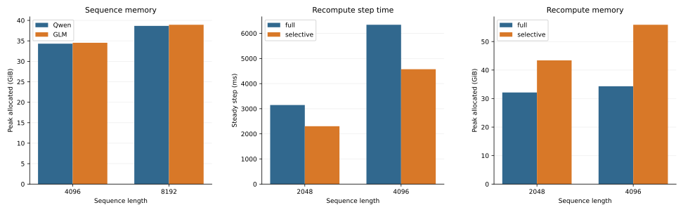
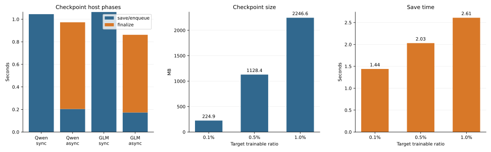

# 30B 실측 결과

이 문서는 현재 유지하는 Megatron 30B LoRA 실험의 실측값을 기록하는 단일 기준입니다.
지원 여부와 실행법은 [Experiments](../experiments.md)를 따르며, 여기서는 비교 조건과 결과만 보존합니다.

## 공통 조건

| 항목 | 값 |
| --- | --- |
| 모델 | Qwen3-30B-A3B, GLM-4.7-Flash |
| 데이터 | 같은 UltraChat revision과 고정 cohort |
| 토폴로지 | 2노드, 노드당 1 process, TP=1, PP=1, EP=2 |
| 정밀도·batch | BF16, micro batch 1, global batch 2 |
| 학습 | attention-projection LoRA, 기본 `LORA_DIM=8`(ratio sweep만 변경), seed 42 |
| attention | `transformer_engine` |
| checkpoint | rank별 node-local NVMe |
| 반복 | cell별 pilot 1회 뒤 측정 3회 |

표의 memory는 run마다 두 rank 중 큰 값을 취해 집계했습니다.
Checkpoint 크기는 두 rank의 최신 shard logical byte 합이며, 시간은 두 rank 중 긴 host 시간을 사용합니다.

## Sequence memory

같은 attention backend에서 sequence length를 4096에서 8192로 늘리면 peak allocated는 Qwen 12.65%, GLM 12.75% 증가했습니다.

| Model | Length | Peak allocated median (GiB) | Peak reserved median (GiB) |
| --- | ---: | ---: | ---: |
| Qwen | 4096 | 34.320 | 40.738 |
| Qwen | 8192 | 38.662 | 48.500 |
| GLM | 4096 | 34.537 | 41.311 |
| GLM | 8192 | 38.942 | 49.859 |

## Recompute

Qwen에서 selective recompute는 full보다 steady step이 26.8~27.9% 짧았지만 peak allocated는 35.0~62.9% 컸습니다.
Steady step은 4-step run의 첫 step을 제외한 median이고, memory는 측정 run 전체의 최댓값입니다.

| Length | Mode | Steady step median (ms) | Peak allocated max (GiB) | Peak reserved max (GiB) |
| ---: | --- | ---: | ---: | ---: |
| 2048 | full | 3148.1 | 32.150 | 36.564 |
| 2048 | selective | 2304.3 | 43.413 | 46.270 |
| 4096 | full | 6343.5 | 34.321 | 39.990 |
| 4096 | selective | 4572.3 | 55.905 | 59.492 |

## Node-local checkpoint

`LORA_DIM=8`에서 async는 `save()` 반환 시간을 줄였지만 남은 write를 finalization에서 기다렸습니다.
따라서 완료 시간 감소는 Qwen 7.0%, GLM 19.0%였으며, 이 값은 restore 시간이나 storage bandwidth가 아닙니다.

| Model | Mode | Logical size median (MB) | Save/enqueue median (s) | Finalize median (s) | Completion median (s) | Save rMAD (%) |
| --- | --- | ---: | ---: | ---: | ---: | ---: |
| Qwen | sync | 10.64 | 1.045 | 0.000 | 1.046 | 0.30 |
| Qwen | async | 10.64 | 0.204 | 0.769 | 0.972 | 2.15 |
| GLM | sync | 22.04 | 1.064 | 0.000 | 1.064 | 0.92 |
| GLM | async | 22.04 | 0.173 | 0.689 | 0.862 | 0.83 |

## LoRA ratio

Qwen의 고정 target module에서 trainable 비율을 약 10배 늘리면 checkpoint 크기는 9.99배, save 시간은 1.81배가 됐습니다.
Trainable 비율의 분모는 전체 모델이 아니라 Megatron 로그의 rank-local shard입니다.

| Target ratio | LoRA rank | Measured trainable (%) | Checkpoint median (MB) | Save median (s) | Save rMAD (%) |
| --- | ---: | ---: | ---: | ---: | ---: |
| 0.1% | 25 | 0.0996 | 224.9 | 1.44 | 2.10 |
| 0.5% | 126 | 0.5019 | 1128.4 | 2.03 | 0.13 |
| 1.0% | 251 | 0.9998 | 2246.6 | 2.61 | 0.60 |

그래프는 위 표를 직접 읽어 그립니다.
다시 만들려면 `python experiments/plot_measured_results.py`를 실행합니다.

## 해석 범위

- 모든 결과는 짧은 LoRA run의 기술적 비교이며 장기 수렴, 품질 또는 full SFT 성능을 뜻하지 않습니다.
- 서로 다른 절의 값은 표에 명시한 조건이 같을 때만 비교합니다.
- Checkpoint는 node-local save만 측정했습니다. Shared storage가 없으므로 distributed restore·resume은 측정하지 않았습니다.
- 로컬 원본은 `results/refresh-{distributed,memory-te}-{qwen,glm}-bee4520/manifest.json`, `results/refresh-recompute-qwen-bee4520/manifest.json`, `results/lora-ratio-checkpoint-io/manifest.json`입니다. `results/`는 Git에 포함하지 않으며 추적되는 기준은 이 문서의 표입니다.
