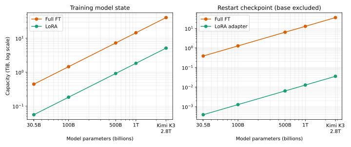

# Scaling Estimates: 30B to Kimi K3 2.8T

이 문서는 동일한 dtype과 optimizer 가정을 30.5B\~2.8T 모델에 적용해 학습 state와 checkpoint에 필요한 **용량의 규모**를 계산합니다.
QLoRA와 100B\~2.8T 수치는 실행 결과나 GPU 구매·배치 수량이 아니라 초기 계획을 위한 추정값이며, 실제 지원 상태는 [Experiments](../experiments.md#support-status)를 따릅니다.
여기서 [QLoRA](https://arxiv.org/abs/2305.14314)는 4-bit frozen base 위에서 LoRA adapter를 학습하는 방식이며 full SFT와 학습 대상이 다릅니다.

> **핵심**: full FT는 parameter당 16 bytes, LoRA는 BF16 base 2 bytes와 adapter state, QLoRA는 4-bit base 0.5 bytes와 같은 adapter state를 가정합니다.
> 1T 학습 state는 각각 14.55 TiB, 1877.5 GiB, 480.6 GiB입니다.
> Kimi K3 2.8T에서는 각각 40.75 TiB, 5.13 TiB, 1.31 TiB입니다.

## 가정

두 변수만 사용합니다.

- `P`: 전체 base parameter 수
- `f=0.001`: base 대비 추가 adapter parameter 비율(0.1%)

여기서 `f`는 전체 모델을 기준으로 한 계산용 가정입니다.
앞선 LoRA sweep의 **rank-local shard 기준 비율과는 분모가 다릅니다.**

Parameter 하나가 차지하는 용량은 다음과 같이 가정합니다.

| 저장 항목 | 가정한 bytes/parameter |
| --- | ---: |
| BF16 weight | 2 |
| 4-bit weight | 0.5 |
| BF16 gradient | 2 (학습 대상만) |
| FP32 master weight + Adam 1차·2차 moment | 12 (학습 대상만) |

이 값을 Full FT, LoRA와 QLoRA에 적용하면 다음 공식이 됩니다.

| 방식 | 학습 중 model state | 배포용 weight | 재시작용 checkpoint |
| --- | ---: | ---: | ---: |
| Full FT | `16P` | `2P` | `14P` |
| LoRA | `2P + 16fP` | `2fP` | `14fP` |
| QLoRA | `0.5P + 16fP` | `2fP` | `14fP` |

학습 중 model state에는 weight, 학습 대상의 gradient와 optimizer state가 포함됩니다.
Checkpoint에는 gradient를 저장하지 않으며, 재시작용 checkpoint에는 weight와 optimizer state를 포함합니다.
LoRA와 QLoRA adapter checkpoint는 frozen base를 포함하지 않으므로 base model의 revision과 가중치를 별도로 보존해야 합니다.
QLoRA의 0.5 bytes는 순수 4-bit weight만 계산한 하한으로 quantization metadata와 runtime 임시 buffer를 제외합니다.

12 bytes는 Adam moment만의 크기가 아니라 **master weight를 포함한 이 저장 방식의 가정**입니다.
Framework의 gradient dtype·master copy·optimizer state 저장 정책에 따라 달라집니다.

## State와 checkpoint 용량

> **표에서 바로 읽을 결론**: Full FT는 100B부터 학습 state가 1.46 TiB, 재시작용 checkpoint가 1.27 TiB입니다.
> 1T에서는 각각 14.55 TiB와 12.73 TiB까지 늘어납니다.
> LoRA와 QLoRA는 adapter checkpoint 크기가 같지만, 학습 중 frozen base는 각각 BF16과 4-bit로 유지합니다.

아래 값은 모든 rank에 분산하기 전 **전체 모델의 합계**이며, rank당 크기나 실제 peak memory가 아닙니다.
Metadata·padding·중복 저장은 제외합니다.

| 모델 규모 | Full FT 학습 state | LoRA 학습 state | QLoRA 학습 state | Full-state checkpoint | Adapter weights | Adapter + Adam checkpoint |
| --- | ---: | ---: | ---: | ---: | ---: | ---: |
| 30.5B (anchor) | 0.44 TiB | 57.3 GiB | 14.7 GiB | 0.39 TiB | 0.06 GiB | 0.40 GiB |
| 100B | 1.46 TiB | 187.8 GiB | 48.1 GiB | 1.27 TiB | 0.19 GiB | 1.30 GiB |
| 500B | 7.28 TiB | 938.8 GiB | 240.3 GiB | 6.37 TiB | 0.93 GiB | 6.52 GiB |
| 1T | 14.55 TiB | 1877.5 GiB | 480.6 GiB | 12.73 TiB | 1.86 GiB | 13.04 GiB |
| Kimi K3 2.8T | 40.75 TiB | 5.13 TiB | 1.31 TiB | 35.65 TiB | 5.22 GiB | 36.51 GiB |

그래프는 위 공식에서 생성하며 두 축 모두 로그 척도입니다.
다시 만들려면 `python experiments/plot_scaling_estimates.py`를 실행합니다.

1T의 배포용 LoRA weight는 약 **1.86 GiB**, 재시작용 LoRA+Adam checkpoint는 **13.04 GiB**입니다.
Full FT의 재시작용 checkpoint 12.73 TiB와 비교하면 약 1,000배 작지만, 별도로 보존해야 하는 BF16 base 1.82 TiB 또는 순수 4-bit base 하한 465.7 GiB는 이 값에 포함되지 않습니다.

## Kimi K3 on B300 GPU nodes

[Kimi K3](https://huggingface.co/moonshotai/Kimi-K3)는 전체 2.8T, token당 활성 104B parameter를 사용하는 MXFP4 MoE 모델입니다.
활성 parameter 수는 연산량에 영향을 주지만 serving할 때는 전체 weight를 GPU에 적재해야 합니다.

GPU node 하나는 [NVIDIA HGX B300](https://docs.nvidia.com/enterprise-reference-architectures/whitepaper/hgx-servers-and-spectrum-x.pdf)의 B300 8장, 명목 GPU memory 2.304 TB로 정의합니다.
[vLLM Kimi K3 recipe](https://github.com/vllm-project/recipes/blob/main/models/moonshotai/Kimi-K3.yaml)의 `gpu-memory-utilization=0.95`를 적용하면 계산에 사용하는 node당 용량은 2.1888 TB입니다.

`N`개 node의 합산 용량과 이론적 최소 node 수는 다음 식으로 계산합니다.

- 합산 용량: `N × 8 × 288 GB × 0.95`
- 최소 node 수: `ceil(required state / 2.1888 TB)`

| Kimi K3 시나리오 | 계산 | 필요 용량 | 최소 B300×8 node 수 |
| --- | ---: | ---: | ---: |
| MXFP4 inference | `0.5P × 1.2` | 1.6800 TB | 1 |
| QLoRA, `f=0.1%` | `0.5P + 16fP` | 1.4448 TB | 1 |
| LoRA, `f=0.1%` | `2P + 16fP` | 5.6448 TB | 3 |
| Full FT | `16P` | 44.8000 TB | 21 |

Inference의 20% headroom은 vLLM recipe와 같은 weight 용량 추정이며, B300 8장 TP=8 단일 node 실행은 [vLLM 가이드](https://github.com/vllm-project/vllm-project.github.io/blob/main/_posts/2026-07-27-k3.md)에 제시된 구성입니다.
반면 QLoRA·LoRA·Full FT 행은 activation, KV cache, framework workspace와 통신 buffer를 제외한 sharding 하한이며 이 저장소에서 구현하거나 GPU로 검증한 구성이 아닙니다.
`N>1`은 하나의 분산 replica, node별 TP=8 replica 또는 prefill/decode 분리로 사용할 수 있으므로 node 수만으로 처리량을 추정하지 않습니다.

## 이상적인 sharding 하한

> **표를 읽는 법**: 100B Full FT의 `119 GiB/device = 13`은 완벽하게 분할해도 최소 13개 device가 필요하다는 뜻입니다.
> 13개로 실제 실행할 수 있다거나 13개를 구매해야 한다는 뜻은 아닙니다.

표는 Full FT 학습 state `16P`를 모든 device에 똑같이 나누고, 각 device의 전체 예산을 model state에만 쓸 수 있다고 가정한 **이론적 최소 device 수**입니다.
계산식은 `ceil(16P / device budget)`입니다.

| 모델 규모 | 119 GiB/device 예산 | 80 GB/device 예산 | 141 GB/device 예산 |
| --- | ---: | ---: | ---: |
| 30.5B | 4 | 7 | 4 |
| 100B | 13 | 20 | 12 |
| 500B | 63 | 100 | 57 |
| 1T | 126 | 200 | 114 |
| Kimi K3 2.8T | 351 | 560 | 318 |

실제 실행에는 activation·workspace·통신 buffer와 분할되지 않는 상태가 더 필요하므로 device 수는 이 하한보다 많아집니다.
DDP는 각 device에 상태를 복제하므로 이 계산을 적용할 수 없고, sharding 방식도 topology와 분할 단위에 따라 효율이 달라집니다.

## 추정의 한계

이 계산은 model state의 크기를 비교하기 위한 하한이며, 실제 실행 가능성에는 다음 항목이 더 필요합니다.

| 계산에서 빠지거나 달라지는 항목 | 실제 영향 |
| --- | --- |
| Activation, MoE routing·communication buffer, framework workspace | Sequence length, batch와 구현에 따라 추가 memory가 필요함 |
| CUDA context, allocator 단편화와 임시 buffer | 초기화나 첫 step의 peak가 표보다 커질 수 있음 |
| Gradient dtype, master copy와 optimizer 저장 정책 | Framework 설정에 따라 bytes/parameter가 달라짐 |
| Device에 표시된 전체 memory | Spark의 119 GiB처럼 CPU와 공유하면 GPU 전용 예산으로 모두 쓸 수 없음 |

Sequence length와 attention 구현의 영향은 일정하지 않으므로 한 측정값을 모든 모델 규모에 같은 배수로 적용하지 않습니다.
따라서 표의 수치나 최소 device 수는 실행 여부가 아니라 후보 구성을 거르는 기준으로만 사용합니다.
실행 가능성은 실제 target module·optimizer·attention·sharding 설정으로 [메모리를 다시 추정](../../experiments/estimate_memory.py)하고, 초기화부터 checkpoint까지 포함한 작은 pilot으로 확인해야 합니다.
