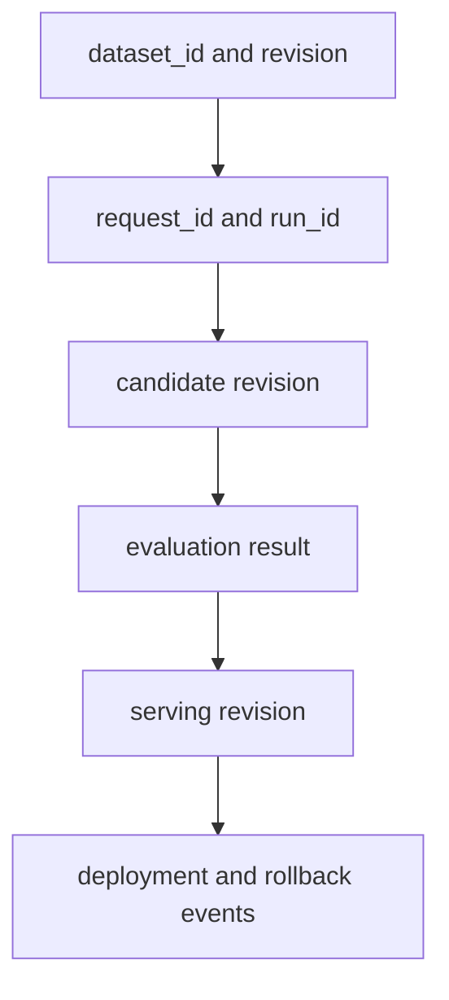

# Operations

## Goal

운영 단계에서는 “training job이 성공했다”는 신호 하나가 아니라 dataset publish, training, artifact registration, evaluation, deployment와 serving 상태를 연결해서 봅니다.
장애가 발생했을 때 영향을 받은 revision을 찾고, promotion을 멈추거나 이전 serving revision으로 되돌릴 수 있어야 합니다.

## Correlation Model

모든 metric에 위 값을 전부 label로 넣는다는 뜻은 아닙니다.
각 system의 metadata에서 다음 identity로 이동할 수 있는 link를 보존하고, metric에는 cardinality가 통제된 `run_id`, phase와 revision만 사용합니다.

| Identity | Created by | Must link to |
| --- | --- | --- |
| Dataset ID and revision | data pipeline | source revision, digest, split policy |
| Request ID | training control plane | dataset, base model, recipe, evaluation suite |
| Run ID | training backend | request ID, backend job, summary와 logs |
| Candidate revision | model registry | run ID, artifact manifest, evaluation evidence |
| Serving revision | deployment controller | candidate, serving configuration, rollout event |

## Observability

metric vocabulary와 수집 방식은 [`profiling` branch](https://github.com/daegyu94/post-training-lab/tree/profiling)의 schema를 사용하고, 이 브랜치에서는 lifecycle별 필수 signal을 정의합니다.

| Stage | Required signals | First question on failure |
| --- | --- | --- |
| Data preparation | input/output count, reject reason, deduplication rate, throughput | 어떤 policy와 source에서 record가 감소했는가? |
| Training | loss, tokens/s, GPU utilization, memory, collective time | 계산, 통신, data read 중 어디서 멈췄는가? |
| Checkpoint | save/load duration, bytes, storage throughput, digest validation | artifact가 완전하고 다시 load 가능한가? |
| Evaluation | suite revision, metric, threshold, pass/fail, regression delta | 어느 gate와 task가 기준을 벗어났는가? |
| Deployment | candidate, replica state, rollout percentage, startup time | traffic 전환 전인가 후인가? |
| Serving | serving revision, request·task success, latency, throughput, memory | candidate와 기존 revision의 차이인가? |

raw prompt, response, credential와 user identifier는 metric label에 넣지 않습니다.
높은 cardinality는 metric system의 비용과 query 성능을 악화시키고, 민감 정보 노출 위험도 만듭니다.
상세 sample은 접근 제어된 artifact로 분리합니다.

## Operational Sequence

### Before a run

- dataset과 base model의 immutable revision과 digest를 확인합니다.
- request ID가 중복되지 않고 retry policy가 정의돼 있는지 확인합니다.
- output은 새 candidate location을 사용하고 production path를 가리키지 않게 합니다.
- disk capacity, registry availability와 필요한 credential scope를 preflight합니다.
- evaluation suite revision과 promotion threshold를 실행 전에 고정합니다.

### During a run

- metric, log와 artifact path에 동일한 run ID를 기록합니다.
- training phase와 checkpoint phase를 구분해 resource metric과 연결합니다.
- worker failure 이후 재시작할 checkpoint가 complete·validated 상태인지 확인합니다.
- retry가 새 artifact를 덮어쓰지 않고 같은 request의 별도 attempt로 남게 합니다.

### After a run

- summary, logs, backend configuration과 artifact file inventory를 수집합니다.
- per-file digest와 clean-process reload를 확인한 뒤 candidate를 publish합니다.
- evaluation과 canary result를 candidate revision에 연결합니다.
- promotion 또는 reject event와 판단 기준을 기록합니다.
- retention policy에 따라 이전 production revision과 rollback dependency를 보존합니다.

## Storage and Network

large-scale training에서는 dataset read와 checkpoint I/O가 shared storage에 집중될 수 있습니다.
checkpoint save가 training step과 겹치는지, 각 rank가 많은 small file을 생성하는지, metadata path와 data path가 어디에 있는지 기록합니다.

multi-node run에서는 collective communication과 storage traffic이 같은 NIC 또는 fabric을 공유하는지도 확인합니다.
network utilization 하나로 병목을 결론 내리지 않고 GPU idle time, collective duration, I/O queueing과 checkpoint phase를 같은 timeline에서 비교합니다.

training cluster와 serving cluster 사이의 artifact transfer는 명시적인 publish 단계로 관리합니다.
upload 완료와 digest validation 이후에만 registry revision을 visible 상태로 바꾸며, serving node가 training 중인 checkpoint directory를 직접 읽지 않게 합니다.

## Failure Handling

| Failure | Immediate response | Preserved evidence |
| --- | --- | --- |
| Dataset validation failure | revision publish 중단 | validation error, policy revision, aggregate reject count |
| Training worker failure | run 실패 처리 또는 validated checkpoint에서 재시작 | failed attempt, worker·rank, last complete step |
| Incomplete checkpoint | candidate discovery에서 숨김 | file inventory, writer error, cleanup status |
| Evaluation regression | promotion 차단 | suite, threshold, metric delta, failing task |
| Canary startup failure | traffic 전환 전 candidate 격리 | load log, serving config, health result |
| Serving regression | 이전 serving revision으로 rollback | rollout window, metric delta, rollback event |
| Registry or storage outage | 현재 production 유지, promotion 중단 | outage interval, affected request와 retry status |

자동 retry는 결과가 같은 idempotent 단계에만 적용합니다.
dataset publish, registry alias 변경과 production traffic 전환처럼 상태를 변경하는 단계는 request identity, expected current revision과 compare-and-swap 조건을 사용해 중복 실행과 lost update를 막습니다.

## Validation Checklist

- dataset, request, run, candidate와 serving revision을 양방향으로 추적할 수 있습니다.
- floating model 또는 dataset 이름 대신 immutable revision과 digest를 사용합니다.
- framework-specific configuration과 공통 lifecycle metadata가 분리돼 있습니다.
- incomplete artifact가 registry나 serving system에 노출되지 않습니다.
- clean process에서 checkpoint 또는 adapter reload를 검증합니다.
- canary failure와 production regression에 대한 rollback을 실제 serving 환경에서 연습했습니다.
- metric, log와 event의 timestamp가 동기화돼 있고 같은 phase를 비교할 수 있습니다.
- 개인정보와 secret이 dataset, log, metric 또는 artifact metadata에 포함되지 않습니다.

전체 개념을 다시 확인하려면 [branch README](../README.md)의 lifecycle과 용어 표로 돌아가세요.
